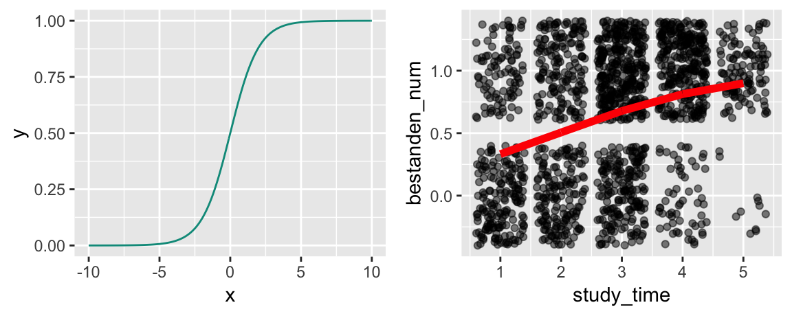
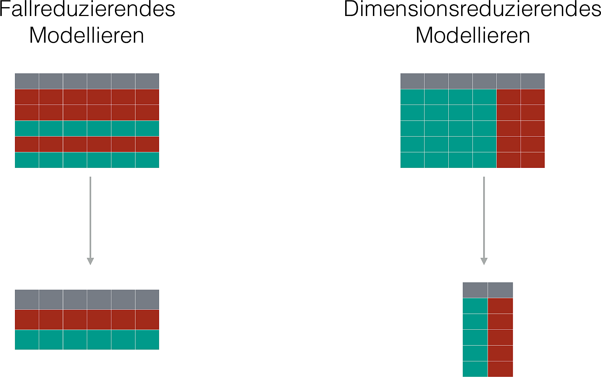
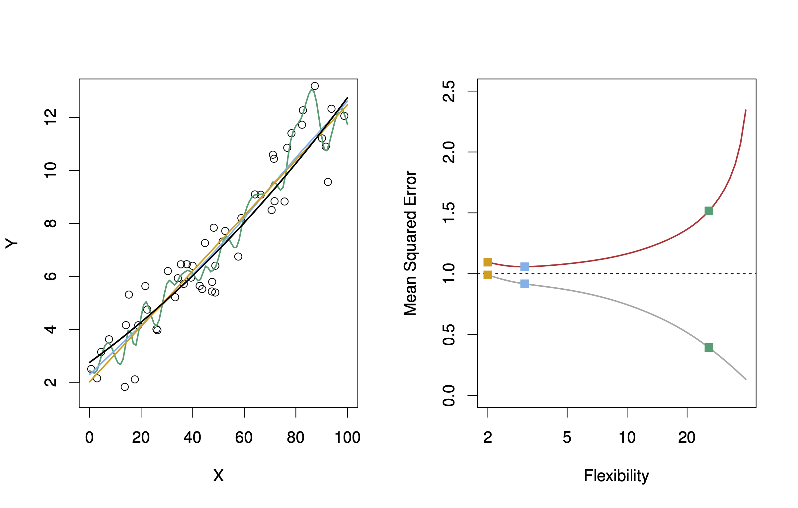

# (PART) Themen {-}

# Grundkonzepte


```{r global-knitr-options, include=FALSE}
  knitr::opts_chunk$set(
  fig.pos = 'H',
  fig.asp = 0.618,
  fig.align='center',
  fig.width = 5,
  out.width = "100%",
  fig.cap = "", 
  fig.path = "chunk-img/",
  dpi = 300,
  # tidy = TRUE,
  echo = FALSE,
  message = FALSE,
  warning = FALSE,
  cache = FALSE,
  fig.show = "hold")
```


```{r}
library(nomnoml)
library(DiagrammeR)

knitr::knit_hooks$set(crop = knitr::hook_pdfcrop)
```


## Was ist Data Science?


Es gibt mehrere Definitionen von *Data Science*, aber keinen kompletten Konsens.
@baumer_modern_2017 definieren Data Science wie folgt (S. 4):


:::: {.infobox .quote}
The science of extracting meaningful information from data
:::

Auf der anderen Seite entgegen viele Statistiker: "Hey, das machen wir doch schon immer!".


Eine Antwort auf diesen Einwand ist, dass in Data Science nicht nur die Statistik eine Rolle spielt, sondern auch die Informatik sowie - zu einem geringen Teil - die Fachwissenschafte ("Domäne"), die sozusagen den Empfänger bzw. die Kunden oder den Rahmen stellt.
Dieser "Dreiklang" ist in folgendem Venn-Diagramm dargestellt.


<script type="module" src="https://unpkg.com/venny?module"></script>

<venn-diagram>
  <venn-set name="A" label="Statistik"></venn-set>
  <venn-set name="B" label="Informatik"></venn-set>
  <venn-set name="C" label="Domäne" size = "5"></venn-set>
  <venn-n sets="A B C">
</venn-diagram>


## Was ist Machine Learning?

*Maschinelles Lernen* (ML), oft auch (synonym) als *statistisches Lernen* (statistical learning) bezeichnet, ist ein Teilgebiet der *künstlichen Intelligenz* (KI; artificial intelligence, AI) [@rhys]. ML wird auch als *data-based* bezeichnet in Abgrenzung von *rule-based*, was auch als "klassische KI" bezeichnet wird, vgl. Abb. \@ref(fig:ai-ml2).


```{r ai-ml2, eval = TRUE, fig.cap="KI und Maschinelles Lernen", strip.white = TRUE, echo = FALSE, fig.align='center'}
d <- "
digraph D {

    node [fontname='Arial'];

    node_A [shape=record    label='{KI|{rule-based|data-based}}'];


}

"


DiagrammeR::grViz(d, height = 250)


```


In beiden Fällen finden Algorithmen Verwendung.
Algorithmen sind nichts anderes als genaue Schritt-für-Schritt-Anleitungen, um etwas zu erledigen.
Ein Kochrezept ist ein klassisches Beispiel für einen Algorithmus.

[Hier](https://www.c-programming-simple-steps.com/images/xsum-two-numbers-h.png.pagespeed.ic.AM9WYFPgEo.webp) findet sich ein Beispiel für einen einfachen Additionsalgorithmus.


Es gibt viele ML-Algorithmen, vgl. Abb. \@ref(fig:algos).

```{r algos, echo = FALSE, fig.cap = "ML-Matroschka"}
d <- 
"#direction: leftright
[KI|
  [ML|
    [Regression] 
    [Neuronale Netze] 
    [...]
  ]  
  
]
"
nomnoml(d, height = 350)
```


### Rule-based

Klassische (ältere) KI implementiert Regeln "hartverdrahtet" in ein Computersystem. 
Nutzer füttern Daten in dieses System. Das System leitet dann daraus Antworten ab.

*Regeln* kann man prototypisch mit *Wenn-Dann-Abfragen* darstellen:


```{r echo = TRUE}
lernzeit <- c(0, 10, 10, 20)
schlauer_nebensitzer <- c(FALSE, FALSE, TRUE, TRUE)

for (i in 1:4) {
  if (lernzeit[i] > 10) {
    print("bestanden!")
  } else {
    if (schlauer_nebensitzer[i] == TRUE) {
      print("bestanden!")
    } else print("Durchgefallen!")
  }
}
```


Sicherlich könnte man das schlauer programmieren, vielleicht so:

```{r echo = TRUE}
d <- 
  tibble(
  lernzeit = c(0, 10, 10, 20),
  schlauer_nebensitzer = c(FALSE, FALSE, TRUE, TRUE)
)

d %>% 
  mutate(bestanden = ifelse(lernzeit > 10 | schlauer_nebensitzer == TRUE, TRUE, FALSE))

```


### Data-based

ML hat zum Ziel, Regeln aus den Daten zu lernen. Man füttert Daten und Antworten in das System, das System gibt Regeln zurück.


@islr definieren ML so:
Nehmen wir an, wir haben die abhängige Variable $Y$ und $p$ Prädiktoren, $X_1,X_2, \ldots, X_p$.
Weiter nehmen wir an, die Beziehung zwischen $Y$ und $X = (X_1, X_2, \ldots, X_p)$ kann durch eine Funktion $f$ beschrieben werden.
Das kann man so darstellen:

$$Y = f(X) + \epsilon$$

ML kann man auffassen als eine Menge an Verfahren, um $f$ zu schätzen.

Ein Beispiel ist in Abb. \@ref(fig:statlearning) gezeigt [@islr].

```{r statlearning, fig.cap = "Vorhersage des Einkommens durch Ausbildungsjahre", out.width = "50%"}

```


Natürlich kann $X$ mehr als eine Variable beinhalten, vgl. Abb. \@ref(fig:sl2) [@islr].


```{r sl2, fig.cap = "Vorhersage des Einkommens als Funktion von Ausbildungsjahren und Dienstjahren"}
knitr::include_graphics("img/2-3.png")
```


<!-- ```{nomnoml, echo = FALSE} -->
<!-- #direction: leftright -->
<!-- #fontSize: 8 -->
<!-- #arrowSize: 1 -->
<!-- #bendSize: 0.3 -->
<!-- #edges: rounded -->
<!-- #stroke: #123456 -->

<!--   [rule-based| -->
<!--   [Daten] -> [Antworten] -->
<!--   [Regeln] -> [Antworten] -->
<!-- ] -->
<!--   [data-based| -->
<!--   [Daten] -> [Regeln] -->
<!--   [Antworten] -> [Regeln] -->
<!-- ] -->
<!-- ``` -->


Anders gesagt: traditionelle KI-Systeme werden mit Daten und Regeln gefüttert und liefern Antworten.
ML-Systeme werden mit Daten und Antworten gefüttert und liefern Regeln zurück, vgl. Abb. \@ref(fig:ki-ml2).


```{r ki-ml2, fig.cap = "Vergleich von klassischer KI und ML", fig.align = "center", echo = FALSE}
nomnoml::nomnoml(
  "#direction: leftright
  [rule-based|
  [Daten] -> [Antworten]
  [Regeln] -> [Antworten]
]
  [data-based|
  [Daten] -> [Regeln]
  [Antworten] -> [Regeln]
]  
  ",
height = 450
)
```


## Modell vs. Algorithmus


### Modell 

Ein Modell, s. Abb. \@ref(fig:vw) [@spurzem_vw_2017]!


```{r vw, echo = FALSE, fig.cap = "Ein Modell-Auto", out.width="33%"}
knitr::include_graphics("img/vw_modell.JPG")
```


Wie man sieht, ist ein Modell eine vereinfachte Repräsentation eines Gegenstands.

Der Gegenstand definiert (gestaltet) das Modell. Das Modell ist eine Vereinfachung des Gegenstands, vgl. Abb. \@ref(fig:modell).

```{r modell, fig.cap = "Gegenstand und Modell", echo = FALSE}
knitr::include_graphics("img/modell-crop.png")
```


Im maschinellen Lernen meint ein Modell, praktisch gesehen, die Regeln,
die aus den Daten gelernt wurden.


### Beispiel für einen ML-Algorithmus

Unter einem ML-Algorithmus versteht man das (mathematische oder statistische) Verfahren,
anhand dessen die Beziehung zwischen $X$ und $Y$ "gelernt" wird. Bei @rhys (S. 9) findet sich dazu ein Beispiel, das kurz zusammengefasst etwa so lautet:


*Beispiel eines Regressionsalgorithmus*

1. Setze Gerade in die Daten mit $b_0 = \hat{y}, b_1 = 0$
2. Berechne $MSS = \sum (y_i - \hat{y_i})^2$
3. "Drehe" die Gerade ein bisschen, d.h. erhöhe $b_1^{neu} = b_1^{alt} + 0.1$
4. Wiederhole 2-3 solange, bis $MSS < \text{Zielwert}$


Diesen Algorithmus kann man "von Hand" z.B. mit [dieser App](https://shinyapps.org/showapp.php?app=https://shiny.psy.lmu.de/felix/lmfit&by=Felix%20Sch%C3%B6nbrodt&title=Find-a-fit!&shorttitle=Find-a-fit!) durchspielen.


## Taxonomie

Methoden des maschinellen Lernens lassen sich verschiedentlich gliedern.
Eine typische Gliederung unterscheidet in *supervidierte* (geleitete) und *nicht-supervidierte* (ungeleitete) Algorithmen, s. Abb. \@ref(fig:taxonomie).


```{r taxonomie, fig.cap="Taxonomie der Arten des maschinellen Lernens", echo = FALSE}
mermaid("
graph LR
  ML[Maschinelles Lernen]
  SL[Supervidiertes Lernen]
  NSL[Nicht-supervidiertes Lernen]
  Re[Regression]
  Class[Klassifikation]
  DimRed[Dimensionsreduktion]
  Clust[Clustering]
  ML --> SL
  ML --> NSL
  SL --> Re
  SL --> Class
  NSL --> DimRed
  NSL --> Clust
",
height = 250
)
```


### Geleitetes Lernen

Die zwei Phasen des geleiteten Lernens sind in Abb. \@ref(fig:supervid) dargestellt.

```{r supervid, echo = FALSE, fig.cap = "Geleitetes Lernen geschieht in zwei Phasen"}
d <-
"

[Lernphase|
[Daten mit Antwort] -> [Geleiteter Algorithmus]
[Geleiteter Algorithmus] -> [Modell]
]

[Vorhersagephase|
[Neue Daten, ohne Antwort] -> [Modell]
[Modell] -> [Antworten]
]

"
nomnoml(d, height = 550)
```


#### Regression: Numerische Vorhersage


```{r}
ggplot(mtcars) +
  aes(x = hp, y = mpg) +
  geom_point() +
  geom_smooth(method = "lm") +
  theme_minimal()
```


Die Modellgüte eines numerischen Vorhersagemodells wird oft mit (einem der) folgenden *Gütekoeffizienten* gemessen:

- Mean Squared Error (Mittlerer Quadratfehler):

$$MSE := \frac{1}{n} \sum (y_i - \hat{y}_i)^2$$


- Mean Absolute Error (Mittlerer Absolutfehler):

$$MAE :=  \frac{1}{n} \sum |(y_i - \hat{y}_i)|$$


:::: {.infobox .caution}
Wir sind nicht adaran interessiert die Vorhersagegenauigkeit in den bekannten Daten einzuschätzen, sondern im Hinblick auf neue Daten, die in der Lernphase dem Modell nicht bekannt waren.
:::


#### Klassifikation: Nominale Vorhersage


```{r }

```


Die Modellgüte eines numerischen Vorhersagemodells wird oft mit folgendem *Gütekoeffizienten* gemessen:

- Mittlerer Klassifikationfehler $e$:

$$e := \frac{1}{n} I(y_i \ne \hat{y}_i) $$

Dabei ist $I$ eine Indikatorfunktion, die `1` zurückliefert, 
wenn tatsächlicher Wert und vorhergesagter Wert identisch sind.

### Ungeleitetes Lernen

Die zwei Phasen des ungeleiteten Lernens sind in Abb. \@ref(fig:unsuper) dargestellt.


```{r unsuper, fig.cap = "Die zwei Phasen des ungeleiteten Lernens", echo = FALSE}
d <-
"

[Lernphase|
[Daten ohne Antwort] -> [Ungeleiteter Algorithmus]
[Ungeleiteter Algorithmus] -> [Modell]
]

[Vorhersagephase|
[Neue Daten, ohne Antwort] -> [Modell]
[Modell] -> [Zuordnung zu den Regeln des Modells]
]

"
nomnoml(d, height = 450)
```


Ungeleitetes Lernen kann man wiederum in zwei Arten unterteilen, vgl. Abb. \@ref(fig:ungel):

1. Fallreduzierendes Modellieren (Clustering)
2. Dimensionsreduzierendes Modellieren (z.B. Faktorenanalyse)

```{r ungel, fig.cap = "Zwei Arten von ungeleitetem Modellieren"}

```


## Ziele des ML

Man kann vier Ziele des ML unterscheiden, s. Abb. \@ref(fig:ziele).

```{r ziele, fig.cap="Ziele des maschinellen Lernens", echo = FALSE, fig.asp = .5}
DiagrammeR::mermaid("
graph TD
  ML[Maschinelles Lernen]
  V[Vorhersage]
  E[Erklärung/kausal]
  B[Beschreibung]
  DimRed[Dimensionsreduktion]
  ML --> V
  ML --> E
  ML --> B
  ML --> DimRed
",
height = 350
)
```

*Vorhersage* bezieht sich auf die Schätzung der Werte von Zielvariablen (sowie die damit verbundene Unsicherheit).
*Erklärung* meint die kausale Analyse von Zusammenhängen.
*Beschreibung* ist praktisch gleichzusetzen mit der Verwendung von deskriptiven Statistiken.
*Dimensionsreduktion* ist ein Oberbegriff für Verfahren, die die Anzahl der Variablen (Spalten) oder der Beobachtungen (Zeilen) verringert.s


Wie "gut" ein Modell ist, quantifiziert man in verschiedenen Kennzahlen; man spricht von Modellgüte oder *model fit*. 
Je schlechter die Modellgüte, desto höher der *Modellfehler*, vgl. Abb. \@ref(fig:resid).

```{r resid, fig.cap = "Wenig (links) vs. viel (rechts) Vorhersagefehler"}
knitr::include_graphics("img/resids-plot-1.png")
```


Die Modellgüte eines Modells ist nur relevant für *neue Beobachtungen*,
an denen das Modell nicht trainiert wurde.


## Über- vs. Unteranpassung

*Overfitting*: Ein Modell sagt die Trainingsdaten zu genau vorher - es nimmt Rauschen als "bare Münze", also fälschlich als Signal. Solche Modelle haben zu viel *Varianz* in ihren Vorhersagen.

*Underfitting*: Ein Modell ist zu simpel (ungenau, grobkörnig) - es unterschlägt Nuancen des tatsächlichen Musters. Solche Modelle haben zu viel *Verzerrung* (Bias) in ihren Vorhersagen.

Welches der folgenden Modelle (B,C,D) passt am besten zu den Daten (A), s. Abb. \@ref(fig:overunder), vgl. [@modar], Kap. 15.

```{r overunder, fig.cap = "Over- vs. Underfitting"}

```


Welches Modell wird wohl neue Daten am besten vorhersagen? Was meinen Sie?

Modell D zeigt sehr gute Beschreibung ("Retrodiktion") der Werte, anhand derer das Modell trainiert wurde ("Trainingsstichprobe").
Wird es aber "ehrlich" getestet, d.h. anhand neuer Daten ("Test-Stichprobe"),
wird es vermutlich *nicht* so gut abschneiden.


Es gilt, ein Modell mit "mittlerer" Komplexität zu finden, um Über- und Unteranpassung in Grenzen zu halten.
Leider ist es nicht möglich, vorab zu sagen, was der richtige, "mittlere" Wert an Komplexität eines Modells ist, vgl. Abb. \@ref(fig:overfitting) aus [@modar].


```{r overfitting, fig.cap = "Mittlere Modellkomplexität führt zur besten Vorhersagegüte"}
knitr::include_graphics("img/overfitting-crop.png")
```


## No free lunch

<a href="https://imgflip.com/i/687izk"></a><div><a href="https://imgflip.com/memegenerator">from Imgflip Meme Generator</a></div>


Wenn $f$ (die Beziehung zwischen $Y$ und $X$, auch *datengenerierender Prozess* genannt) linear oder fast linear ist,
dann wird ein lineare Modell gute Vorhersagen liefern, vgl. Abb. \@ref(fig:2-10) aus @islr, dort zeigt die schwarze Linie den "wahren Zusammenhang", also $f$ an. In orange sieht man ein lineares Modell, in grün ein hoch komplexes Modell,
das sich in einer "wackligen" Funktion - also mit hoher Varianz - 
niederschlägt. Das grüne Modell könnte z.B. ein Polynom-Modell hohen Grades sein, z. B. 
$y = b_0 + b_1 x^{10} + b_2 x^9 + \ldots + b_11 x^1 + \epsilon$. 
Das lineare Modell hat hingegen wenig Varianz und in diesem Fall wenig Bias.
Daher ist es für dieses $f$ gut passend.
Die grüne Funktion zeigt dagegen Überanpassung (overfitting), 
also viel Modellfehler (für eine Test-Stichprobe).


:::: {.infobox .caution}
Die grüne Funktion in  Abb. \@ref(fig:2-10) wird neue, beim Modelltraining unbekannte Beobachtungen ($y_0$) vergleichsweise schlecht vorhersagen. In Abb. \@ref(fig:2-11)  ist es umgekehrt.
:::

```{r 2-10, fig.cap = "Ein lineare Funktion verlangt ein lineares Modell; ein nichtlineares Modell wird in einem höheren Vorhersagefehler (bei neuen Daten!) resultieren."}

```


Betrachten wir im Gegensatz dazu  Abb. \@ref(fig:2-11) aus @islr, die (in schwarz) eine hochgradig *nichtlineare* Funktion $f$ zeigt.
Entsprechend wird das lineare Modell (orange) nur schlechte Vorhersagen erreichen - es hat zu viel Bias, da zu simpel. 
Ein lineares Modell wird der Komplexität von $f$ nicht gerecht,
Unteranpassung (underfitting) liegt vor.


```{r 2-11, fig.cap = "Eine nichtlineare Funktion (schwarz) verlangt eine nichtlineares Modell. Ein lineares Modell (orange) ist unterangepasst und hat eine schlechte Vorhersageleistung."}

```


## Bias-Varianz-Abwägung

Der Gesamtfehler $E$ des Modells ist die Summe dreier Terme:

$$E = (y - \hat{y}) = \text{Bias} + \text{Varianz} + \epsilon$$

Dabei meint $\epsilon$ den *nicht reduzierbaren Fehler*, z.B. weil dem Modell Informationen fehlen. So kann man etwa auf der Motivation von Studentis keine perfekte Vorhersage ihrer Noten erreichen (lehrt die Erfahrung).

Bias und Varianz sind Kontrahenten: Ein Modell, das wenig Bias hat, neigt tendenziell zu wenig Varianz und umgekehrt, vgl. Abb. \@ref(fig:bias-var) aus @modar.


```{r bias-var, fig.cap = "Abwängung von Bias vs. Varianz"}
knitr::include_graphics("img/plot-bias-variance-1.png")
```


<!-- ## Aufgaben -->


```{r render-outline-exs, results = "asis", echo = FALSE, message = FALSE}
source("https://raw.githubusercontent.com/sebastiansauer/Lehre/main/R-Code/render-course-sections.R")

course_dates_file <- here::here("course-dates.yaml")
content_file <- here::here("_modul-ueberblick.yaml")

stopifnot(file.exists(course_dates_file))
stopifnot(file.exists(content_file))

render_section(course_dates_file,
               content_file,
               i = 1, 
               name = "Aufgaben",
               header_level = 1)
```


<!-- ## Vertiefung -->


```{r render-outline-vertiefung, results = "asis", echo = FALSE, message = FALSE}


render_section(course_dates_file,
               content_file,
               i = 1, 
               name = "Vertiefung",
               header_level = 1)
```

