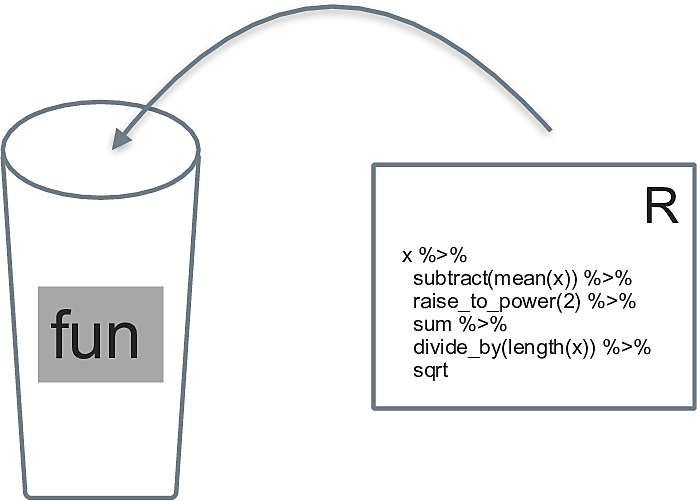

```{r src-constants, eval = TRUE, include = FALSE}
source("funs/define-constants.R")
```


# R, zweiter Blick


Benötigte R-Pakete für dieses Kapitel:

```{r}
library(tidyverse)
library(tidymodels)
```


## Lernsteuerung

<!-- Chapter Start sections: Lernziele, Literatur, Hinweise, ... -->

```{r chapter-start-sections, echo = FALSE, results = "asis"}
source("funs/chapter-start-sections.R")
chapter_start_sections(i = 2)
```


## Objekttypen in R

Näheres zu Objekttypen findet sich in @modar, Kap. 5.2.


### Überblick

In R ist praktisch alles ein Objekt. 
Ein Objekt meint ein im Computerspeicher repräsentiertes Ding, etwa eine Tabelle.


Vektoren und Dataframes (Tibbles) sind die vielleicht gängigsten Objektarten in R (vgl. Abb. \@ref(fig:obs), aus @modar).

```{r obs, fig.cap = "Zentrale Objektarten in R", out.width="70%", echo = FALSE}
knitr::include_graphics("img/zentrale_objektarten.png")
```

Es gibt in R keine (Objekte für) Skalare (einzelne Zahlen).
Stattdessen nutzt R Vektoren der Länge 1.

Ein nützliches Schema stammt aus @r4ds, s. Abb. \@ref(fig:objtypes).

```{r objtypes, fig.cap = "Objektarten hierarchisch gegliedert", echo = FALSE, out.width="70%"}
knitr::include_graphics("https://d33wubrfki0l68.cloudfront.net/1d1b4e1cf0dc5f6e80f621b0225354b0addb9578/6ee1c/diagrams/data-structures-overview.png")
```


### Taxonomie

Unter *homogenen* Objektiven verstehen wir Datenstrukturen, 
die nur eine Art von Daten (wie Text oder Ganze Zahlen) fassen.
Sonstige Objekte nennen wir *heterogen*.


- Homogene Objekte
    - Vektoren 
    - Matrizen
- Heterogen
    - Liste
    - Dataframes (Tibbles)
    
    
    
#### Vektoren

*Vektoren* sind insofern zentral in R,
als dass die übrigen Datenstrukturen auf ihnen aufbauen, vgl. Abb. \@ref(fig:vektorenimzentrum) aus @modar.

Reine (atomare) Vektoren in R sind eine geordnete Liste von Daten eines Typs.

```{r vektorenimzentrum, fig.cap = "Vektoren stehen im Zentrum der Datenstrukturen in R", echo = FALSE}
knitr::include_graphics("img/Datenstrukturen.png")
```


```{r echo = TRUE}
ein_vektor <- c(1, 2, 3)
noch_ein_vektor <- c("A", "B", "C")
logischer_vektor <- c(TRUE, FALSE, TRUE)
```


Mit `str()` kann man sich die `Str`uktur eines Objektsausgeben lassen:

```{r echo = TRUE}
str(ein_vektor)
str(noch_ein_vektor)
str(logischer_vektor)
```


Vektoren können von folgenden Typen sein:

- Kommazahlen ( `double`) genannt
- Ganzzahlig (`integer`, auch mit `L` für *Long* abgekürzt)
- Text (´character`, String)
- logische Ausdrücke (`logical` oder `lgl`) mit `TRUE` oder `FALSE`


Kommazahlen und Ganze Zahlen zusammen bilden den Typ `numeric` (numerisch) in R.


```{r}
knitr::opts_chunk$set(echo = TRUE)
```


Den Typ eines Vektors kann man mit `typeof()` ausgeben lassen:

```{r echo = TRUE}
typeof(ein_vektor)
```


#### Faktoren


```{r echo = TRUE}
sex <- factor(c("Mann", "Frau", "Frau"))
```

Interessant:

```{r echo = TRUE}
str(sex)
```


Vertiefende Informationen findet sich in @r4ds.

#### Listen

```{r echo = TRUE}
eine_liste <- list(titel = "Einführung",
                   woche = 1,
                   datum = c("2022-03-14", "2202-03-21"),
                   lernziele = c("dies", "jenes", "und noch mehr"),
                   lehre = c(TRUE, TRUE, TRUE)
                   )
str(eine_liste)
```


#### Tibbles

Für `tibble()` brauchen wir `tidyverse`:

```{r message=FALSE,  echo = TRUE}
library(tidyverse)
```


```{r tibble-ex, echo = TRUE}

studentis <-
  tibble(
    name = c("Anna", "Berta"),
    motivation = c(10, 20),
    noten = c(1.3, 1.7)
  )
str(studentis)
```


### Indizieren

Einen Teil eines Objekts auszulesen, bezeichnen wir als *Indizieren*.


#### Reine Vektoren

Zur Erinnerung:

```{r echo = TRUE}
str(ein_vektor)
```


```{r echo = TRUE}
ein_vektor[1]
ein_vektor[c(1,2)]
```

Aber *nicht* so:

```{r error=TRUE,  echo = TRUE}
ein_vektor[1,2]
```

Man darf Vektoren auch wie Listen ansprechen, also eine doppelte Eckklammer zum Indizieren verwenden

```{r}
ein_vektor[[2]]
```

Der Grund ist,
dass Listen auch Vektoren sind, nur eben ein besonderer Fall eines Vektors:


```{r}
is.vector(eine_liste)
```


Was passiert, wenn man bei einem Vektor der Länge 3 das 4. Element indiziert?

```{r echo = TRUE}
ein_vektor[4]
```

Ein schnödes `NA` ist die Antwort. Das ist interessant: 
Wir bekommen keine Fehlermeldung, sondern den Hinweis,
das angesprochene Element sei leer bzw. nicht verfügbar.


In @modar, Kap. 5.3.1 findet man weitere Indizierungsmöglichkeiten für reine Vektoren.


#### Listen

```{r echo = TRUE}
eine_liste %>% str()
```


Listen können wie Vektoren, also mit `[` ausgelesen werden. 
Dann wird eine Liste zurückgegeben.


```{r echo = TRUE}
eine_liste[1]
eine_liste[2]
```

Das hat den technischen Hintergrund,
dass Listen als eine bestimmte Art von Vektoren implementiert sind.


Mann kann auch die "doppelte Eckklammer", `[[` zum Auslesen verwenden;
dann wird anstelle einer Liste die einfachere Struktur eines Vektors zurückgegeben:


```{r echo = TRUE}
eine_liste[[1]]
```

Man könnte sagen,
die "äußere Schicht" des Objekts, die Liste,
wird abgeschält, und man bekommnt die "innere" Schicht,
den Vektor.


Mann die Elemente der Liste entweder mit ihrer Positionsnummer (1, 2, ...) oder,
sofern vorhanden, ihren Namen ansprechen:


```{r echo = TRUE}
eine_liste[["titel"]]
```


Dann gibt es noch den Dollar-Operator,
mit dem Mann benannte Elemente von Listen ansprechen kann:

```{r echo = TRUE}
eine_liste$titel
```

Man kann auch tiefer in eine Liste hinein indizieren.
Sagen wir, uns interessiert das 4. Element der Liste `eine_liste` - 
und davon das erste Element. 

Das geht dann so:

```{r echo = TRUE}
eine_liste[[4]][[1]] 
```


Eine einfachere Art des Indizierens von Listen bietet die Funktion `pluck()`, aus dem Paket `purrr`,
das Hilfen für den Umgang mit Listen bietet.


```{r echo = TRUE}
pluck(eine_liste, 4)
```


Und jetzt aus dem 4. Element das 1. Element:

```{r echo = TRUE}
pluck(eine_liste, 4, 1)
```


Probieren Sie mal, aus einer Liste der Länge 5 das 6. Element auszulesen:

```{r echo = TRUE}
eine_liste %>% length()
```

```{r echo = TRUE, error = TRUE}
eine_liste[[6]]
```

Unser Versuch wird mit einer Fehlermeldung quittiert.


Sprechen wir die Liste wie einen (atomaren) Vektor an,
bekommen wir hingegen ein `NA` bzw. ein `NULL`:

```{r echo = TRUE, error = TRUE}
eine_liste[6]
```

#### Tibbles

Tibbles lassen sich sowohl wie ein Vektor als auch wie eine Liste indizieren.


```{r echo = TRUE}
studentis[1]
```

Die Indizierung eines Tibbles mit der einfachen Eckklammer liefert einen Tibble zurück.

```{r echo = TRUE}
studentis["name"]
```
Mit doppelter Eckklammer bekommt man,
analog zur Liste, 
einen Vektor zurück:

```{r echo = TRUE}
studentis[["name"]]
```

Beim Dollar-Operator kommt auch eine Liste zurück:

```{r echo = TRUE}
studentis$name
```


### Weiterführende Hinweise

- [Tutorial](https://jennybc.github.io/purrr-tutorial/bk00_vectors-and-lists.html) zum Themen Indizieren von Listen von Jenny BC.


### Indizieren mit dem Tidyverse 

Natürlich kann man auch die Tidyverse-Verben zum Indizieren verwenden.
Das bietet sich an, wenn zwei Bedingungen erfüllt sind:

1. Wenn man einen Tibble als Input und als Output hat
2. Wenn man nicht programmieren möchte


## Datensätze von lang nach breit umformatieren


Manchmal findet man Datensätze im sog. *langen* Format vor,
manchmal im *breiten*.

In der Regel müssen die Daten "tidy" sein,
was meist dem langen Format entspricht, vgl. Abb. \@ref(fig:langbreit) aus @modar.


```{r langbreit, fig.cap = "Von lang nach breit und zurück"}
knitr::include_graphics("img/gather_spread.png")
```


In einer neueren Version des Tidyverse werden diese beiden Befehle umbenannt bzw. erweitert:

- `gather()` -> `pivot_longer()`
- `spread()` -> `pivot_wider()`

Weitere Informationen findet sich in @r4ds, in [diesem Abschnitt, 12.3](https://r4ds.had.co.nz/tidy-data.html?q=pivot_#pivoting).


## Funktionen

Eine Funktion kann man sich als analog zu einer Variable vorstellen.
Es ist ein Objekt, das nicht Daten, sondern Syntax beinhaltet, 
vgl. Abb. \@ref(fig:funs) aus @modar.


```{r funs, fig.cap = "Sinnbild einer Funktion", echo = FALSE}

```


```{r echo = TRUE}
mittelwert <- function(x){
  
  summe <- sum(x, na.rm = TRUE)
  mw <- summe/length(x)
  return(mw)
  
}
```

```{r  echo = TRUE}
mittelwert(c(1, 2, 3))
```


Weitere Informationen finden sich in [Kapitel 19](https://r4ds.had.co.nz/functions.html) in @r4ds. Alternativ findet sich ein Abschnitt dazu (28.1) in @modar.


## Wiederholungen programmieren

Häufig möchte man eine Operation mehrfach ausführen.
Ein Beispiel wäre die Anzahl der fehlenden Werte pro Spalte auslesen.
Natürlich kann man die Abfrage einfach häufig tippen, nervt aber irgendwann.
Daher braucht's Strukturen, die *Wiederholungen* beschreiben.

Dafür gibt es verschiedene Ansätze.

### `across()`

Handelt es sich um Spalten von Tibbles, dann bietet sich die Funktion `across(.col, .fns)` an.
`across` wendet eine oder mehrere Funktionen (mit `.fns` bezeichnet) auf die Spalten `.col` an.

Das erklärt sich am besten mit einem Beispiel:


Natürlich hätte man in diesem Fall auch anders vorgehen können:

```{r echo = TRUE}
mtcars %>% 
  summarise(across(.cols = everything(),
                   .fns = mean))
```


Möchte man der Funktion `.fns` Parameter übergeben, so nutzt man diese Syntax ("Purrr-Lambda"):

```{r echo = TRUE}
mtcars %>% 
  summarise(across(.cols = everything(),
                   .fns = ~ mean(., na.rm = TRUE)))
```


[Hier](https://www.rebeccabarter.com/blog/2020-07-09-across/) findet sich ein guter Überblick zu `across()`. 


### `map()`

`map()` ist eine Funktion aus dem R-Paket `purrr` und Teil des Tidyverse.

`map(x, f)` wenden die Funktion `f` auf jedes Element von `x` an.
Ist `x` ein Tibble, so wird `f` demnach auf jede Spalte von `x` angewendet ("zugeordnet", daher `map`), vgl. Abb. \@ref(fig:map1) aus @modar.


```{r map1, fig.cap = "Sinnbild für map", echo = FALSE}
knitr::include_graphics("img/wdh.png")
```


Hier ein Beispiel-Code:

```{r echo = TRUE}
data(mtcars)

mtcars <- mtcars %>% select(1:3)  # nur die ersten 3 Spalten

map(mtcars, mean)
```


Möchte man der gemappten Funktion Parameter übergeben,
nutzt man wieder die "Kringel-Schreibweise":


```{r echo = TRUE}
map(mtcars, ~ mean(., na.rm = TRUE))
```


### Weiterführende Hinweise

Weiteres zu `map()` findet sich z.B. in @r4ds, [Kapitel 21.5](https://r4ds.had.co.nz/iteration.html#the-map-functions) oder in @modar, Kap. 28.2.

[Tutorial](https://jennybc.github.io/purrr-tutorial/ls01_map-name-position-shortcuts.html) zu `map()` von Jenny BC.

## Listenspalten


### Wozu Listenspalten?

Listenspalten sind immer dann sinnvoll,
wenn eine einfache Tabelle nicht komplex genug für unsere Daten ist.

Zwei Fälle stechen dabei ins Auge:

1. Unsere Datenstruktur ist nicht rechteckig
2. In einer Zelle der Tabelle soll mehr als ein einzelner Wert stehen: vielleicht ein Vektor, eine Liste oder eine Tabelle


Der erstere Fall (nicht reckeckig) ließe sich noch einfach lösen,
in dem man mit `NA` auffüllt.

Der zweite Fall verlangt schlichtweg nach komplexeren Datenstrukturen.


[Kap. 25.3](https://r4ds.had.co.nz/many-models.html?q=list#creating-list-columns) aus @r4ds bietet einen guten Einstieg in das Konzept von Listenspalten (list-columns) in R.


### Beispiele für Listenspalten


#### tidymodel

Wenn wir mit `tidymodels` arbeiten,
werden wir mit Listenspalten zu tun haben.
Daher ist es praktisch, sich schon mal damit zu beschäftigen.

Hier ein Beispiel für eine $v=3$-fache Kreuzvalidierung:

```{r echo = TRUE}
library(tidymodels)
mtcars_cv <-
  vfold_cv(mtcars, v = 3)

mtcars_cv
```

Betrachten wir das Objekt `mtcars_cv` näher.
Die Musik spielt in der 1. Spalte.

Lesen wir den Inhalt der 1. Spalte, 1 Zeile aus (nennen wir das mal "Position 1,1"):

```{r  echo = TRUE}
pos11 <- mtcars_cv[[1]][[1]]
pos11
```

In dieser Zelle findet sich eine Aufteilung des Komplettdatensatzes in den Analyseteil (Analysis sample) und den Assessmentteil (Assessment Sample).

Schauen wir jetzt in dieses Objekt näher an.
Das können wir mit `str()` tun.
`str()` zeigt uns die Strktur eines Objekts.

```{r  echo = TRUE}
str(pos11)
```

Oh! `pos11` ist eine Liste, und zwar eine durchaus komplexe.
Wir müssen erkennen,
dass in einer einzelnen Zelle dieses Dataframes viel mehr steht,
als ein Skalar bzw. ein einzelnes, atomares Element.

Damit handelt es sich bei Spalte 1 dieses Dataframes (`mtcars_cv`) also um eine Listenspalte.


Üben wir uns noch etwas im Indizieren.

Sprechen wir in `pos11` das erste Element an (`data`) und davon das erste Element:

```{r echo = TRUE}
pos11[["data"]][[1]]
```

Wir haben hier die doppelten Eckklammern benutzt, 
um den "eigentlichen" oder "inneren" Vektor zu bekommen, 
nicht die "außen" herumgewickelte Liste.
Zur Erinnerung: 
Ein Dataframe ist ein Spezialfall einer Liste, 
also auch eine Liste, nur eine mit bestimmten Eigenschaften.

Zum Vergleich indizieren wir mal mit einer einfachen Eckklammer:

```{r echo = TRUE}
pos11[["data"]][1] %>% 
  head()
```


Mit `pluck()` bekommen wir das gleiche Ergebnis, 
nur etwas komfortabler,
da wir keine Eckklammern tippen müssen:

```{r echo = TRUE}
pluck(pos11, "data", 1, 1)
```

Wie man sieht, können wir beliebig tief in das Objekt hineinindizieren.


#### Kurs DataScience1

Ein Kurs, wie dieser, kann anhand einer "Deskriptoren" wie Titel der Inhalte, Lernziele, Literatur und so weiter zusammmengefasst werden.
Diese Deskriptoren kann man wiederum jeder Kurswoche oder jedem Kursabschnitt zuordnen, 
so dass eine zweidimensionale Struktur resultiert. 
Eine Tabelle, einfach gesagt, etwa so:


```{r}
tibble::tribble(
  ~Nr,   ~Titel,   ~Literatur,   ~Aufgaben,
   1L, "Titel1", "Literatur1", "Aufgaben1",
   2L, "Titel2", "Literatur2", "Aufgaben2",
   3L, "Titel3", "Literatur3", "Aufgaben3"
  ) %>% 
  gt::gt()
```


Wie man sieht, entspricht jede Spalte einem Deskriptor des Kurses,
und jede Zeile entspricht einem Thema (oder Woche oder Abschnitt) des Kurses.


Jetzt ist es nur so,
dass einzelne Zellen dieser Tabelle nicht aus nur einem Element bestehen.
So könnte etwa "Aufgaben1" aus mehreren Aufgaben bestehen, 
die jeweils wiederum aus mehreren (Text-)Elementen bestehen. 
Oder "Literatur2" besteht vielleicht aus zwei Literaturquellen.

Kurz gesagt, wir brauchen eine Tabelle,
die erlaubt, in einer Zelle mehr als ein einzelnes Element zu packen.
Listenspalten erlauben das.

Schauen wir uns die "Mastertabelle" dieses Kurses an zur Illustration.

Zunächst `source`n wir die nötigen Funktionen.

```{r echo = TRUE}
source("https://raw.githubusercontent.com/sebastiansauer/Lehre/main/R-Code/render-course-sections.R")
```


In Ihrem `Environment` sollten Sie jetzt die gesourcten Funktionen sehen.
Mit Klick auf den Funktionsnamen können Sie diese Funktionen auch betrachten.

Die Deskriptoren des Kurses speisen sich aus zwei Textdateien, gespeichert im sog. YAML-Format, ein einfaches Textformat, und hier nicht weiter von Belang.

Zum einen eine Datei mit den Datumsangaben:

```{r echo = TRUE, eval = FALSE}
course_dates_file <- "https://raw.githubusercontent.com/sebastiansauer/datascience1/main/course-dates.yaml"
```


Zum anderen eine Datei mit den Deskriptoren,
die unabhängig vom Datum sind:

```{r echo = TRUE, eval = FALSE}
content_file <- "https://raw.githubusercontent.com/sebastiansauer/datascience1/main/_modul-ueberblick.yaml"
```


Im [Githup-Repo](https://github.com/sebastiansauer/datascience1) 
dieses Kurses können Sie die Dateien komfortabel betrachten.


Die "Mastertabelle" kann man mit folgender Funktion erstellen:


```{r mastertable-illustration, echo = TRUE}
mastertable <- build_master_course_table(
  course_dates_file =  course_dates_file,
  content_file = content_file)
```

Betrachten Sie die Tabelle in Ruhe!
Sie werden sehen, dass einige Spalten komplex sind, 
also mehr als nur einen einzelnen Wert enthalten:


```{r echo = TRUE}
mastertable[["Vorbereitung"]][[1]]
```


Gerade haben wir aus dem Objekt `mastertable`, ein Dataframe, 
die Spalte mit dem Namen *Vorbereitung*  ausgelesen und aus dieser Spalte das erste erste Element.
Dieses erste Element ist ein Textvektor der Länge 3.

Daraus könnten wir z.B. das zweite Element auslesen:


```{r echo = TRUE}
mastertable[["Vorbereitung"]][[1]][2]
```


Was würde passieren, wenn wir anstelle der doppelten Eckklammer einfache Eckklammern verwenden würden?


```{r echo = TRUE}
mastertable["Vorbereitung"] %>% class()
mastertable[["Vorbereitung"]] %>% class()
```

Das macht noch keinen großen Unterschied,
aber schauen wir mal weiter.

Wenn wir das erste Element der Spalte "Vorbereitung" mit *doppelter* Eckklammer ansprechen, 
bekommen wir einen Text-Vektor (der Länge drei) zurück.

```{r echo = TRUE}
mastertable[["Vorbereitung"]][[1]]
```

Jetzt können wir, wie oben getan,
diese einzelnen Elemente ansprechen.


Aber: Wenn wir das erste Element der Spalte "Vorbereitung" mit einfacher Eckklammer ansprechen, bekommen wir eine Liste *mit einem Element* zurück. 

```{r echo = TRUE}
mastertable[["Vorbereitung"]][1]
```

Wir können also nicht (ohne weiteres "Abschälen") 
z.B. das zweite Element des Text-Vektors ("Installieren Sie...") auslesen:

```{r error = TRUE, echo = TRUE}
mastertable[["Vorbereitung"]][1] %>% pluck(2)
```


Wenn Sie sich über `pluck()` wundern, 
Sie hätten synonym auch schreiben können:

```{r error = TRUE, echo = TRUE}
mastertable[["Vorbereitung"]][1][2]
```


Da die Liste nur aus einem Element besteht,
könnten wir z.B. nicht das zweite Element der Liste ansprechen:

```{r error = TRUE, echo = TRUE}
mastertable[["Vorbereitung"]][1][[2]]
```


Haben wir aber die doppelte Eckklammer verwendet,
so bekommen wir einen Vektor der Länge drei zurück (vom Typ Text),
und daher können wir die Elemente 1 bis 3 ansprechen:

```{r error = TRUE, echo = TRUE}
mastertable[["Vorbereitung"]][[1]][2]
```

Dabei ist es egal, ob Sie einfache oder doppelte Eckklammern benutzen,
da Listen auch Vektoren sind.   


### Programmieren mit dem Tidyverse

Das Programmieren mit dem Tidyvers ist nicht ganz einfach und hier nicht näher ausgeführt.
Eine Einführung findet sich z.B. 

- [Tidyeval in fünf Minuten (Video)](https://www.youtube.com/watch?v=nERXS3ssntw)
- In [Kapiteln 17-21 in Advanced R, 2nd Ed](https://adv-r.hadley.nz/)
- Ein Überblicksdiagramm findet sich [hier](https://twitter.com/lapply/status/1493908215796535296/photo/1) [Quelle](https://twitter.com/lapply/status/1493908215796535296?t=P0SbLJAd0Yd97hYPzNMxMg&s=09).


## R ist schwierig

Manche behaupten, R [sei ein Inferno](https://www.burns-stat.com/pages/Tutor/R_inferno.pdf).

Zum Glück gibt es auch aufmunternde Stimmen:

```{r}
praise::praise()
```


Hat jemand einen guten Rat für uns?
Vielleicht ist der häufigste Rate, dass man die [Dokumentation lesen solle](https://en.wikipedia.org/wiki/RTFM).


