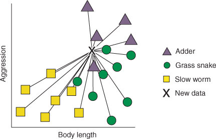

# K-Nächste-Nachbarn


```{r global-knitr-options, include=FALSE}
  knitr::opts_chunk$set(
  fig.pos = 'H',
  fig.asp = 0.618,
  fig.align='center',
  fig.width = 5,
  out.width = "70%",
  fig.cap = "", 
  fig.path = "chunk-img/tidymodels",
  dpi = 300,
  # tidy = TRUE,
  echo = TRUE,
  message = FALSE,
  warning = FALSE,
  cache = FALSE,
  fig.show = "hold")
```

Benötigte R-Pakete für dieses Kapitel:

```{r}
library(tidyverse)
library(tidymodels)
```

```{r echo = FALSE, message=FALSE}
library(gt)
```


## Intuitive Erklärung

*K-Nächste-Nachbarn* (k nearest neighbors, kNN) ist ein einfacher Algorithmus des maschinellen Lernens,
der sowohl für Klassifikation als auch für numerische Vorhersage (Regression) genutzt werden kann.
Wir werden kNN als Beispiel für eine Klassifikation betrachten.


Betrachen wir ein einführendes Beispiel von @rhys, für das es eine [Online-Quelle](https://livebook.manning.com/book/machine-learning-for-mortals-mere-and-otherwise/chapter-3/22) gibt.
Stellen Sie sich vor, wir laufen durch englische Landschaft,
vielleicht die Grafschaft Kent, und sehen ein kleines Tier durch das Gras huschen.
Eine Schlange?!
In England gibt es (laut @rhys) nur eine giftige Schlange,
die Otter (Adder). 
Eine andere Schlange, die *Grass Snake* ist nicht giftig,
und dann kommt noch der *Slow Worm* in Frage,
der gar nicht zur Familie der Schlangen gehört.
Primär interessiert uns die Frage, haben wir jetzt eine Otter gesehen?
Oder was für ein Tier war es?

Zum Glück wissen wir einiges über Schlangen bzw. schlangenähnliche Tiere Englands.
Nämlich können wir die betreffenden Tierarten in Größe und Aggressivität einschätzen,
das ist in Abbildung \@ref(fig:slang) dargestellt.

```{r slang, echo = FALSE, fig.cap = "Haben wir gerade eine Otter gesehen?"}

```

Der Algorithmus von kNN sieht einfach gesagt vor,
dass wir schauen, welcher Tierarten Tiere mit ähnlicher Aggressivität und Größe angehören.
Die Tierart die bei diesen "Nachbarn" hinsichtlich Ähnlichkeit relevanter Merkmale am häufigsten vertreten ist, ordnen wir die bisher unklassifizierte Beobachtung zu.

Etwas zugespitzt:

>   Wenn es quakt wie eine Ente, läuft wie eine Ente und aussieht wie eine Ente, dann ist es eine Ente.


Die Anzahl $k$ der nächsten Nachbarn können wir frei wählen; 
der Wert wird *nicht* vom Algorithmuss bestimmt.
Solche vom Nutzi zu bestimmenden Größen nennt man auch *Tuningparameter*.


## Krebsdiagnostik

Betrachten wir ein Beispiel von @timbers_data_2022,
das [hier](https://datasciencebook.ca/classification.html#classification-with-k-nearest-neighbors) frei eingesehen werden kann.

Die Daten sind so zu beziehen:


```{r}
data_url <- "https://raw.githubusercontent.com/UBC-DSCI/introduction-to-datascience/master/data/wdbc.csv"
cancer <- read_csv(data_url)
```

In diesem Beispiel versuchen wir Tumore der Brust zu klassifizieren,
ob sie einen schweren Verlauf (maligne, engl. malignant) oder einen weniger schweren Verlauf (benigne, engl. benign) erwarten lassen.
Der Datensatz ist [hier](https://datasciencebook.ca/classification.html#describing-the-variables-in-the-cancer-data-set) näher erläutert.


Wie in Abb. \@ref(fig:cancer1) ersichtlich,
steht eine Tumordiagnose (malignant vs. benign) in Abhängigkeit
von Umfang (engl. perimeter) und [Konkavität](https://de.wikipedia.org/wiki/Konvexe_und_konkave_Funktionen),
die "Gekrümmtheit nach innen".

```{r cancer1, fig.cap = "Streudiagramm zur Einschätzung von Tumordiagnosen", echo = FALSE}
perim_concav <- cancer |>
  ggplot(aes(x = Perimeter, y = Concavity, color = Class)) +
  geom_point(alpha = 0.6) +
  labs(x = "Durchmesser (z)", 
       y = "Konkavität (z)",
       color = "Diagnose") +
  scale_color_manual(labels = c("Malign", "Benign"), 
                     values = c("orange2", "steelblue2")) +
  theme(text = element_text(size = 12))
perim_concav
```

Wichtig ist, dass die Merkmale standardisiert sind, also eine identische Skalierung aufweisen,
da sonst das Merkmal mit kleinerer Skala weniger
in die Berechnung der Nähe (bzw. Abstand) eingeht.

Für einen neuen, bisher unklassifizierten Fall suchen nur nun nach einer Diagnose,
also nach der am besten passenden Diagnose (maligne oder benigne),
s. Abb. \@ref(fig:cancer2), wieder aus @timbers_data_2022.
Ihr Quellcode für dieses Diagramm (und das ganze Kapitel) findet sich [hier](https://github.com/UBC-DSCI/introduction-to-datascience/blob/master/classification1.Rmd).

```{r cancer2, fig.cap = "Ein neuer Fall, bisher unklassifiziert", echo = TRUE}
new_point <- c(2, 4)
attrs <- c("Perimeter", "Concavity")

perim_concav_with_new_point <-  bind_rows(cancer, 
                                          tibble(Perimeter = new_point[1], 
                                                 Concavity = new_point[2], 
                                                 Class = "unknown")) |>
  ggplot(aes(x = Perimeter, 
             y = Concavity, 
             color = Class, 
             shape = Class, 
             size = Class)) +
  geom_point(alpha = 0.6) +
  labs(color = "Diagnosis", x = "Durchmesser (z)", 
       y = "Konkavität (z)") +
  scale_color_manual(name = "Diagnose", 
                     labels = c("Benign", "Malign", "Unbekannt"), 
                     values = c("steelblue2", "orange2", "red")) +
  scale_shape_manual(name = "Diagnose", 
                     labels = c("Benign", "Malign", "Unbekannt"),
                     values= c(16, 16, 18))+ 
  scale_size_manual(name = "Diagnose", 
                    labels = c("Benign", "Malign", "Unbekannt"),
                    values= c(2, 2, 2.5))
perim_concav_with_new_point
```

Wir können zunächst den (im euklidischen Koordinatensystem) nächst gelegenen Fall (der "nächste Nachbar") betrachten,
und vereinbaren, 
dass wir dessen Klasse als Schätzwert für den unklassiffizierten Fall übernehmen,
s. Abb. \@ref(fig:cancer3).


```{r cancer3, fig.cap = "Ein nächster Nachbar", echo = FALSE}
source("children/cancer3.R")
```


Betrachten wir einen anderen zu klassifizierenden Fall, s. Abb \@ref(fig:cancer4).
Ob hier die Klassifikation von "benign" korrekt ist?
Womöglich nicht, denn viele andere Nachbarn, 
die etwas weiter weg gelegen sind, gehören zur anderen Diagnose, malign.


```{r cancer4, fig.cap = "Trügt der nächste Nachbar?", echo = FALSE}
knitr::include_graphics("https://datasciencebook.ca/_main_files/figure-html/05-knn-4-1.png")
```

Um die Vorhersage zu verbessern,
können wir nicht nur den nächst gelegenen Nachbarn betrachten,
sondern die $k$ nächst gelegenen, z.B. $k=3$, s. Abb \@ref(fig:cancer5).


```{r cancer5, fig.cap = "kNN mit k=3", echo = FALSE}
knitr::include_graphics("https://datasciencebook.ca/_main_files/figure-html/05-knn-5-1.png")
```


Die Entscheidungsregel ist dann einfach eine Mehrheitsentscheidung:
Wir klassifizieren den neuen Fall entsprechend der Mehrheit in den $k$ nächst gelegenen Nachbarn.


## Berechnung der Nähe


Es gibt verschiedenen Algorithmen,
um die Nähe bzw. Distanz der Nachbarn zum zu klassifizieren Fall zu berechnen.

Eine gebräuchliche Methode ist der *euklidische* Abstand,
der mit Pythagoras berechnet werden kann, s. Abb. \@ref(fig:pyth1) aus @modar.


```{r pyth1, echo = FALSE, fig.cap = "Euklidischer Abstand wird mit der Regel von Pythagoras berechnet"}
knitr::include_graphics("/Users/sebastiansaueruser/Google Drive/research/Publikationen/In_Arbeit/Statistik__21/images/cluster/distanz_crop.png")
```

Wie war das noch mal?

$$c^2 = a^2 + b^2$$

Im Beispiel oben also:

$c^2 = 3^2 + 4^2 = 5^2$

Damit gilt: $c = \sqrt{c^2} = \sqrt{5^2}=5$.


Im 2D-Raum ist das so einfach, dass man das (fat) mit bloßem Augenschein entscheiden kann.
In mehr als 2 Dimensionen wird es aber schwierig für das Auge, wie ein [Beispiel](https://datasciencebook.ca/classification.html#more-than-two-explanatory-variables) aus @timbers_data_2022 zeigt.


Allerdings kann man den guten alten Pythagoras auch auf Dreiecke mit mehr als zwei Dimensionen anwenden, s. Abb. \@ref(fig:pyth2) aus @modar, Kap. 21.1.2.


```{r pyth2, echo = FALSE, fig.cap = "Pythagoras aufgebohrt"}
knitr::include_graphics("/Users/sebastiansaueruser/Google Drive/research/Publikationen/In_Arbeit/Statistik__21/images/cluster/pythagoras_crop.png")
```

Bleiben wir beim Beispiel von Anna und Berta und nehmen wir eine dritte Variable 
hinzu (Statistikliebe). 
Sagen wir, der Unterschied in dieser dritten Variable zwischen Anna und Berta betrage 2.

Es gilt:

$$
\begin{aligned}
e^2 &= c^2 + d^2 \\
e^2 &= 5^2 + 2^2 \\
e^2 &= 25 + 4\\
e &= \sqrt{29} \approx 5.4
\end{aligned}
$$


## kNN mit Tidymodels


### Analog zu Timbers et al.

Eine Anwendung von kNN mit Tidymodels ist in @timbers_data_2022, Kap. 5.6, [hier](https://datasciencebook.ca/classification.html#k-nearest-neighbors-with-tidymodels) beschrieben.


Die Daten aus @timbers_data_2022 finden sich [in diesem Github-Repo](https://github.com/UBC-DSCI/introduction-to-datascience/tree/master/data)-

Die (z-transformierten) Daten zur Tumorklassifikation können [hier](https://raw.githubusercontent.com/UBC-DSCI/data-science-a-first-intro-worksheets/main/worksheet_classification1/data/clean-wdbc-data.csv) bezogen werden.


```{r}
data_url <- "https://raw.githubusercontent.com/UBC-DSCI/introduction-to-datascience/master/data/wdbc.csv"
cancer <- read_csv(data_url)
```

@timbers_data_2022 verwenden in Kap. 5 auch noch nicht standardisierte Daten, `unscales_wdbc.csv`, die [hier](https://raw.githubusercontent.com/UBC-DSCI/introduction-to-datascience/master/data/unscaled_wdbc.csv) als CSV-Datei heruntergeladen werden können.


```{r}
cancer_unscales_path <- "https://raw.githubusercontent.com/UBC-DSCI/introduction-to-datascience/master/data/unscaled_wdbc.csv"

unscaled_cancer <- read_csv(cancer_unscales_path) |>
  mutate(Class = as_factor(Class)) |>
  select(Class, Area, Smoothness)
unscaled_cancer
```

### Rezept definieren

```{r}
uc_recipe <- recipe(Class ~ ., data = unscaled_cancer)
print(uc_recipe)
```

Und jetzt die z-Transformation:


```{r}
uc_recipe <- 
  uc_recipe |>
  step_scale(all_predictors()) |>
  step_center(all_predictors())
```


Die Schritte `prep()` und `bake()` sparen wir uns, da `fit()` und `predict()` 
das für uns besorgen.

### Modell definieren


```{r}
knn_spec <- nearest_neighbor(weight_func = "rectangular", neighbors = 5) |>
  set_engine("kknn") |>
  set_mode("classification")
knn_spec
```

### Workflow definieren

```{r}
knn_fit <- workflow() |>
  add_recipe(uc_recipe) |>
  add_model(knn_spec) |>
  fit(data = unscaled_cancer)

knn_fit
```

### Vorhersagen


```{r}
new_observation <- tibble(Area = c(500, 1500), Smoothness = c(0.075, 0.1))
prediction <- predict(knn_fit, new_observation)

prediction
```


## Mit Train-Test-Aufteilung

Im Kapitel 5 greifen @timbers_data_2022 die Aufteilung in Train- vs. Test-Sample noch nicht auf (aber in Kapitel 6).

Da in diesem Kurs diese Aufteilung aber schon besprochen wurde,
soll dies hier auch dargestellt werden.

```{r}
cancer_split <- initial_split(cancer, prop = 0.75, strata = Class)
cancer_train <- training(cancer_split)
cancer_test <- testing(cancer_split) 
```


### Rezept definieren

```{r}
cancer_recipe <- recipe(Class ~ Smoothness + Concavity, data = cancer_train) |>
  step_scale(all_predictors()) |>
  step_center(all_predictors())
```


### Modell definieren


```{r}
knn_spec <- nearest_neighbor(weight_func = "rectangular", neighbors = 3) |>
  set_engine("kknn") |>
  set_mode("classification")
```


### Workflow definieren


```{r}
knn_fit <- workflow() |>
  add_recipe(cancer_recipe) |>
  add_model(knn_spec) |>
  fit(data = cancer_train)

knn_fit
```


### Vorhersagen

Im Gegensatz zu @timbers_data_2022 verwenden wir hier `last_fit()` und `collect_metrics()`,
da wir dies  bereits eingeführt haben und künftig darauf aufbauen werden.


```{r}
cancer_test_fit <- last_fit(knn_fit, cancer_split)

cancer_test_fit
```


### Modellgüte

```{r}
cancer_test_fit %>% collect_metrics()
```

Die eigentlichen Predictions stecken in der Listenspalte `.predictions` im Fit-Objekt:

```{r}
names(cancer_test_fit)
```

Genau genommen ist `.predictions` eine Spalte, in der in jeder Zeile (und damit Zelle) eine Tabelle (Tibble) steht. 
Wir haben nur eine Zeile und wollen das erste Element dieser Spalte herausziehen.
Da hilft `pluck()`:

```{r comp-conf}
cancer_test_predictions <- 
cancer_test_fit %>% 
  pluck(".predictions", 1)

confusion <- cancer_test_predictions |>
             conf_mat(truth = Class, estimate = .pred_class)

confusion
```


### Visualisierung


```{r}
autoplot(confusion, type = "mosaic")
autoplot(confusion, type = "heatmap") +
  labs(x = "Beobachtung",
       y = "Vorhersage",
       title = "Konfusionsmatrix")
```


## Kennzahlen der Klassifikation


In @modar, Kap. 19.6, findet sich einige Erklärung zu Kennzahlen der Klassifikationsgüte.

Ein Test kann vier verschiedenen Ergebnisse haben:

```{r class-stats, echo = FALSE}
df <- readr::read_csv("children/class_results.csv")

gt::gt(df,
  caption = "Vier Arten von Ergebnissen von Klassifikationen")
```


Es gibt eine verwirrende Vielfalt von Kennzahlen,
um die Güte einer Klassifikation einzuschätzen.
Hier sind einige davon:


```{r diag-stats, echo = FALSE}

df <- readr::read_csv("children/diag_stats.csv")

gt::gt(df) %>% 
  tab_header(title = "Geläufige Kennwerte der Klassifikation.",
    subtitle = "F: Falsch. R: Richtig. P: Positiv. N: Negativ")
```


## Krebstest-Beispiel

Betrachten wir Daten eines fiktiven Krebstest, aber realistischen
Daten.

```{r echo = FALSE, message=FALSE}
krebstest <- read_csv("data/krebstest.csv")

library(vtree)
library(magick)
# krebstest_vtree <- vtree(krebstest, "Krebs Test")
# vtree_png <- grVizToPNG(krebstest_vtree, width = 500,
#                         folder = "img")
krebstest_img <- image_read(paste0("img/krebstest_vtree.png"))
print(krebstest_img)
```

Wie gut ist dieser Test?
Berechnen wir einige Kennzahlen.

Da die Funktionen zur Klassifikation stets einen Faktor wollen,
wandeln wir die relevanten Spalten zuerst in einen Faktor um (aktuell sind es numerische Spalten).


```{r}
krebstest <-
  krebstest  %>% 
  mutate(Krebs = factor(Krebs),
         Test = factor(Test))
```

Gesamtgenauigkeit:


```{r}
accuracy(krebstest, truth = Krebs, estimate = Test)
```


Sensitivität:

```{r}
sens(krebstest, truth = Krebs, estimate = Test)
```

Spezifität:

```{r}
spec(krebstest, truth = Krebs, estimate = Test)
```

Kappa:

```{r}
kap(krebstest, truth = Krebs, estimate = Test)
```

Positiver Vorhersagewert:

```{r}
ppv(krebstest, truth = Krebs, estimate = Test)
```

Negativer Vorhersagewert:

```{r}
npv(krebstest, truth = Krebs, estimate = Test)
```

Während Sensitivität und Spezitivität sehr hoch sind,
ist die der negative Vorhersagewert sehr gering:

Wenn man einen positiven Test erhält, ist die 
Wahrscheinlichkeit, in Wahrheit krank zu sein gering, zum Glück!
