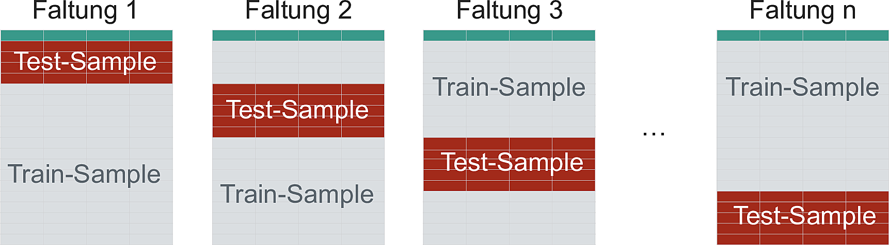

# Statistisches Lernen, 2 


```{r global-knitr-options, include=FALSE}
  knitr::opts_chunk$set(
  fig.pos = 'H',
  fig.asp = 0.618,
  fig.align='center',
  fig.width = 5,
  out.width = "100%",
  fig.cap = "", 
  dpi = 300,
  # tidy = TRUE,
  echo = TRUE,
  message = FALSE,
  warning = FALSE,
  cache = FALSE,
  fig.show = "hold")
```


Benötigte R-Pakete:

```{r}
library(tidyverse)
library(tidymodels)
library(tune)
library(AmesHousing)
```


Das Paket `tune` auf CRAN hat einen Bug^[https://community.rstudio.com/t/trouble-using-extract-parameter-set-dials-in-tidy-models-with-r/131178],
daher empfiehlt der Autor, Max Kuhn, die Version des Pakets von Github zu installieren:

```{r eval = FALSE, echo = TRUE}
devtools::install_github("tidymodels/tune")
```


## Resampling


Vergleichen Sie die drei Fälle, die sich in der Nutzung von Train- und Test-Sample unterscheiden:

1. Wir fitten ein Klassifikationsmodell in einer Stichprobe, sagen die Y-Werte dieser Stichprobe "vorher". Wir finden eine Gesamtgenauigkeit von 80%.
2. Wir fitten ein Klassifikationsmodell in einem Teil der ursprünglichen Stichprobe (Train-Sample) und sagen Y-die Werte im verbleibenden Teil der ursprünglichen Stichprobe vorher (Test-Sample). Wir finden eine Gesamtgenauigkeit von 70%.
3. Wir wiederholen Fall 2 noch drei Mal mit jeweils anderer Zuweisung der Fälle zum Train- bzw. zum Test-Sample. Wir finden insgesamt folgende Werte an Gesamtgenauigkeit: 70%, 70%, 65%, 75%.


Welchen der drei Fälle finden Sie am sinnvollsten? Warum?


## Illustration des Resampling

*Resampling* stellt einen Oberbegriff dar; *Kreuzvalidierung* ist ein Unterbegriff dazu.
Es gibt noch andere Arten des Resampling, etwa *Bootstrapping* oder *Leave-One-Out-Cross-Validation* (LOOCV).

Im Folgenden ist nur die Kreuzvalidierung dargestellt,
da es eines der wichtigsten und vielleicht das Wichtigste ist.
In vielen Quellen finden sich Erläuterungen anderer Verfahren dargestellt,
etwa in @silge_tidy_2022, @islr oder @rhys.


### Einfache v-fache Kreuzvalidierung

Abb. \@ref(fig:resampling) illustriert die zufällige Aufteilung von $n=10$ Fällen der Originalstrichprobe auf eine Train- bzw. Test-Stichpobe. 
Man spricht von *Kreuzvalidierung* (cross validation, CV).

In diesem Fall wurden 70% der ($n=10$) Fälle der Train-Stichprobe zugewiesen (der Rest der Test-Stichprobe);
ein willkürlicher, aber nicht unüblicher Anteil.
Diese Aufteilung wurde $v=3$ Mal vorgenommen,
es resultieren drei "Resampling-Stichproben", die
manchmal auch als "Faltungen" bezeichnet werden.


```{r resampling, fig.cap = "Resampling: Eine Stichprobe wird mehrfach (hier 3 Mal) zu 70% in ein Train- und zu 30% in die Test-Stichprobe aufgeteilt", echo = FALSE, messagen = FALSE, out.width="100%"}
source("children/resampling-plot.R")
illustrate_resampling()
```


@modar stellt das Resampling so dar (S. 259), s. Abb. \@ref(fig:cvmodar).

```{r cvmodar, echo = FALSE, fig.cap = "Kreuzvalidierung, Aufteilung in Train- vs. Testsample"}

```


Der Gesamtfehler der Vorhersage wird als Mittelwerte der Vorhersagefehler in den einzelnen Faltungen berechnet.

Warum ist die Vorhersage besser,
wenn man mehrere Faltungen, mehrere Schätzungen für $y$ also, vornimmt?

Der Grund ist das Gesetz der großen Zahl,
nachdem sich eine Schätzung in Mittelwert und Variabilität stabilisiert mit steigendem
Stichprobenumfang,
dem wahren Mittelwert also präziser schätzt.
Bei Normalverteilungen klappt das gut,
bei randlastigen Verteilungen leider nicht mehr [@fattails].


Häufig werden $v=10$ Faltungen verwendet,
was sich empirisch als guter Kompromiss von Rechenaufwand und Fehlerreduktion herausgestellt hat.


### Wiederholte Kreuzvalidierung


Die $r$-fach wiederholte Kreuzvalidierung wiederholte die einfache Kreuzvalidierung mehrfach (nämlich $r=4$ mal),
@modar stellt das Resampling so dar (S. 259), s. Abb. \@ref(fig:cvrep).


```{r cvrep, echo = FALSE, fig.cap = "Wiederholte Kreuzvalidierung"}
knitr::include_graphics("img/crossval_repeated.png")
```

Die wiederholte Kreuzvalidierung reduziert den Standardfehler der Vorhersagen.

@silge_tidy_2022 zeigen die Verringerung des Schätzfehlers als Funktion der $r$ Wiederholungen dar,
s. Abb. \@ref(fig:repcvred).


```{r repcvred, echo = FALSE, fig.cap = "Reduktion des Schätzfehlers als Funktion der r Wiederhoulugen der Kreuzvalidierung"}
knitr::include_graphics("https://www.tmwr.org/figures/variance-reduction-1.png")
```


Warum ist die Wiederholung der Kreuzvalidierung nützlich?

Die Kreuvalidierung liefert einen Schätzwert der Modellparameter,
die wahren Modellparameter werden also anhand einer Stichprobe von $n=1$ geschätzt.
Mit höherem Stichprobenumfang kann diese Schätzung natürlich präzisiert werden.

Da jede Stichprobenverteilung bei $n \rightarrow \infty$ normalverteilt ist - 
ein zentrales Theorem der Statistik, der *Zentrale Grenzwertsatz* (Central Limit Theorem) - 
kann man hoffen, dass sich eine bestimmte Stichprobenverteilung bei kleinerem $n$ ebenfalls annähernd
normalverteilt^[Das klappt bei randlastigen Verteilungen nicht]. 
Dann sind die Quantile bekannt und man kann die Streuung der Schätzers, 
${\sigma }_{\bar {x}}$, z.B. für den Mittelwert,
einfach schätzen:

$${\displaystyle {\sigma }_{\bar {x}}\ ={\frac {\sigma }{\sqrt {n}}}}$$


### Resampling passiert im Train-Sample

Wichtig zu beachten ist, dass
die Resampling nur im Train-Sample stattfindet.
Das Test-Sample bleibt unangerührt.
Dieser Sachverhalt ist in Abb. \@ref(fig:initialsplit), aus @silge_tidy_2022, illustriert.


```{r initialsplit, echo = FALSE, fig.cap = "Resampling im Train-, nicht im Test-Sample"}
knitr::include_graphics("https://www.tmwr.org/premade/resampling.svg")
```


Wie in Abb. \@ref(fig:initialsplit) dargestellt,
wird das Modell im *Analyse-Sample* berechnet (gefittet),
und im *Assessment-Sample* auf Modellgüte hin überprüft.

Die letztliche Modellgüte ist dann die Zusammenfassung (Mittelwert) der einzelnen Resamples.


### Andere Illustrationen


Es gibt eine Reihe vergleichbarer Illustrationen in anderen Büchern:

- [Timbers, Campbell & Lee, 2022, Kap. 6](https://datasciencebook.ca/img/cv.png)
- [Silge & Kuhn, 2022, Abb. 10.1](https://datasciencebook.ca/img/cv.png)
- [Silge & Kuhn, 2022, Abb. 10.2](https://www.tmwr.org/premade/three-CV.svg)
- [Silge & Kuhn, 2022, Abb. 10.3](https://www.tmwr.org/premade/three-CV-iter.svg)
- James, Witten, hastie & Tishirani, 2021, Abb. 5.3


## Gesetz der großen Zahl

Nach dem *Gesetz der großen Zahl* (Law of Large Numbers) sollte sich der Mittelwert einer großen Stichprobe 
dem theoretischen Mittelwert der zugrundeliegenden Verteilung (Population, datengeneriender Prozess) 
sehr nahe kommen.

$$\displaystyle \lim _{n\to \infty }\sum _{i=1}^{n}{\frac {X_{i}}{n}}={\overline {X}}$$

David Salazar visualisiert das folgendermaßen in [diesem Post](https://david-salazar.github.io/2020/04/17/fat-vs-thin-does-lln-work/) seines lesenswerten [Blogs](https://david-salazar.github.io/), s. Abb. \@ref(fig:lln).

```{r  lln, echo = TRUE, fig.cap = "Gesetz der großen Zahl", fig.width=7}
# source: https://david-salazar.github.io/2020/04/17/fat-vs-thin-does-lln-work/
samples <- 1000

thin <- rnorm(samples, sd = 20)

cumulative_mean <- function(numbers) {
    x <- seq(1, length(numbers))
    cum_mean <- cumsum(numbers)/x 
    cum_mean
}

thin_cum_mean <- cumulative_mean(thin)

thin_cum_mean %>%
  tibble(running_mean = .) %>% 
  add_rownames(var = 'number_samples') %>% 
  mutate(number_samples = as.double(number_samples)) %>% 
  arrange(number_samples) %>% 
  ggplot(aes(x = number_samples, y = running_mean)) +
    geom_line(color = 'dodgerblue4') +
    geom_hline(yintercept = 0, linetype = 2, color = 'red') +
  hrbrthemes::theme_ipsum_rc(grid = 'Y') +
  scale_x_continuous(labels = scales::comma) +
  labs(x = "Stichprobengröße",
       title = "Gesetz der großen Zahl", 
       subtitle = "Kumulierter Mittelwert aus einer Normalverteilung mit sd=20")
```

Wie man sieht, nähert sich der empirische Mittelwert (also in der Stichprobe)
immer mehr dem theoretischen Mittelwert, 0, an.

Achtung: Bei randlastigen Verteilungen darf man dieses schöne, wohlerzogene Verhalten nicht erwarten [@fattails].


## Über- und Unteranpassung an einem Beispiel


```{r overfitting-prep-4-plots, echo = FALSE, include = FALSE, fig.height = 3, fig.width = 3}
x <- seq(from = 1, to = 10, by = 1)
y <- sin(x) + rnorm(n = length(x), mean = 0, sd = .3)

daten <- tibble(x, y)

p0 <-
  ggplot(daten) +
  aes(x = x, y = y) +
  coord_fixed(ratio = 5/1) +
  scale_x_continuous(name = NULL, breaks = NULL) +
  scale_y_continuous(name = NULL, breaks = NULL)

p0 +
  stat_function(n = 99, fun = sin) +
  labs(title = "A") -> p1

p0 + 
  geom_point() +
  ggtitle("B") -> p2

p0 + 
  geom_point() +
  geom_smooth(method = "lm", se = FALSE, color = "grey80") +
  ggtitle("C") -> p3

p0 + 
  geom_point() +
  geom_smooth(method = "lm", formula = y~poly(x, 9), color = "blue") +
  ggtitle("D") -> p4

p0 +
  geom_point() +
  stat_function(n = 99, fun = sin, color = "grey50") +
  ggtitle("E") -> p5
```


```{r overfitting-4-plots, echo = FALSE, fig.cap = "Welches Modell (Teile C-E) passt am besten zu den Daten (Teil B)? Die 'wahre Funktion', der datengenerierende Prozess ist im Teil A dargestellt", out.width = "100%"}
library(patchwork)
p1 + p2 + p3 + p4 + p5 + plot_layout(ncol = 5, widths = c(1,1,1,1,1))

```

Abb. \@ref(fig:overfitting-4-plots) zeigt:

- Teil *A*: Die 'wahre Funktion', $f$, die die Daten  erzeugt. Man spricht auch von der "datengenerierenden Funktion". Wir gehen gemeinhin davon aus, dass es eine wahre Funktion gibt. Das heißt nicht, dass die wahre Funktion die Daten perfekt erklärt, schließlich kann die Funktion zwar wahr, aber unvollständig sein oder unsere Messinstrumente sind nicht perfekt präzise.
- Teil *B:* Die Daten, erzeugt aus A plus etwas zufälliges Fehler (Rauschen).
- Teil *C*: Ein zu einfaches Modell: Unteranpassung. Vorhersagen in einer neuen Stichprobe (basierend auf dem datengenerierenden Prozess aus A) werden nicht so gut sein.
- Teil *D*: Ein zu komplexes Modell: Überanpassung.  Vorhersagen in einer neuen Stichprobe (basierend auf dem datengenerierenden Prozess aus A) werden nicht so gut sein.
- Teil *E*: Ein Modell mittlerer Komplexität. Keine Überanpassung, keine Unteranpassung. Vorhersagen in einer neuen Stichprobe (basierend auf dem datengenerierenden Prozess aus A) werden gut sein.


## Tuning

### Grid Search vs. Iterative Search


Im K-Nächste-Nachbarn-Modell ist der vorhergesagt Wert, $\hat{y}$ für eine neue Beobachtung $x_0$ wie folgt definiert:

$$
\hat y = \frac{1}{K}\sum_{\ell = 1}^K x_\ell^*,
$$

wobei $K$ die Anzahl der zu berücksichtigen nächsten Nachbarn darstellt und $x_\ell^*$ die Werte dieser berücksichtiggten Nachbarn.

Die Wahl von $K$ hat einen gewaltigen Einfluss auf die Vorhersagen und damit auf die Vorhersagegüte.
Allerdings wird $K$ nicht vom Modell geschätzt.
Es liegt an den Nutzi,
diesen Wert zu wählen.

Parameter dieser Art (die von den Nutzi zu bestimmen sind, nicht vom Algorithmus),
nennt man *Tuningparameter*.


Abbildung \@ref(fig:nnoverfit) aus @silge_tidy_2022 stellt exemplarisch dar,
welchen großen Einfluss die Wahl des Werts eines Tuningparameters auf die 
Vorhersagen eines Modells haben.


```{r nnoverfit, echo = FALSE, fig.cap = "Overfitting als Funktion der Modellparameter und insofern als Problem de Wahl der Tuningparameter"}
knitr::include_graphics("https://www.tmwr.org/figures/two-class-boundaries-1.png")
```


Aber wie wählt man "gute" Werte der Tuningparater?
Zwei Ansätze, grob gesprochen, bieten sich an.

1. *Grid Search:* Probiere viele Werte aus und schaue, welcher der beste ist. Dabei musst du hoffen, dass du die Werte erwischt, die nicht nur im Train-, sondern auch im Test-Sample gut funktionieren werden.

2. *Iterative Search:* Wenn du einen Wert eines Tuningparameters hast, nutze diesen, um intelligenter einen neuen Wert eines Tuningparameters zu finden.


Der Unterschied beider Ansätze ist in @silge_tidy_2022 wie in Abb. \@ref(fig:tuning1) dargestellt.


```{r tuning1, echo=FALSE, fig.cap = "Links: Grid Search. Rechts: Iterative Search2"}
knitr::include_graphics("https://www.tmwr.org/figures/tuning-strategies-1.png")
```


In `tidymodels` kann man mit `tune()` angeben, dass man einen bestimmten Parameter tunen möchte. 
`tidymodels` führt das dann ohne weiteres Federlesens für uns durch.


## Tuning mit Tidymodels

### Tuning definieren mit tidymodels für kNN


#### Datensatz aufteilen


```{r ames-split}
ames <- make_ames()

set.seed(4595)
data_split <- initial_split(ames, strata = "Sale_Price")

ames_train <- training(data_split)
ames_test <- testing(data_split)

set.seed(2453)
rs_splits <- vfold_cv(ames_train, strata = "Sale_Price")
```


#### Rezept, Modell und Workflow definieren

```{r ames-wf}
ames_rec <-
  recipe(Sale_Price ~ ., data = ames_train) %>%
  step_log(Sale_Price, base = 10) %>%
  step_other(Neighborhood, threshold = .1)  %>%
  step_dummy(all_nominal()) %>%
  step_zv(all_predictors()) 

knn_model <-
  nearest_neighbor(
    mode = "regression",
    neighbors = tune("K")
  ) %>%
  set_engine("kknn")

ames_wflow <-
  workflow() %>%
  add_recipe(ames_rec) %>%
  add_model(knn_model)
```

Das kNN-Modell ist noch nicht berechnet,
es ist nur ein "Rezept" erstellt:

```{r}
knn_model
```

```{r}
ames_wflow
```

#### Tuningparameter betrachten


Möchte man wissen, 
welche und wie viele Tuningparameter tidymodels in einem Modell berücksichtigt,
kann man `extract_parameter_set_dials()` aufrufen:

```{r}
extract_parameter_set_dials(ames_wflow)
```

Die Ausgabe informiert uns,
dass es nur einen Tuningparameter gibt in diesem Modell und
dass der Name (Label, ID) des Tuningparameters "K" ist.
Außerdem sollen die Anzahl der Nachbarn getunt werden.
Der Tuningparameter ist numerisch; das sieht man an `nparam[+]`.


Schauen wir uns mal an,
auf welchen Wertebereich `tidymodels` den Parameter $K$ begrenzt hat:


```{r}
ames_wflow %>% 
  extract_parameter_dials("K")
```


Wir können auch Einfluss nehmen und angeben,
dass die Grenzen des Wertebereichs zwischen 1 und 50 liegen soll 
(für den Tuningparameter `neighbors`):

```{r ames-update}
ames_set <-
  extract_parameter_set_dials(ames_wflow) %>%
  update(K = neighbors(c(1, 50)))

ames_set
```


### Datenabhängige Tuningparameter

Manche Tuningparameter kann man nur bestimmen,
wenn man den Datensatz kennt.
So ist die Anzahl der Prädiktoren, `mtry` in einem Random-Forest-Modell 
sinnvollerweise als Funktion der Prädiktorenzahl zu wählen.
Der Workflow kennt aber den Datensatz nicht.
Daher muss der Workflow noch "finalisiert" oder "aktualisiert" werden,
um den Wertebereich (Unter- und Obergrenze) eines Tuningparameters zu bestimmen.


Wenn wir im Rezept aber z.B. die Anzahl der Prädiktoren verändert haben,
möchten wir die Grenzen des Wertebereichs für `mtry` (oder andere Tuningparameter) vielleicht nicht händisch, "hartverdrahtet" selber bestimmen,
sondern lieber den Computer anweisen, und sinngemäß sagen:
"Warte mal mit der Bestimmung der Werte der Tuningparameter,
bis du den Datensatz bzw. dessen Dimensionen kennst. Merk dir, 
dass du, wenn du den Datensatz kennst, die Werte des Tuningparameter noch ändern musst. Und tu das dann auch." Dazu später mehr.


```{r ames-finalize}
ames_set <-
  workflow() %>% 
  add_model(knn_model) %>% 
  add_recipe(ames_rec) %>% 
  extract_parameter_set_dials() %>% 
  finalize(ames_train)
```


### Modelle mit Tuning berechnen

Nachdem wir die Tuningwerte bestimmt haben, 
können wir jetzt das Modell berechnen:
Für jeden Wert des Tuningparameters wird ein Modell berechnet:

```{r ames-tune-grid, cache = TRUE}
ames_grid_search <-
  tune_grid(
    ames_wflow,
    resamples = rs_splits
  )

ames_grid_search
```

Im Default berechnet `tiymodels` 10 Kandidatenmodelle.

Die Spalte `.metrics` beinhaltet die Modellgüte für jedes Kandidatenmodell.

```{r}
ames_grid_search %>% 
  collect_metrics()
```

Das können wir uns einfach visualisieren lassen:

```{r}
autoplot(ames_grid_search)
```


Auf Basis dieser Ergebnisse könnte es Sinn machen, 
noch größere Werte für $K$ zu überprüfen.

### Vorhersage im Test-Sample

Welches Modellkandidat war jetzt am besten?

```{r}
show_best(ames_grid_search)
```


Wählen wir jetzt mal das beste Modell aus (im Sinne des Optimierungskriteriusms):

```{r}
select_best(ames_grid_search)
```

Ok,
notieren wir uns die Kombination der Tuningparameterwerte 
im besten Kandiatenmodell.
In diesem Fall hat das Modull nur einen Tuningparameter:

```{r}
ames_knn_best_params <-
  tibble(K = 15)
```

Unser Workflow weiß noch nicht,
welche Tuningparameterwerte am besten sind:

```{r}
ames_wflow
```

`neighbors = tune("K")` sagt uns,
dass er diesen Parameter tunen will.
Das haben wir jetzt ja erledigt.
Wir wollen für das Test-Sample nur noch einen Wert,
eben aus dem besten Kandidatenmodell, 
verwenden:


```{r ames-finalize-wf}
ames_final_wflow <-
  ames_wflow %>% 
  finalize_workflow(ames_knn_best_params)

ames_final_wflow
```

Wie man sieht,
steht im Workflow nichts mehr von Tuningparameter.

Wir können jetzt das *ganze Train-Sample* fitten,
also das Modell auf das ganze Train-Sample anwenden -
nicht nur auf ein Analysis-Sample.
Und mit den dann resultierenden Modellkoeffizienten sagen
wir das TestSample vorher:


```{r ames-last-fit}
final_ames_knn_fit <-
  last_fit(ames_final_wflow, data_split)

final_ames_knn_fit
```

Holen wir uns die Modellgüte:

```{r}
collect_metrics(final_ames_knn_fit)
```


<!-- ### Vorhersage von Hand -->

<!-- Natürlich könnten wir auch "von Hand" vorhersagen: -->


<!-- ```{r ames-fit-von-hand} -->
<!-- final_ames_knn_fit <- -->
<!--   ames_final_wflow %>%  -->
<!--   fit(ames_train) -->
<!-- ``` -->

<!-- Man beachte, -->
<!-- dass die Vorhersagegüte für das Train-Sample überoptimistisch ist. -->

<!-- Und jetzt sagen wir auf dieser Basis das Test-Sample vorher: -->

<!-- ```{r error = TRUE} -->
<!-- ames_pred <- -->
<!--   predict(final_ames_knn_fit, new_data = ames_test) -->
<!-- ``` -->

<!-- Oh Nein! Es geht nicht, woran liegt das wohl? -->

<!-- Wir müssen noch die Transformationen des Rezept auf das Test-Sample anwenden.  -->
<!-- Puh, ganz schön unkomfortabel. -->

<!-- Es ist nicht empfehlenswert, den folgenden Weg einzuschlagen, -->
<!-- viel einfacher ist es, mit `last_fit()` seine Ergebnisse zu bekommen. -->
<!-- Aber sei's drum, jetzt ziehen wir das halt mal durch. -->


<!-- Zuerst berechnen wir die Werte des *Rezepts*, z.B. -->
<!-- die MW- und SD-Werte für z-Transformationen oder die Anzahl -->
<!-- der Prädiktoren im Datensatz. -->

<!-- ```{r ames-prep} -->
<!-- ames_prep <- -->
<!--   prep(ames_rec, training = ames_train) -->

<!-- ames_prep -->
<!-- ``` -->
<!-- Mit `prep()` haben wir *nur* das Rezept berechnet, -->
<!-- noch kein Modell auf einen Datensatz gefittet! -->

<!-- Alternativ könnten wir uns das trainierte Rezept auch so holen: -->

<!-- ```{r} -->
<!-- extract_recipe(final_ames_knn_fit) -->
<!-- ``` -->


<!-- Jetzt wenden wir das Rezept auf den Test-Datensatz an: -->

<!-- ```{r ames-bake} -->
<!-- ames_test_baked <-  -->
<!--   bake(ames_prep, new_data = ames_test) -->
<!-- ``` -->

<!-- Das Ergebnis ist jetzt der "gebackene" Datensatz `ames_test_baked`, -->
<!-- in dem jetzt die Transformationen des Test-Samples angewendet sind. -->

<!-- Damit können wir jetzt die Vorhersagen im Test-Sample durchführen. -->


<!-- ```{r ames-pred-final-von-hand, error = TRUE} -->
<!-- ames_pred <- -->
<!--   predict(final_ames_knn_fit, new_data = ames_test) -->
<!-- ``` -->

<!-- Und damit haben wir unsere Modellgüte für das Test-Sample. -->

