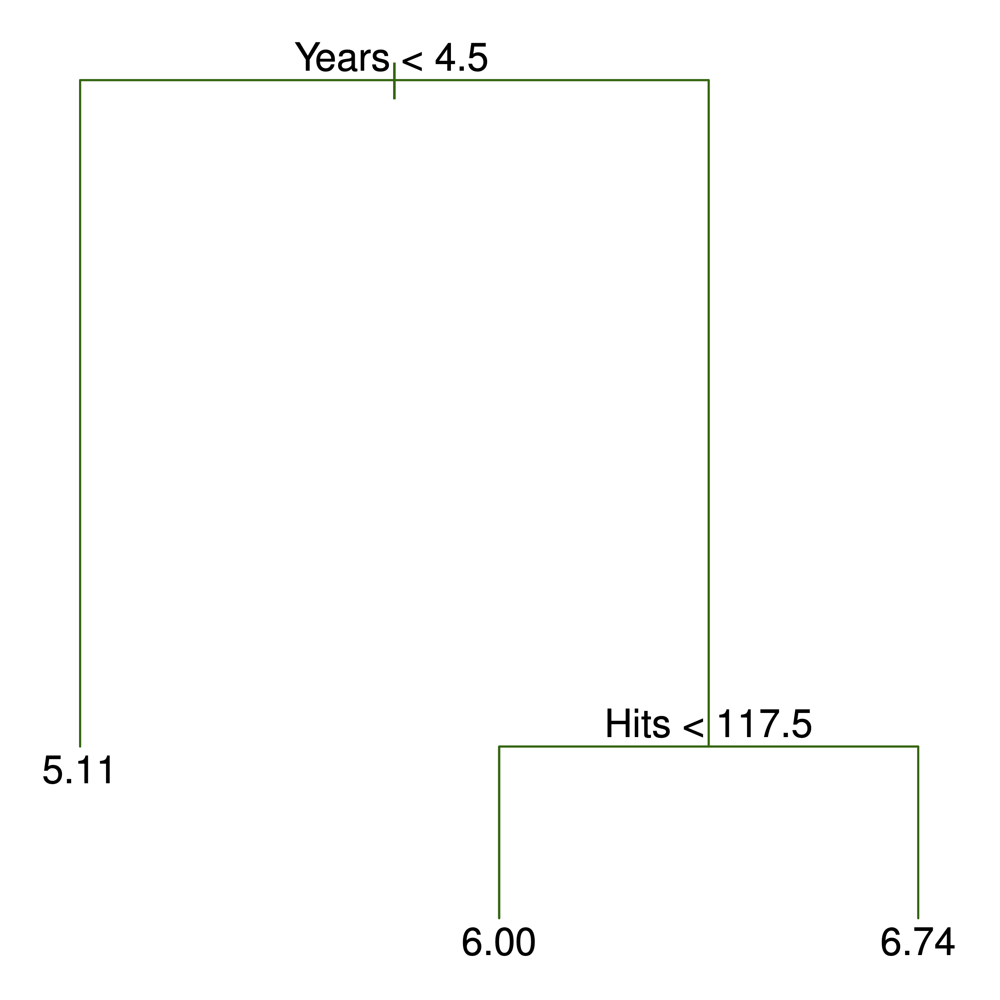
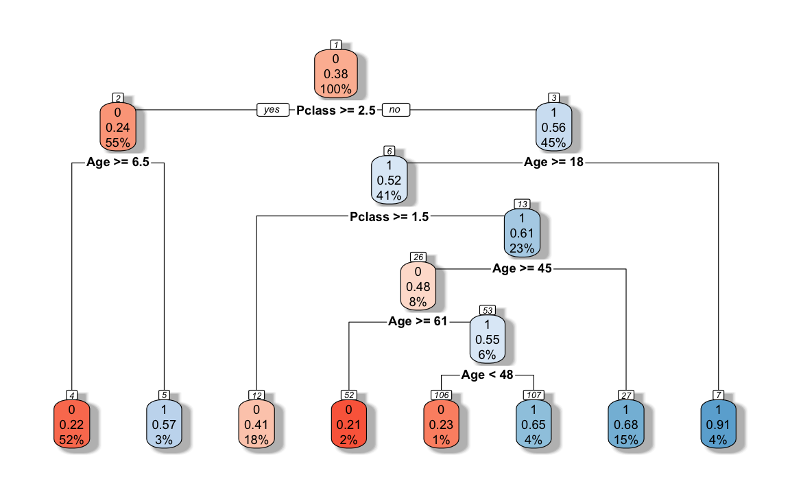
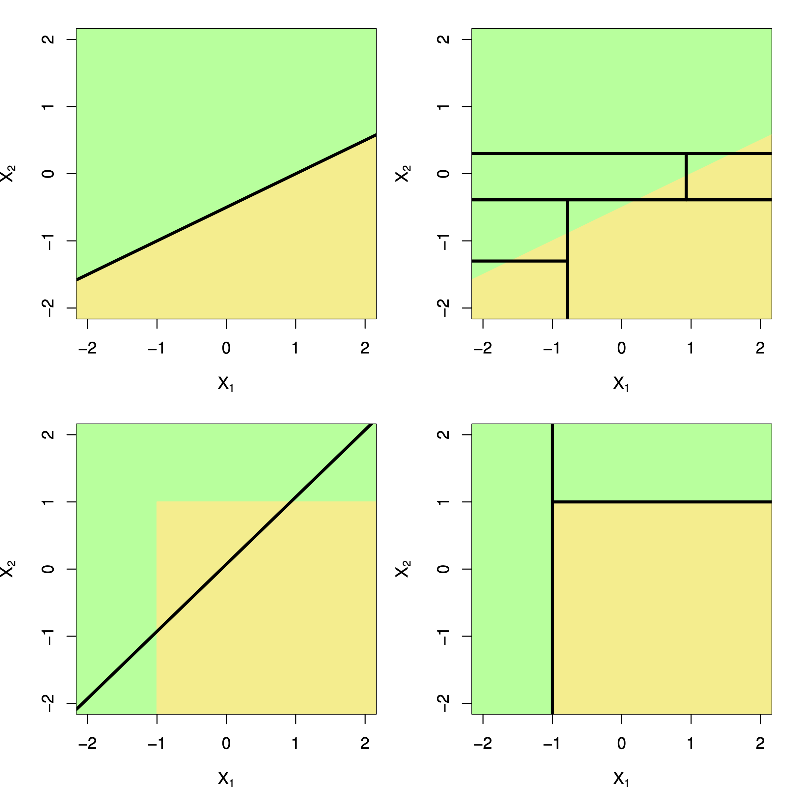

# Entscheidungsbäume


```{r global-knitr-options, include=FALSE}
  knitr::opts_chunk$set(
  fig.pos = 'H',
  fig.asp = 0.618,
  fig.align='center',
  fig.width = 5,
  out.width = "100%",
  fig.cap = "", 
  dpi = 300,
  # tidy = TRUE,
  echo = FALSE,
  message = FALSE,
  warning = FALSE,
  cache = FALSE,
  fig.show = "hold")
```


## Vorbereitung


In diesem Kapitel werden folgende R-Pakete benötigt:

```{r echo = TRUE}
library(titanic)
#library(rpart)
library(tidymodels)
```


```{r echo = FALSE}
titanic_train$Survived = as.factor(titanic_train$Survived)

ti_tree <-
  decision_tree() %>%
  set_engine("rpart") %>%
  set_mode("classification") %>%
  fit(Survived ~ Pclass + Age, data = titanic_train)
```


## Anatomie eines Baumes

Ein Baum 🌳 hat (u.a.):

- Wurzel
- Blätter
- Äste


In einem *Entscheidungsbaum* ist die Terminologie ähnlich, s. Abb. \@ref(fig:rec-part2).
Allgemein gesagt, kann ein Entscheidungsbaum in einem baumähnlichen Graphen visualisiert werden.
Dort gibt es Knoten, die durch Kanten verbunden sind,
wobei zu einem Knoten genau ein Kanten führt. 


Ein  Beispiel für einen einfachen Baum sowie die zugehörige *rekursive Partionierung* ist in Abb. \@ref(fig:rec-part2) dargestellt; 
man erkennt $R=3$ *Regionen* bzw. Blätter [@islr].


```{r rec-part2, out.width = c("45%", "45%"), fig.cap = "Einfaches Beispiel für einen Baum sowie der zugehörigen rekursiven Partionierung", fig.show = "hold"}

knitr::include_graphics("img/8.2.png")
```


In Abb. \@ref(rec-part2) wird der Knoten an der Spitze auch als *Wurzel(knoten)* bezeichnet.
Von diesem Knoten entspringen alle Pfade.
Ein Pfad ist die geordnete Menge der Pfade mit ihren Knoten ausgehend von der Wurzel bis zu einem Blatt.
Knoten, aus denen kein Kanten mehr wegführt ("Endknoten") werden als *Blätter* bezeichnet.
Von einem Knoten gehen zwei Kanten aus (oder gar keine).
Knoten, von denen zwei Kanten ausgehen, spiegeln eine *Bedingung* (Prüfung) wider, im Sinne einer Aussage,
die mit ja oder nein beantwortet werden kann.
Die Anzahl der Knoten eines Pfads entsprechen den *Ebenen* bzw. der Tiefe des Baumes.
Von der obersten Ebene (Wurzelknoten) kann man die $e$ Ebenen aufsteigend durchnummerieren,
beginnend bei 1: $1,2,\ldots,e$.


## Bäume als Regelmaschinen rekursiver Partionierung

Ein Baum kann man als eine Menge von *Regeln*, im Sinne von *Wenn-dann-sonst-Aussagen*, sehen:

```
Wenn Prädiktor A = 1 ist dann
|  Wenn Prädiktor B = 0 ist dann p = 10%
|  sonst p = 30%
sonst p = 50%
```

In diesem Fall, zwei Prädiktoren, ist der Prädiktorenraum in *drei Regionen* unterteilt:
Der Baum hat drei Blätter.

Für Abb. \@ref(fig:tree1) ergibt sich eine komplexere Aufteilung, s. auch Abb. \@ref(fig:recursive-part).


```{r tree1, fig.cap = "Beispiel für einen Entscheidungsbaum"}
library(rpart.plot)
#

rpart.plot(ti_tree[["fit"]], 
           box.palette="RdBu", 
           shadow.col="gray")
```

Kleine Lesehilft für Abb. \@ref(fig:tree1):

- Für jeden Knoten steht in der ersten Zeile der vorhergesagte Wert, z.B. `0` im Wurzelknoten
- darunter steht der Anteil (die Wahrscheinlichkeit) für die in diesem Knoten vorhergesagte Kategorie (`0` oder `1`)
- darunter (3. Zeile) steht der Anteil der Fälle (am Gesamt-Datensatz) in diesem Knoten, z.B. `100%`


```{r recursive-part, fig.cap = "Partionierung in Rechtecke durch Entscheidungsbäume"}
knitr::include_graphics("img/recursive-part.png")
```


Wie der Algorithmus oben zeigt,
wird der Prädiktorraum wiederholt (rekursiv) aufgeteilt,
und zwar in Rechtecke,s. Abb. \@ref(fig:recursive-part).
Man nennt (eine Implementierung) dieses Algorithmus auch *rpart*.


Das Regelwerk zum Baum aus Abb. \@ref(fig:tree1) sieht so aus:

```{r message=FALSE, echo = TRUE}
titanic_train$Survived = as.factor(titanic_train$Survived)

ti_tree <-
  decision_tree() %>%
  set_engine("rpart") %>%
  set_mode("classification") %>%
  fit(Survived ~ Pclass + Age, data = titanic_train)

ti_tree
```


Kleine Lesehilfe:
Ander Wurzel `root` des Baumes, Knoten `1)`haben wir 891 Fälle,
von denen 342 *nicht* unserer Vorhersage `yval` entsprechen, also `loss` sind,
das ist ein Anteil, `(yprob)` von 0.38.
Unsere Vorhersage ist `0`, da das die Mehrheit in diesem Knoten ist,
dieser Anteil beträgt ca. 61%.
In der Klammer stehen also die Wahrscheinlichkeiten für alle Ausprägungen von Y:, `0` und `1`,
in diesem Fall.
Entsprechendes gilt für jeden weiteren Knoten.


Ein kurzer Check der Häufigkeit am Wurzelknoten:

```{r}
count(titanic_train, Survived)
```


Solche Entscheidungsbäume zu erstellen, ist nichts neues. 
Man kann sie mit einer einfachen Checkliste oder Entscheidungssystem vergleichen.
Der Unterschied zu Entscheidungsbäumen im maschinellen Lernen ist nur,
dass die Regeln aus den Daten gelernt werden, man muss sie nicht vorab kennen.


Noch ein Beispiel ist in Abb. \@ref(fig:tree3) gezeigt [@islr]: 
Oben links zeigt eine *unmögliche* Partionierung (für einen Entscheidungsbaum). 
Oben rechts zeigt die Regionen, 
die sich durch den Entscheidungsbaum unten links ergeben.
Untenrechts ist der Baum in 3D dargestellt.


```{r tree3, fig.cap = "Ein weiteres Beispiel zur Darstellung von Entscheidungsbäumen"}
knitr::include_graphics("img/8.3.png")
```


## Klassifikation


Bäume können für Zwecke der Klassifikation (nominal skalierte AV) oder Regression (numerische AV) verwendet werden.
Betrachten wir zunächst die binäre Klassifikation, also für eine zweistufige (nominalskalierte) AV.
Das Ziel des Entscheidungsmodel-Algorithmus ist es,
zu Blättern zu kommen, die möglichst "sortenrein" sind, 
sich also möglichst klar für eine (der beiden) Klassen $A$ oder $B$ aussprechen.
Nach dem Motto: "Wenn Prädiktor 1 kleiner $x$ und wenn Prädiktor 2 gleich $y$,
dann handelt es sich beim vorliegenden Fall ziemlich sicher um Klasse $A$."


:::: {.infobox .quote}
Je homogener die Verteilung der AV pro Blatt, desto genauer die Vorhersagen.
:::


Unsere Vorhersage in einem Blatt entspricht der Merheit bzw. der häufigsten Kategorie in diesem Blatt.


## Gini als Optimierungskriterium

Es gibt mehrere Kennzahlen, die zur Optimierung bzw. zur Entscheidung zum Aufbau des Entscheidungsbaum herangezogen werden.
Zwei übliche sind der *Gini-Koeffizient* und die *Entropie*.
Bei Kennzahlen sind Maß für die Homogenität oder "Sortenreinheit" (vs. Heterogenität, engl. auch impurity).

Den Algorithmus zur Erzeugung des Baumes kann man so darstellen:

```
Wiederhole für jede Ebenes
|  prüfe für alle Prädiktoren alle möglichen Bedingungen
|  wähle denjenigen Prädiktor mit derjenigen Bedingung, der die Homogenität maximiert
solange bis Abbruchkriterium erreicht ist.
```

Ein Bedingung könnte sein `Age >= 18` oder `Years < 4.5`.

Es kommen mehrere Abbruchkriterium in Frage:

- Eine Mindestanzahl von Beobachtungen pro Knoten wird unterschritten (`minsplit`)
- Die maximale Anzahl an Ebenen ist erreicht (`maxdepth`)
- Die minimale Zahl an Beobachtungen eines Blatts wird unterschritten (`minbucket`)


Der Gini-Koeffizient ist im Fall einer UV mit zwei Stufen, $c_A$ und $c_B$, so definiert:

$$G = 1 - \left(p(c_A)^2 + (1-p(c_A))^2\right)$$


Der Algorithmus ist "gierig" (greedy): Optimiert werden lokal optimale Aufteilungen,
auch wenn das bei späteren Aufteilungen im Baum dann insgesamt zu geringerer Homogenität führt.


Die Entropie ist definiert als 

$$D = - \sum_{k=1}^K p_k \cdot log(p_k),$$

wobei $K$ die Anzahl der Kategorien indiziert.

Gini-Koeffizient und Entropie kommen oft zu ähnlichen numerischen Ergebnissen,
so dass wir uns im Folgenden auf den Gini-Koeffizienten konzentieren werden.

---

*Beispiel*

Vergleichen wir drei Bedingungen mit jeweils $n=20$ Fällen, die zu unterschiedlich homogenen Knoten führen:

- 10/10
- 15/5
- 19/1

Was ist jeweils der Wert des Gini-Koeffizienten?


```{r echo = TRUE}
G1 <- 1 - ((10/20)^2 + (10/20)^2)
G1

G2 <- 1 - ((15/20)^2 + (5/20)^2)
G2

G3 <- 1 - ((19/20)^2 + (1/20)^2)
G3
```


Wie man sieht, sinkt der Wert des Gini-Koeffizienten ("G-Wert"), je homogener die Verteilung ist.
*Maximal* heterogen ("gemischt") ist die Verteilung, wenn alle Werte gleich oft vorkommen,
in diesem Fall also 50%/50%.


---


Neben dem G-Wert für einzelne Knoten kann man den G-Wert für eine Aufteilung ("Split") berechnen,
also die Fraeg beantworten, ob die Aufteilung eines Knoten in zwei zu mehr Homogenität führt.
Der G-Wert einer Aufteilung ist die gewichtete Summe der G-Werte der beiden Knoten (links, $l$ und rechts, $r$):


$$G_{split} = p(l) G_{l} + p(r) G_r$$

Der *Gewinn* (gain) an Homogenität ist dann die Differenz des G-Werts der kleineren Ebene und der Aufteilung:


$$G_{gain} = G - G_{split}$$


Der Algorithmus kann auch bei UV mit mehr als zwei, also $K$ Stufen, $c_1, c_2, \ldots, c_K$ verwendet werden:


$$G= 1- \sum_{k=1}^K p(c_k)^2$$ 


## Metrische Prädiktoren


Außerdem ist es möglich, Bedingung  bei *metrischen* UV auf ihre Homogenität hin zu bewerten,
also Aufteilungen der Art `Years < 4.5` zu tätigen. 
Dazu muss man einen Wert identifieren, bei dem man auftrennt.

Das geht in etwa so:

```
Sortiere die Werte eines Prädiktors (aufsteigend)
Für jedes Paar an aufeinanderfolgenden Werten berechne den G-Wert
Finde das Paar mit dem höchsten G-Wert aus allen Paaren
Nimm den Mittelwert der beiden Werte dieses Paares: Das ist der Aufteilungswert
```


Abbildung \@ref(fig:tree-metr) stellt dieses Vorgehen schematisch dar [@rhys].


```{r tree-metr, fig.cap = "Aufteilungswert bei metrischen Prädiktoren"}
knitr::include_graphics("img/fig7-5_alt.jpeg")
```


## Regressionbäume

Bei Regressionsbäumen wird nicht ein Homogenitätsmaß wie der Gini-Koeffizient als Optimierungskriterium
herangezogen, sondern die *RSS* (Residual Sum of Squares) bietet sich an.

Die $J$ Regionen (Partionierungen) des Prädiktorraums $R_1, R_2, \ldots, R_J$ müssen so gewählt werden,
dass RSS minimal ist:


$$RSS = \sum^J_{j=1}\sum_{i\in R_j}(u_i - \hat{y}_{R_j})^2,$$

wobei $\hat{y}$ der (vom Baum) vorhergesagte Wert ist für die $j$-te Region.

## Baum beschneiden

Ein Problem mit Entscheidungsbäumen ist,
dass ein zu komplexer Baum, "zu verästelt" sozusagen,
in hohem Maße Overfitting ausgesetzt ist:
Bei höheren Ebenen im Baum ist die Anzahl der Beobachtungen zwangsläufig klein,
was bedeutet, dass viel Rauschen gefittet wird.

Um das Overfitting zu vermeiden, gibt es zwei auf der Hand liegende Maßnahmen:

1. Den Baum nicht so groß werden lassen
2. Den Baum "zurückschneiden"

Die 1. Maßnahme beruht auf dem Festlegen einer maximalen Zahl an Ebenen (`maxdepth`) oder einer minimalen Zahl an Fällen pro Knoten (`minsplit`) oder im Blatt (`minbucket`).


Die 2. Maßnahme, das Zurückschneiden (pruning) des Baumes hat als Idee, einen "Teilbaum" $T$ zu finden,
der so klein wie möglich ist, aber so gut wie möglich präzise Vorhersagen erlaubt.
Dazu belegen wir die RSS eines Teilbaums (subtree) mit einem Strafterm $s = \alpha |T|$,
wobei $|T|$ die Anzahl der Blätter des Baums entspricht. $\alpha$ ist ein Tuningparameter,
also ein Wert, der nicht vom Modell berechnet wird, sondern von uns gesetzt werden muss -
zumeist durch schlichtes Ausprobieren.
$\alpha$ wägt ab zwischen Komplexität und Fit (geringe RSS).
Wenn $\alpha=0$ haben wir eine normalen, unbeschnittenen Baum $T_0$.
Je größer $\alpha$ wird, desto höher wird der "Preis" für viele Blätter, also für Komplexität
und der Baum wird kleiner.
Dieses Vorgehen nennt man auch *cost complexity pruning*.


## Das Rechteck schlägt zurück


Entscheidungsbäume zeichnen sich durch rechtecke (rekursive) Partionierungen des Prädiktorenraums aus.
Lineare Modelle durch eine einfache lineare Partionierung (wenn man Klassifizieren möchte),
Abb. \@ref(fig:rechteck) verdeutlicht diesen Unterschied [@islr].


```{r rechteck, fig.cap = "Rechteckige vs. lineare Partionierung"}

```

Jetzt kann sich fragen: Welches Vorgehen ist besser - das rechteckige oder das lineare Partionierungen.
Da gibt es eine klare Antwort: Es kommt drauf an.
Wie Abb. \@ref(fig:rechteck) gibt es Datenlagen, in denen das eine Vorgehen zu homogenerer Klassifikation führt
und Situationen, in denen das andere Vorgehen besser ist, vgl. Abb. \@ref(fig:lunch).


```{r lunch, fig.cap = "Free Lunch?", out.width="30%"}
knitr::include_graphics("http://hephaestus-associates.com/wp-content/uploads/2016/07/What-if-I-told-You-There-is-no-Such-Thing-as-a-Free-Lunch-300x300.jpg")
```

