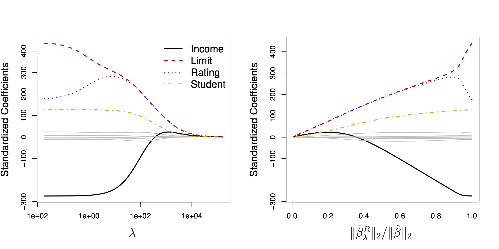
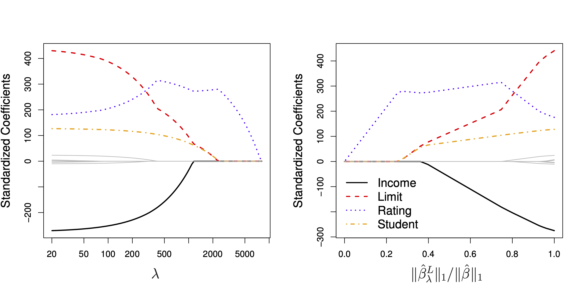
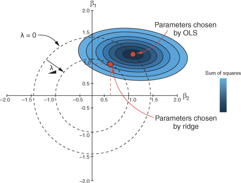

# Regularisierte Modelle


```{r global-knitr-options, include=FALSE}
  knitr::opts_chunk$set(
  fig.pos = 'H',
  fig.asp = 0.618,
  fig.align='center',
  fig.width = 5,
  out.width = "100%",
  fig.cap = "", 
  dpi = 300,
  # tidy = TRUE,
  echo = FALSE,
  message = FALSE,
  warning = FALSE,
  cache = FALSE,
  fig.show = "hold")
```


## Lernsteuerung

```{r chapter-start-sections, echo = FALSE, results = "asis"}
source("https://raw.githubusercontent.com/sebastiansauer/Lehre/main/R-Code/render-course-sections.R")
source("funs/define-constants.R")
source("funs/chapter-start-sections.R")
#undebug(chapter_start_sections)
chapter_start_sections(title = "Regularisierung")
```


## Vorbereitung


In diesem Kapitel werden folgende R-Pakete benötigt:

```{r echo = TRUE}
library(tidymodels)
library(tictoc)  # Zeitmessung
```


## Regularisierung

### Was ist Regularisierung?


Regularisieren verweist auf "regulär"; 
laut [Duden]() bedeutet das Wort so viel wie "den Regeln, Bestimmungen, 
Vorschriften entsprechend; vorschriftsmäßig, ordnungsgemäß, richtig" oder "üblich".

Im Englischen spricht man auch von "penalized models", "bestrafte Modell" und von "shrinkage",
von "Schrumpfung" im Zusammenhang mit dieer Art von Modellen.

Regularisierung ist ein Metalalgorithmus, also ein Verfahren, was als zweiter Schritt "auf" verschiedene 
Modelle angewendet werden kann - zumeist aber auf lineare Modelle, worauf 
wir uns im Folgenden konzentrieren.

Das Ziel von Regularisierung ist es, Overfitting zu vermeiden,
in dem die Komplexität eines Modells reduziert wird.
Der Effekt von Regularisierung ist, 
dass die Varianz der Modelle verringert wird und damit das Overfitting.
Der Preis ist, dass der Bias erhöht wird,
aber oft geht die Rechnung auf, dass der Gewinn größer ist als der Verlust.

Im Kontext von linearen Modellen bedeutet das,
dass die Koeffizienten ($\beta$s) im Betrag verringert werden durch Regularisierung,
also in Richtung Null "geschrumpft" werden.

Dem liegt die Idee zugrunde,
dass extreme Werte in den Koeffizienten vermutlich nicht "echt", sondern durch Rauschen
fälschlich vorgegaukelt werden.

Die bekanntesten Vertreter dieser Modellart sind *Ridge Regression*, $L2$, das *Lasso*, $L1$, sowie *Elastic Net*.


### Ähnliche Verfahren

 Ein ähnliches
Ziel wie der Regulaisierung liegt dem Pruning zugrunde, 
dem nachträglichen Beschneiden von Entscheidungsbäumen.
In beiden Fällen wird die Komplexität des Modells verringert,
und damit die Varianz auf Kosten eines möglichen Anstiegs der Verzerrung (Bias)
des Modells. Unterm Strich hofft man, dass der Gewinn die Kosten übersteigt
und somit der Fit im Test-Sample besser wird.


Eine Andere Art der Regularisierung wird durch die Verwendung von Bayes-Modellen erreicht:
Setzt man einen konservativen Prior, etwa mit Mittelwert Null und kleiner Streuung,
so werden die Posteriori-Koeffizienten gegen Null hin geschrumpft werden.

Mit Mehrebenen-Modellen (Multi Level Models) lässt sich ein ähnlicher Effekt erreichen.


### Normale Regression (OLS)


Man kann sich fragen, warum sollte man an der normalen Least-Square-Regression 
(OLS: Ordinary Least Square) weiter herumbasteln wollen,
schließlich garantiert das [Gauss-Markov-Theorem](https://en.wikipedia.org/wiki/Gauss%E2%80%93Markov_theorem), dass eine lineare Regression
den besten linearen unverzerrten Schätzwert (BLUE, best linear unbiased estimator) stellt,
vorausgesetzt die Voraussetzungen der Regression sind erfüllt.

Ja, die Schätzwerte (Vorhersagen) der Regression sind BLUE, schätzen also den wahren
Wert korrekt und maximal präzise. Das gilt (natürlich) nur, wenn die Voraussetzungen der Regression erfüllt
sind, also vor allem, dass die Beziehung auch linear-additiv ist.


Zur Erinnerung, mit OLS minimiert man  man den quadrierten Fehler, $RSS$, Residual Sum of Square:


$$RSS = \sum_{i=1}^n \left(y_i - \beta_0 - \sum_{j=1}^p \beta_j x_{ij} \right)$$

Man sucht also diejenigen Koeffizientenwerte $\beta$ (Argumente der Loss-Funktion RSS),
die RSS minimieren:


$$\beta = \underset {\beta}{\operatorname {arg\,min(RSS)}}$$


Es handelt sich hier um Schätzwerte, die meist mit dem Hütchen $\hat{\beta}$ ausgedrückt werden,
hier aber zur einfacheren Notation weggelassen sind.

Abb. \@ref(fig:ols) visualisiert die Optimierung mit OLS [Quelle](https://www.crumplab.com/rstatsforpsych/regression.html).
An [gleicher Stelle](https://www.crumplab.com/rstatsforpsych/regression.html) findet sich
eine gute Darstellung zu den (mathematischen) Grundlagen der OLS-Regression.

```{r ols, fig.cap = "Visualisierung der Minimierung der RSS durch OLS", out.width = "70%"}
knitr::include_graphics("https://www.crumplab.com/rstatsforpsych/imgs/regression_squares.gif")
```


Übrigens nennt man Funktionen, die man minimiert mit Hilfe von Methoden des maschinellen Lernens 
mit dem Ziel die optimalen Koeffizienten (wie $\beta$s) zu finden, auch *Loss Functions* (Kostenfunktion).

Das Problem der Regression ist, dass die schöne Eigenschaft BLUE nur im *Train-Sample*, *nicht* (notwendig)
im Test-Sample gilt.


## Ridge Regression, L2


### Strafterm

Ridge Regression ist sehr ähnlich zum OLS-Algorithmus,
nur das ein "Strafterm aufgebrummt" wird, der $RSS$ erhöht.


Der Gesamtterm, der optimiert wird, $L_{L2}$ (Loss Level 2) ist also
die Summe aus RSS und dem Strafterm:


$$L_{L2} = RSS + \text{Strafterm}$$

Der Strafterm ist so aufgebaut,
dass (im Absolutbetrag) größere Koeffizienten mehr zum Fehler beitragen,
also eine Funktion der (quadrierten) Summe der Absolutwerte der Koeffizienten:


$$\text{Strafterm} = \lambda \sum_{j=1}^p \beta_j^2$$


Man nennt den L2-Strafterm auch L2-Norm^[Streng genommen ist er eine Funktion der L2-Norm bzw. mit Lambda-Gewichtet und ohne die Wurzel, die zur Vektornorm gehört].

Dabei ist $\lambda$ (lambda) ein Tuningparameter, 
der bestimmt, wie stark die Bestrafung ausfällt. Den Wert von $\lambda$ lassen wir durch
Tuning bestimmen, wobei $\lambda \in \mathbb{R}^+\setminus\{0\}$. 
Es gilt: Je größer lambda, desto stärker die Schrumpfung der Koeffizienten gegen Null,
da der gesamte zu minimierende Term, $L_{L2}$ entsprechend durch lambda vergrößert wird.

Der Begriff "L2" beschreibt dass es sich um eine quadrierte Normierung handelt.

Der Begriff "Norm" stammt aus der Vektoralgebra. Die L2-Norm eines Vektors $||v||$ mit $k$ Elementen ist so definiert [Quelle](https://towardsdatascience.com/intuitions-on-l1-and-l2-regularisation-235f2db4c261):

$$||v|| = \left(|{v_1}|^2+ |{v_2}|^2+ |{v_i}|^2+ \ldots + |{v_k}|^2 \right)^{1/2} $$
wobei $|{v_i}|$ den Absolutwert (Betrag) meint de Elements $v_i$ meint.
Im Falle von reellen Zahlen und Quadrierung braucht es hier die Absolutfunktion nicht.

Im Falle von zwei Elementen vereinfacht sich obiger Ausdruck zu:


$$||v|| = \sqrt{\left({v_1}^2+ {v_2}^2\right)} $$

Das ist nichts anderes als Pythagoras' Gesetz im euklidischen Raum.

Der Effekt von $\lambda \sum_{j=1}^p \beta_j^2$ ist wie gesagt, dass
die Koeffizienten in Richtung Null geschrumpft werden. Wenn $\lambda = 0$,
resultiert OLS. 
Wenn $\lambda \rightarrow \infty$, werden alle Koeffizienten auf Null geschätzt werden,
Abb. \@ref(fig:l2-shrink) verdeutlicht dies [@islr].


```{r l2-shrink, fig.cap = "Links: Regressionskoeffizienten als Funktion von lambda. Rechts: L2-Norm der Ridge-Regression im Verhältnis zur OLS-Regression"}

```


### Standardisierung


Die Straftermformel sagt uns, dass die Ridge-Regression abhängig von der Skalierung
der Prädiktoren ist.
Daher sollten die Prädiktoren vor der Ridge-Regression zunächst auf $sd=1$ standardisiert werden.
Da wir $\beta_0$ nicht schrumpfen wollen, sondern nur die Koeffizienten der Prädiktoren
bietet es sich an, die Prädiktoren dazu noch zu zentieren.
Kurz: Die z-Transformation bietet sich als Vorverarbeitung zur Ridge-Regression an.


## Lasso, L1


### Strafterm

Der Strafterm in der "Lasso-Variante" der regularisierten Regression lautet so:

$$\text{Strafterm} = \lambda \sum_{j=1}^p |\beta_j|,$$


ist also analog zur Ridge-Regression konzipiert.

Genau wie bei der L2-Norm-Regularisierung ist ein "guter" Wert von lambda entscheidend.
Dieser Wert wird, wie bei der Ridge-Regression, durch Tuning bestimmt.

Der Unterschied ist, dass die L1-Norm (Absolutwerte) und nicht die L2-Norm (Quadratwerte)
verwendet werden.

Die L1-Norm eines Vektors ist definiert durch $||\beta||_1 = \sum|\beta_j|$.


### Variablenselektion

Genau wie die Ridge-Regression führt ein höhere lambda-Wert zu einer Regularisierung (Schrumpfung)
der Koeffizienten.
Im Unterschied zur Ridge-Regression hat das Lasso die Eigenschaft,
einzelne Parameter auf *exakt* Null zu schrumpfen und damit faktisch als Prädiktor auszuschließen.
Anders gesagt hat das Lasso die praktische Eigenschaft,
Variablenselektion zu ermöglichen.

Abb. \@ref(fig:lasso-l1) verdeutlicht den Effekt der Variablenselektion, vgl. @islr, Kap. 6.2.
Die Ellipsen um $\hat{beta}$ herum nent man Kontourlinien. Alle Punkte einer Kontourlinie
haben den gleiche RSS-Wert,
stehen also für eine gleichwertige OLS-Lösung.


```{r lasso-l1, fig.cap = "lambda in der Lasso-Regression"}

```


Warum erlaubt die L1-Norm Variablenselektion,
die L2-Norm aber nicht?
Abb. \@ref(fig:l1l2) verdeutlicht den Unterschied zwischen L1- und L2-Norm.
Es ist eine Regression mit zwei Prädiktoren, also den zwei Koeffizienten $\beta1, \beta_2$ dargestellt.


```{r l1l2, fig.cap = "Verlauf des Strafterms bei der L1-Norm (links) und der L2-Norm (rechts)"}

```


Betrachten wir zunächst das rechte Teilbild für die L2-Norm aus Abb.  \@ref(fig:l1l2),
das in Abb. \@ref(fig:l2-penalty) in den Fokus gerückt wird [@rhys].


```{r l2-penalty, fig.cap = "Verlauf des Strafterms bei der L2-Norm"}

```


Wenn lambda gleich Null ist, entspricht $L_{L2}$ genau der OLS-Lösung.
Vergrößert man lambda,
so liegt $L_{L2}$ dem Schnittpunkt des OLS-Kreises mit dem zugehörigen lambda-Kreis.
Wie man sieht, führt eine Erhöhung von lambda zu einer Reduktion der Absolutwerte von $\beta_1$ und $\beta_2$.
Allerdings werden, wie man im Diagramm sieht, auch bei hohen lambda-Werten die 
Regressionskoeffizienten nicht exakt Null sein.

Warum lässt die L2-Norm für bestimmte lambda-Werte den charakteristischen Kreis entstehen?
Die Antwort ist, dass die Lösungen für $\beta_1^2 + \beta_2^2=1$ (mit $\lambda=1$) graphisch als Kreis dargestellt werden können.


Anders ist die Situation bei der L1-Norm, dem Lasso, vgl. Abb. \@ref(fig:l1-penalty) [@rhys].


```{r l1-penalty, fig.cap = "Verlauf des Strafterms bei der L1-Norm"}

```


Eine Erhöhung von \lambda$ führt aufgrund der charakteristischen Kontourlinie zu einem Schnittpunkt (von OLS-Lösung und lambda-Wert), 
der - wenn lambda groß genug ist, stets auf einer der beiden Achsen liegt,
also zu einer Nullsetzung des Parameters führt.

Damit kann man argumentieren,
dass das Lasso implizit davon ausgeht,
dass einige Koeffizienten in Wirklichkeit *exakt Null* sind,
die L2-Norm aber nicht.


## L1 vs. L2


### Wer ist stärker?

Man kann nicht sagen, dass die L1- oder die L2-Norm strikt besser sei.
Es kommt auf den Datensatz an.
Wenn man einen Datensatz hat, in dem es eingie wenige starke Prädiktoren gibt
und viele sehr schwache (oder exakt irrelevante) Prädiktoren gibt,
dann wird L1 tendenziell zu besseren Ergebnissen führen[@islr, S. 246].
Das Lasso hat noch den Vorteil der Einfachheit, da
weniger Prädiktoren im Modell verbleiben.

Ridge-Regression wird dann besser abschneiden (tendenziell),
wenn die Prädiktoren etwa alle gleich stark sind.


### Elastic Net als Kompromiss

Das Elastic Net (EN) ist ein Kompromiss zwischen L1- und L2-Norm.
$\lambda$ wird auf einen Wert zwischen 1 und 2 eingestellt;
auch hier wird der Wert für $\lambda$ wieder per Tuning gefunden.

$$L_{EN} = RSS + \lambda\left((1-\alpha))\cdot \text{L2-Strafterm} + \alpha \cdot  \text{L1-Strafterm}\right)$$

$\alpha$ ist ein Tuningparameter, der einstellt, wie sehr wir uns Richtung L1- vs. L2-Norm bewegen.
Damit wird sozusagen die "Mischung" eingestellt (von L1- vs. L2).

Spezialfälle:

- Wenn $\alpha=0$ resultiert die Ridge-Regression (L1-Strafterm wird Null)
- Wenn $\alpha=1$ resultiert die Lasso-Regression (L2-Strafterm wird Null)


<!-- ## Aufgaben und Vertiefung -->


```{r render-outline-vertiefung-aufgaben, results = "asis", echo = FALSE, message = FALSE, eval = TRUE}
source("https://raw.githubusercontent.com/sebastiansauer/Lehre/main/R-Code/render-course-sections.R")

render_section(course_dates_file,
                 content_file,
                 i = NULL,
                 title = "Regularisierung",
                 name = "Aufgaben",
                 header_level = 1)


render_section(course_dates_file,
               content_file,
               i = NULL, 
               title = "Regularisierung",
               name = "Vertiefung",
               header_level = 1)
```
