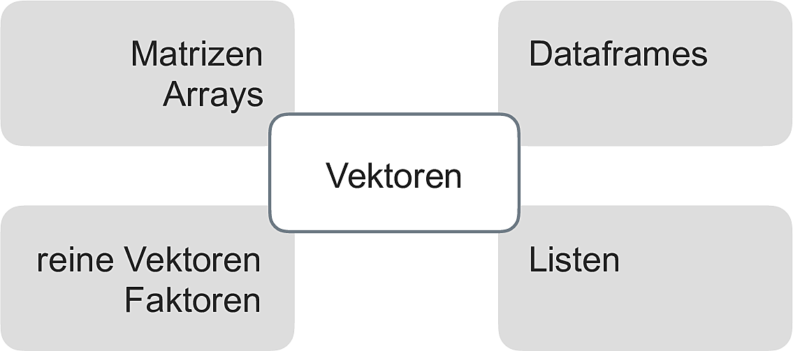
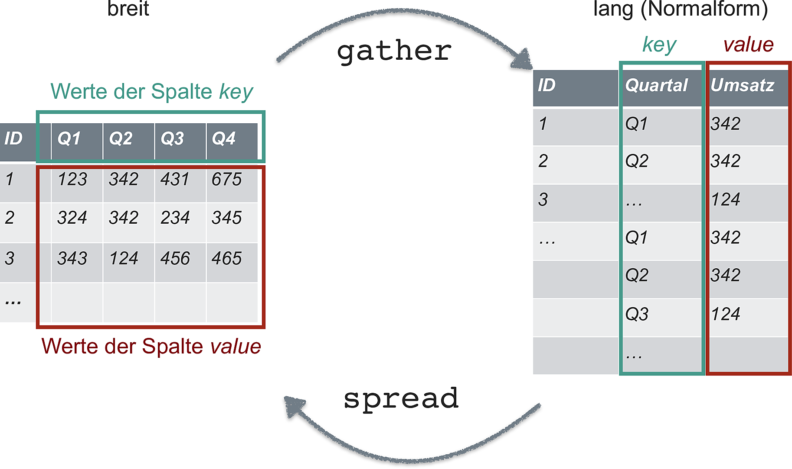
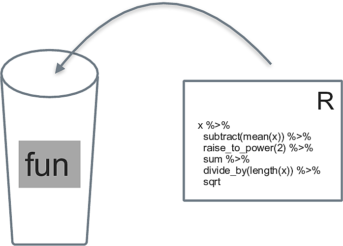

# R, zweiter Blick


## Objekttypen in R

Näheres zu Objekttypen findet sich in @modar, Kap. 5.2.


### Überblick

In R ist praktisch alles ein Objekt. 
Ein Objekt meint ein im Computerspeicher repräsentiertes Ding, etwa eine Tabelle.


Vektoren und Dataframes (Tibbles) sind die vielleicht gängigsten Objektarten in R (vgl. Abb. \@ref(fig:obs), aus @modar).

```{r obs, fig.cap = "Zentrale Objektarten in R", out.width="70%"}
knitr::include_graphics("img/zentrale_objektarten.png")
```

Es gibt in R keine (Objekte für) Skalare (einzelne Zahlen).
Stattdessen nutzt R Vektoren der Länge 1.

Ein nützliches Schema stammt aus @r4ds, s. Abb. \@ref(fig:objtypes).

```{r objtypes, fig.cap = "Objektarten hierarchisch gegliedert", out.width="70%"}
knitr::include_graphics("https://d33wubrfki0l68.cloudfront.net/1d1b4e1cf0dc5f6e80f621b0225354b0addb9578/6ee1c/diagrams/data-structures-overview.png")
```


### Taxonomie

Unter *homogenen* Objektiven verstehen wir Datenstrukturen, 
die nur eine Art von Daten (wie Text oder Ganze Zahlen) fassen.
Sonstige Objekte nennen wir *heterogen*.


- Homogene Objekte
    - Vektoren 
    - Matrizen
- Heterogen
    - Liste
    - Dataframes (Tibbles)
    
    
    
#### Vektoren

*Vektoren* sind insofern zentral in R,
als dass die übrigen Datenstrukturen auf ihnen aufbauen, vgl. Abb. \@ref(fig:vektorenimzentrum) aus @modar.

Reine (atomare) Vektoren in R sind eine geordnete Liste von Daten eines Typs.

```{r vektorenimzentrum, fig.cap = "Vektoren stehen im Zentrum der Datenstrukturen in R"}

```


```{r echo = TRUE}
ein_vektor <- c(1, 2, 3)
noch_ein_vektor <- c("A", "B", "C")
logischer_vektor <- c(TRUE, FALSE, TRUE)
```


Mit `str()` kann man sich die `Str`uktur eines Objektsausgeben lassen:

```{r echo = TRUE}
str(ein_vektor)
str(noch_ein_vektor)
str(logischer_vektor)
```


Vektoren können von folgenden Typen sein:

- Kommazahlen ( `double`) genannt
- Ganzzahlig (`integer`, auch mit `L` für *Long* abgekürzt)
- Text (´character`, String)
- logische Ausdrücke (`logical` oder `lgl`) mit `TRUE` oder `FALSE`


Kommazahlen und Ganze Zahlen zusammen bilden den Typ `numeric` (numerisch) in R.


#### Faktoren


```{r echo = TRUE}
sex <- factor(c("Mann", "Frau", "Frau"))
```

Interessant:

```{r echo = TRUE}
str(sex)
```


Vertiefende Informationen findet sich in @r4ds.

#### Listen

```{r echo = TRUE}
eine_liste <- list(titel = "Einführung",
                   woche = 1,
                   datum = c("2022-03-14", "2202-03-21"),
                   lernziele = c("dies", "jenes", "und noch mehr"),
                   lehre = c(TRUE, TRUE, TRUE)
                   )
str(eine_liste)
```


#### Tibbles

Für `tibble()` brauchen wir `tidyverse`:

```{r message=FALSE,  echo = TRUE}
library(tidyverse)
```


```{r echo = TRUE}

studentis <-
  tibble(
    name = c("Anna", "Berta"),
    motivation = c(10, 20),
    noten = c(1.3, 1.7)
  )
str(studentis)
```


### Indizieren

Einen Teil eines Objekts auszulesen, bezeichnen wir als *Indizieren*.


#### Reine Vektoren

Zur Erinnerung:

```{r echo = TRUE}
str(ein_vektor)
```


```{r echo = TRUE}
ein_vektor[1]
ein_vektor[c(1,2)]
```

Aber *nicht* so:

```{r error=TRUE,  echo = TRUE}
ein_vektor[1,2]
```

In @modar, Kap. 5.3.1 findet man weitere Indizierungsmöglichkeiten für reine Vektoren.


#### Listen

```{r echo = TRUE}
eine_liste %>% str()
```


Listen können wie Vektoren, also mit `[` ausgelesen werden. 
Dann wird eine Liste zurückgegeben.


```{r echo = TRUE}
eine_liste[1]
eine_liste[2]
```


Mann kann auch die "doppelte Eckklammer", `[[` zum Auslesen verwenden;
dann wird anstelle einer Liste die einfachere Struktur eines Vektors zurückgegeben:


```{r echo = TRUE}
eine_liste[[1]]
```


Mann die Elemente der Liste entweder mit ihrer Positionsnummer (1, 2, ...) oder,
sofern vorhanden, ihren Namen ansprechen:


```{r echo = TRUE}
eine_liste[["titel"]]
```


Dann gibt es noch den Dollar-Operator,
mit dem Mann benannte Elemente von Listen ansprechen kann:

```{r echo = TRUE}
eine_liste$titel
```

Man kann auch tiefer in eine Liste hinein indizieren.
Sagen wir, uns interessiert das 4. Element der Liste `eine_liste` - 
und davon das erste Element. 

Das geht dann so:

```{r echo = TRUE}
eine_liste[[4]][[1]] 
```


Eine einfachere Art des Indizierens von Listen bietet die Funktion `pluck()`, aus dem Paket `purrr`,
das Hilfen für den Umgang mit Listen bietet.


```{r echo = TRUE}
pluck(eine_liste, 4)
```


Und jetzt aus dem 4. Element das 1. Element:

```{r echo = TRUE}
pluck(eine_liste, 4, 1)
```


#### Tibbles

Tibbles lassen sich sowohl wie ein Vektor als auch wie eine Liste indizieren.


```{r echo = TRUE}
studentis[1]
```

Die Indizierung eines Tibbles mit der einfachen Eckklammer liefert einen Tibble zurück.

```{r echo = TRUE}
studentis["name"]
```
Mit doppelter Eckklammer bekommt man,
analog zur Liste, 
einen Vektor zurück:

```{r echo = TRUE}
studentis[["name"]]
```

Beim Dollar-Operator kommt auch eine Liste zurück:

```{r echo = TRUE}
studentis$name
```


### Weiterführende Hinweise

- [Tutorial](https://jennybc.github.io/purrr-tutorial/bk00_vectors-and-lists.html) zum Themen Indizieren von Listen von Jenny BC.


### Indizieren mit dem Tidyverse 

Natürlich kann man auch die Tidyverse-Verben zum Indizieren verwenden.
Das bietet sich an, wenn zwei Bedingungen erfüllt sind:

1. Wenn man einen Tibble als Input und als Output hat
2. Wenn man nicht programmieren möchte


## Datensätze von lang nach breit umformatieren


Manchmal findet man Datensätze im sog. *langen* Format vor,
manchmal im *breiten*.

In der Regel müssen die Daten "tidy" sein,
was meist dem langen Format entspricht, vgl. Abb. \@ref(fig:langbreit) aus @modar.


```{r langbreit, fig.cap = "Von lang nach breit und zurück"}

```


In einer neueren Version des Tidyverse werden diese beiden Befehle umbenannt bzw. erweitert:

- `gather()` -> `pivot_longer()`
- `spread()` -> `pivot_wider()`

Weitere Informationen findet sich in @r4ds, in [diesem Abschnitt, 12.3](https://r4ds.had.co.nz/tidy-data.html?q=pivot_#pivoting).


## Funktionen

Eine Funktion kann man sich als analog zu einer Variable vorstellen.
Es ist ein Objekt, das nicht Daten, sondern Syntax beinhaltet, 
vgl. Abb. \@ref(fig:funs) aus @modar.


```{r funs, fig.cap = "Sinnbild einer Funktion"}

```


```{r echo = TRUE}
mittelwert <- function(x){
  
  summe <- sum(x, na.rm = TRUE)
  mw <- summe/length(x)
  return(mw)
  
}
```

```{r  echo = TRUE}
mittelwert(c(1, 2, 3))
```


Weitere Informationen finden sich in [Kapitel 19](https://r4ds.had.co.nz/functions.html) in @r4ds. Alternativ findet sich ein Abschnitt dazu (28.1) in @modar.


## Wiederholungen programmieren

Häufig möchte man eine Operation mehrfach ausführen.
Ein Beispiel wäre die Anzahl der fehlenden Werte pro Spalte auslesen.
Natürlich kann man die Abfrage einfach häufig tippen, nervt aber irgendwann.
Daher braucht's Strukturen, die *Wiederholungen* beschreiben.

Dafür gibt es verschiedene Ansätze.

### `across()`

Handelt es sich um Spalten von Tibbles, dann bietet sich die Funktion `across(.col, .fns)` an.
`across` wendet eine oder mehrere Funktionen (mit `.fns` bezeichnet) auf die Spalten `.col` an.

Das erklärt sich am besten mit einem Beispiel:


Natürlich hätte man in diesem Fall auch anders vorgehen können:

```{r echo = TRUE}
mtcars %>% 
  summarise(across(.cols = everything(),
                   .fns = mean))
```


Möchte man der Funktion `.fns` Parameter übergeben, so nutzt man diese Syntax ("Purrr-Lambda"):

```{r echo = TRUE}
mtcars %>% 
  summarise(across(.cols = everything(),
                   .fns = ~ mean(., na.rm = TRUE)))
```


[Hier](https://www.rebeccabarter.com/blog/2020-07-09-across/) findet sich ein guter Überblick zu `across()`. 


### `map()`

`map()` ist eine Funktion aus dem R-Paket `purrr` und Teil des Tidyverse.

`map(x, f)` wenden die Funktion `f` auf jedes Element von `x` an.
Ist `x` ein Tibble, so wird `f` demnach auf jede Spalte von `x` angewendet ("zugeordnet", daher `map`), vgl. Abb. \@ref(fig:map1) aus @modar.


```{r map1, fig.cap = "Sinnbild für map"}
knitr::include_graphics("img/wdh.png")
```


Hier ein Beispiel-Code:

```{r echo = TRUE}
data(mtcars)

map(mtcars, mean)
```


Möchte man der gemappten Funktion Parameter übergeben,
nutzt man wieder die "Kringel-Schreibweise":


```{r echo = TRUE}
map(mtcars, ~ mean(., na.rm = TRUE))
```


### Weiterführende Hinweise

Weiteres zu `map()` findet sich z.B. in @r4ds, [Kapitel 21.5](https://r4ds.had.co.nz/iteration.html#the-map-functions) oder in @modar, Kap. 28.2.

[Tutorial](https://jennybc.github.io/purrr-tutorial/ls01_map-name-position-shortcuts.html) zu `map()` von Jenny BC.

## Listenspalten


[Kap. 25.3](https://r4ds.had.co.nz/many-models.html?q=list#creating-list-columns) aus @r4ds bietet einen guten Einstieg in das Konzept von Listenspalten (list-columns) in R.


## Literatur

