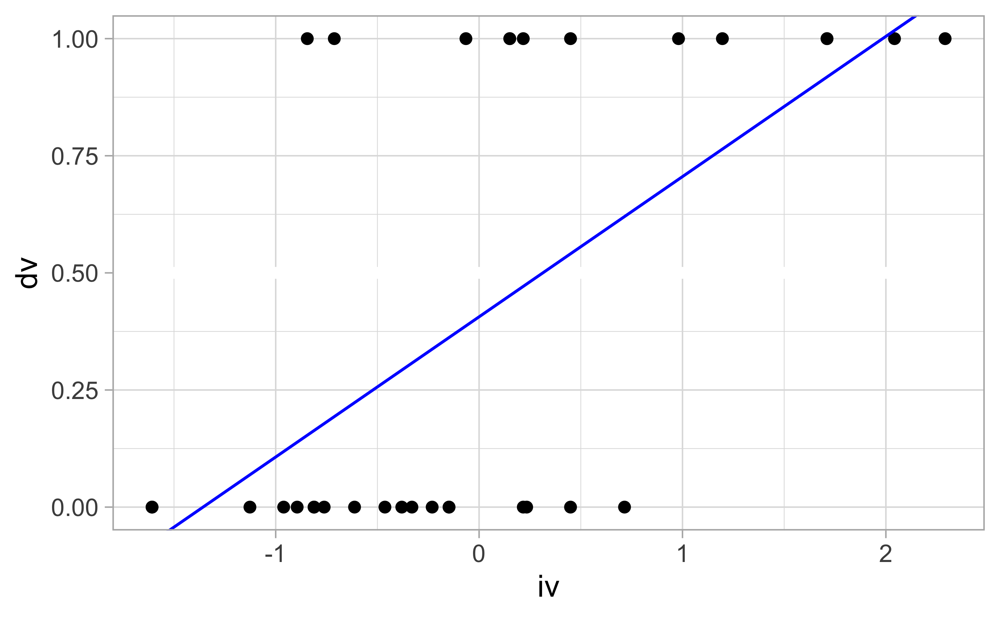
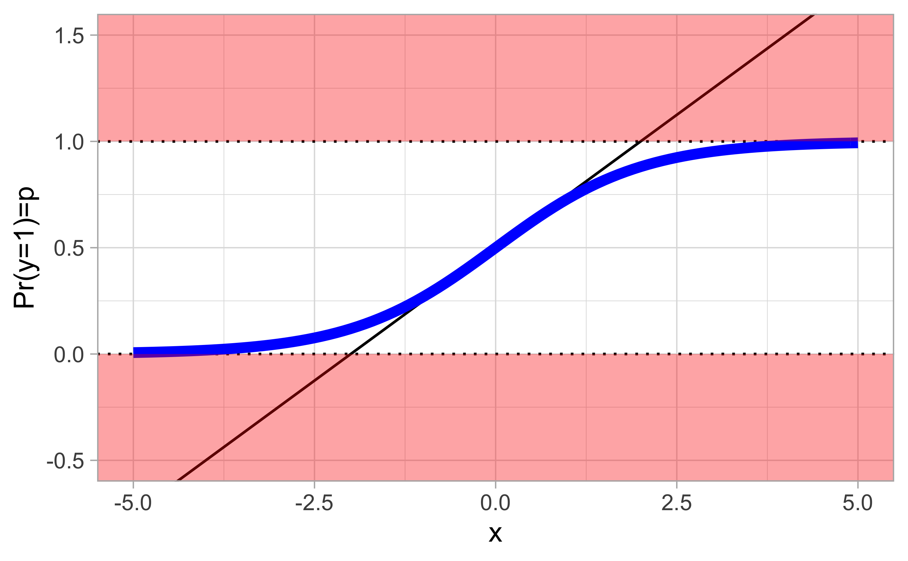
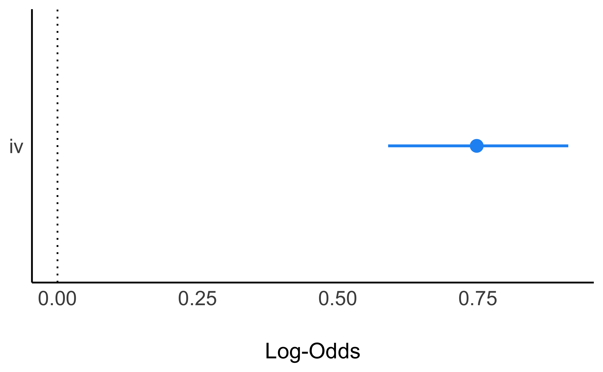
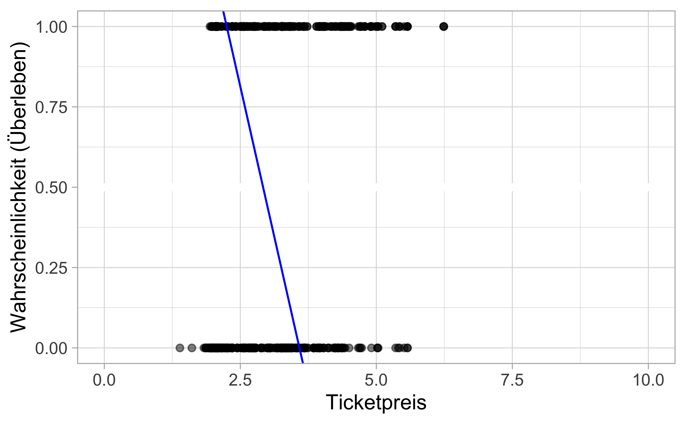
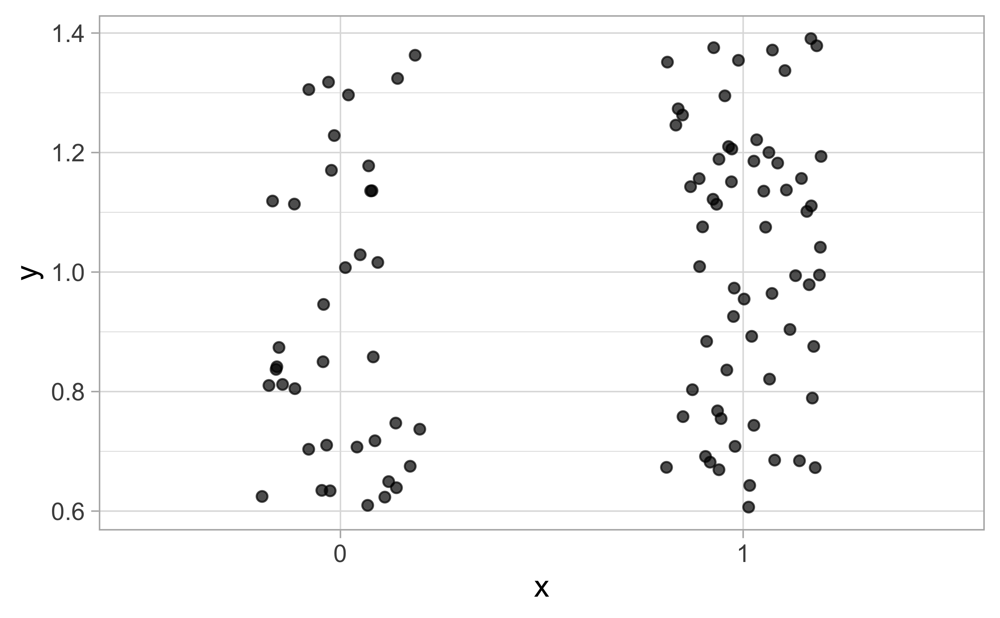
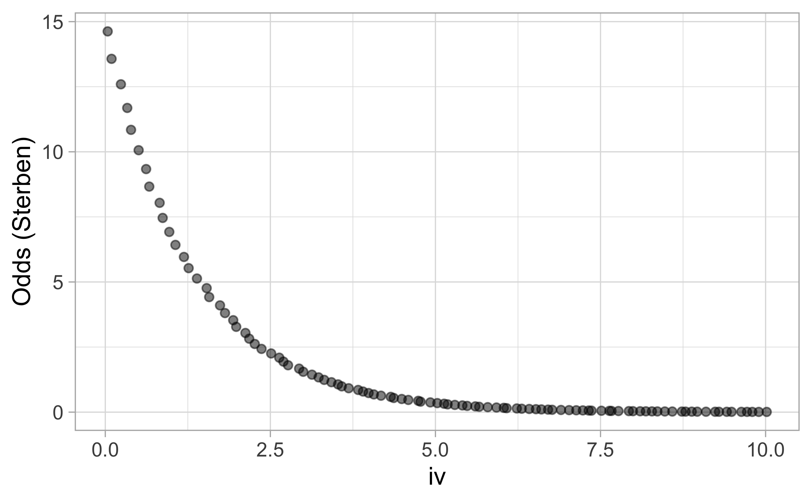
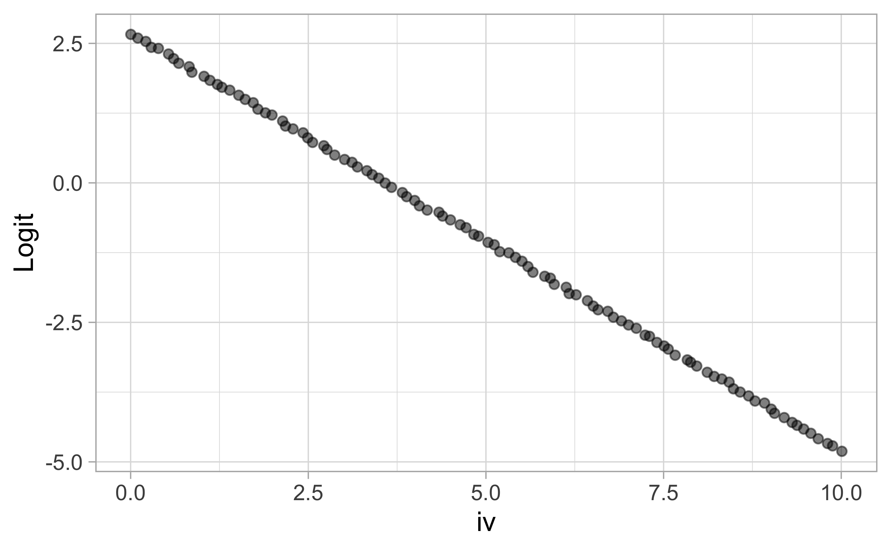
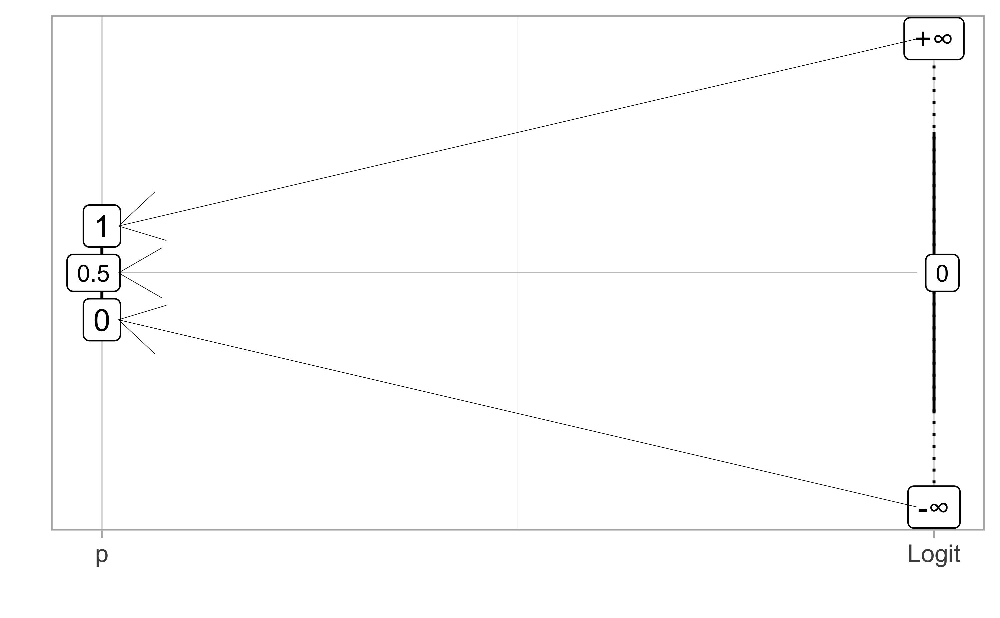
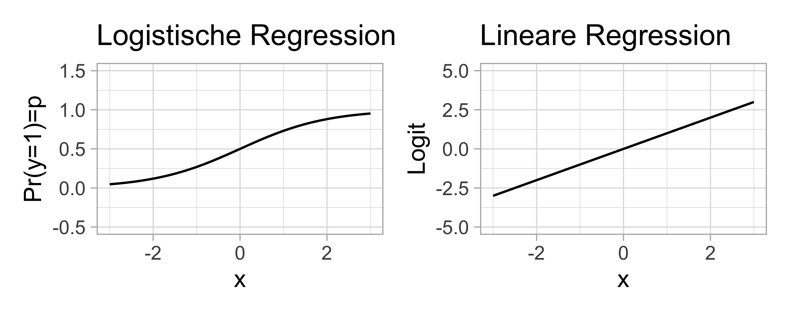

# Logistische Regression


Benötigte R-Pakete für dieses Kapitel:


```r
library(tidyverse)
library(tidymodels)
library(datawizard)
```


## Lernsteuerung

<!-- Chapter Start sections: Lernziele, Literatur, Hinweise, ... -->

### Vorbereitung 

- Frischen Sie Ihr Wissen zur logistischen Regression auf bzw. machen Sie sich mit den Grundlagen des Verfahrens vertraut.


### Lernziele 

- Sie verstehen den Zusammenhang von linearen und logistischen Modellen
- Sie können die logistische Regression mit Methoden von tidymodels anwenden


### Literatur 

- Rhys, Kap. 4


## Intuitive Erklärung

Die *logistische Reression* ist ein Spezialfall des linearen Modells (lineare Regression),
der für *binäre* (dichotom) AV eingesetzt wird (es gibt auch eine Variante für multinominale AV). 
Es können eine oder mehrere UV in eine logistische Regression einfließen,
mit beliebigem Skalenniveau.

Beispiele für  Forschungsfragen, die mit der logistischen Regression modelliert werden sind:

- Welche Faktoren sind prädiktiv, um vorherzusagen, ob jemand einen Kredit zurückzahlen kann oder nicht?
- Haben weibliche Passagiere aus der 1. Klasse eine höhere Überlebenschance als andere Personen auf der Titanic?
- Welche Faktoren hängen damit zusammen, ob ein Kunde eine Webseite verlässt, bevor er einen Kauf abschließt?


Der Name stammt von der [logistischen Funktion](https://en.wikipedia.org/wiki/Logistic_function),
die man in der einfachsten Form so darstellen kann:

$$f(x) = \frac{x}{1+e^{-x}}$$

Da die AV als dichotom modelliert wird, spricht man von einer *Klassifikation*.


Allerdings ist das Modell reichhaltiger als eine bloße Klassifikation,
die (im binären Fall) nur 1 Bit Information liefert: "ja" vs. "nein" bzw. 0 vs. 1.

Das Modell liefert nämlich nicht nur eine Klassifikation zurück,
sondern auch eine *Indikation der Stärke* (epistemologisch) der Klassenzugehörigkeit.

Einfach gesagt heißt das, 
dass die logistische Regression eine Wahrscheinlichkeit der Klassenzugehörigkeit zurückliefert.


<div class="figure" style="text-align: center">

```{=html}
<div id="htmlwidget-928ef130029c0b7dd8c7" style="width:100%;height:300px;" class="nomnoml html-widget"></div>
<script type="application/json" data-for="htmlwidget-928ef130029c0b7dd8c7">{"x":{"code":"\n#fill: #FEFEFF\n#lineWidth: 1\n#zoom: 4\n#direction: right\n\n#direction: right\n [Daten] -> [Modell] \n [Modell] -> [Wskt] \n [Wskt] -> [Klassifikation]\n","svg":false},"evals":[],"jsHooks":[]}</script>
```

<p class="caption">(\#fig:logist-regr)Definition eines Models in tidymodels</p>
</div>

## Profil

Das Profil des Modells kann man wie folgt charakterisieren, vgl. Tab. \@ref(tab:prof-logist).


```{=html}
<div id="zgxsaowpxk" style="overflow-x:auto;overflow-y:auto;width:auto;height:auto;">
<style>html {
  font-family: -apple-system, BlinkMacSystemFont, 'Segoe UI', Roboto, Oxygen, Ubuntu, Cantarell, 'Helvetica Neue', 'Fira Sans', 'Droid Sans', Arial, sans-serif;
}

#zgxsaowpxk .gt_table {
  display: table;
  border-collapse: collapse;
  margin-left: auto;
  margin-right: auto;
  color: #333333;
  font-size: 16px;
  font-weight: normal;
  font-style: normal;
  background-color: #FFFFFF;
  width: auto;
  border-top-style: solid;
  border-top-width: 2px;
  border-top-color: #A8A8A8;
  border-right-style: none;
  border-right-width: 2px;
  border-right-color: #D3D3D3;
  border-bottom-style: solid;
  border-bottom-width: 2px;
  border-bottom-color: #A8A8A8;
  border-left-style: none;
  border-left-width: 2px;
  border-left-color: #D3D3D3;
}

#zgxsaowpxk .gt_heading {
  background-color: #FFFFFF;
  text-align: center;
  border-bottom-color: #FFFFFF;
  border-left-style: none;
  border-left-width: 1px;
  border-left-color: #D3D3D3;
  border-right-style: none;
  border-right-width: 1px;
  border-right-color: #D3D3D3;
}

#zgxsaowpxk .gt_title {
  color: #333333;
  font-size: 125%;
  font-weight: initial;
  padding-top: 4px;
  padding-bottom: 4px;
  border-bottom-color: #FFFFFF;
  border-bottom-width: 0;
}

#zgxsaowpxk .gt_subtitle {
  color: #333333;
  font-size: 85%;
  font-weight: initial;
  padding-top: 0;
  padding-bottom: 6px;
  border-top-color: #FFFFFF;
  border-top-width: 0;
}

#zgxsaowpxk .gt_bottom_border {
  border-bottom-style: solid;
  border-bottom-width: 2px;
  border-bottom-color: #D3D3D3;
}

#zgxsaowpxk .gt_col_headings {
  border-top-style: solid;
  border-top-width: 2px;
  border-top-color: #D3D3D3;
  border-bottom-style: solid;
  border-bottom-width: 2px;
  border-bottom-color: #D3D3D3;
  border-left-style: none;
  border-left-width: 1px;
  border-left-color: #D3D3D3;
  border-right-style: none;
  border-right-width: 1px;
  border-right-color: #D3D3D3;
}

#zgxsaowpxk .gt_col_heading {
  color: #333333;
  background-color: #FFFFFF;
  font-size: 100%;
  font-weight: normal;
  text-transform: inherit;
  border-left-style: none;
  border-left-width: 1px;
  border-left-color: #D3D3D3;
  border-right-style: none;
  border-right-width: 1px;
  border-right-color: #D3D3D3;
  vertical-align: bottom;
  padding-top: 5px;
  padding-bottom: 6px;
  padding-left: 5px;
  padding-right: 5px;
  overflow-x: hidden;
}

#zgxsaowpxk .gt_column_spanner_outer {
  color: #333333;
  background-color: #FFFFFF;
  font-size: 100%;
  font-weight: normal;
  text-transform: inherit;
  padding-top: 0;
  padding-bottom: 0;
  padding-left: 4px;
  padding-right: 4px;
}

#zgxsaowpxk .gt_column_spanner_outer:first-child {
  padding-left: 0;
}

#zgxsaowpxk .gt_column_spanner_outer:last-child {
  padding-right: 0;
}

#zgxsaowpxk .gt_column_spanner {
  border-bottom-style: solid;
  border-bottom-width: 2px;
  border-bottom-color: #D3D3D3;
  vertical-align: bottom;
  padding-top: 5px;
  padding-bottom: 5px;
  overflow-x: hidden;
  display: inline-block;
  width: 100%;
}

#zgxsaowpxk .gt_group_heading {
  padding: 8px;
  color: #333333;
  background-color: #FFFFFF;
  font-size: 100%;
  font-weight: initial;
  text-transform: inherit;
  border-top-style: solid;
  border-top-width: 2px;
  border-top-color: #D3D3D3;
  border-bottom-style: solid;
  border-bottom-width: 2px;
  border-bottom-color: #D3D3D3;
  border-left-style: none;
  border-left-width: 1px;
  border-left-color: #D3D3D3;
  border-right-style: none;
  border-right-width: 1px;
  border-right-color: #D3D3D3;
  vertical-align: middle;
}

#zgxsaowpxk .gt_empty_group_heading {
  padding: 0.5px;
  color: #333333;
  background-color: #FFFFFF;
  font-size: 100%;
  font-weight: initial;
  border-top-style: solid;
  border-top-width: 2px;
  border-top-color: #D3D3D3;
  border-bottom-style: solid;
  border-bottom-width: 2px;
  border-bottom-color: #D3D3D3;
  vertical-align: middle;
}

#zgxsaowpxk .gt_from_md > :first-child {
  margin-top: 0;
}

#zgxsaowpxk .gt_from_md > :last-child {
  margin-bottom: 0;
}

#zgxsaowpxk .gt_row {
  padding-top: 8px;
  padding-bottom: 8px;
  padding-left: 5px;
  padding-right: 5px;
  margin: 10px;
  border-top-style: solid;
  border-top-width: 1px;
  border-top-color: #D3D3D3;
  border-left-style: none;
  border-left-width: 1px;
  border-left-color: #D3D3D3;
  border-right-style: none;
  border-right-width: 1px;
  border-right-color: #D3D3D3;
  vertical-align: middle;
  overflow-x: hidden;
}

#zgxsaowpxk .gt_stub {
  color: #333333;
  background-color: #FFFFFF;
  font-size: 100%;
  font-weight: initial;
  text-transform: inherit;
  border-right-style: solid;
  border-right-width: 2px;
  border-right-color: #D3D3D3;
  padding-left: 12px;
}

#zgxsaowpxk .gt_summary_row {
  color: #333333;
  background-color: #FFFFFF;
  text-transform: inherit;
  padding-top: 8px;
  padding-bottom: 8px;
  padding-left: 5px;
  padding-right: 5px;
}

#zgxsaowpxk .gt_first_summary_row {
  padding-top: 8px;
  padding-bottom: 8px;
  padding-left: 5px;
  padding-right: 5px;
  border-top-style: solid;
  border-top-width: 2px;
  border-top-color: #D3D3D3;
}

#zgxsaowpxk .gt_grand_summary_row {
  color: #333333;
  background-color: #FFFFFF;
  text-transform: inherit;
  padding-top: 8px;
  padding-bottom: 8px;
  padding-left: 5px;
  padding-right: 5px;
}

#zgxsaowpxk .gt_first_grand_summary_row {
  padding-top: 8px;
  padding-bottom: 8px;
  padding-left: 5px;
  padding-right: 5px;
  border-top-style: double;
  border-top-width: 6px;
  border-top-color: #D3D3D3;
}

#zgxsaowpxk .gt_striped {
  background-color: rgba(128, 128, 128, 0.05);
}

#zgxsaowpxk .gt_table_body {
  border-top-style: solid;
  border-top-width: 2px;
  border-top-color: #D3D3D3;
  border-bottom-style: solid;
  border-bottom-width: 2px;
  border-bottom-color: #D3D3D3;
}

#zgxsaowpxk .gt_footnotes {
  color: #333333;
  background-color: #FFFFFF;
  border-bottom-style: none;
  border-bottom-width: 2px;
  border-bottom-color: #D3D3D3;
  border-left-style: none;
  border-left-width: 2px;
  border-left-color: #D3D3D3;
  border-right-style: none;
  border-right-width: 2px;
  border-right-color: #D3D3D3;
}

#zgxsaowpxk .gt_footnote {
  margin: 0px;
  font-size: 90%;
  padding: 4px;
}

#zgxsaowpxk .gt_sourcenotes {
  color: #333333;
  background-color: #FFFFFF;
  border-bottom-style: none;
  border-bottom-width: 2px;
  border-bottom-color: #D3D3D3;
  border-left-style: none;
  border-left-width: 2px;
  border-left-color: #D3D3D3;
  border-right-style: none;
  border-right-width: 2px;
  border-right-color: #D3D3D3;
}

#zgxsaowpxk .gt_sourcenote {
  font-size: 90%;
  padding: 4px;
}

#zgxsaowpxk .gt_left {
  text-align: left;
}

#zgxsaowpxk .gt_center {
  text-align: center;
}

#zgxsaowpxk .gt_right {
  text-align: right;
  font-variant-numeric: tabular-nums;
}

#zgxsaowpxk .gt_font_normal {
  font-weight: normal;
}

#zgxsaowpxk .gt_font_bold {
  font-weight: bold;
}

#zgxsaowpxk .gt_font_italic {
  font-style: italic;
}

#zgxsaowpxk .gt_super {
  font-size: 65%;
}

#zgxsaowpxk .gt_footnote_marks {
  font-style: italic;
  font-weight: normal;
  font-size: 65%;
}
</style>
<table class="gt_table">
  <caption>(#tab:prof-logist)Profil der logistischen Regression</caption>
  
  <thead class="gt_col_headings">
    <tr>
      <th class="gt_col_heading gt_columns_bottom_border gt_left" rowspan="1" colspan="1">Merkmal</th>
      <th class="gt_col_heading gt_columns_bottom_border gt_left" rowspan="1" colspan="1">Logistische Regression</th>
    </tr>
  </thead>
  <tbody class="gt_table_body">
    <tr><td class="gt_row gt_left">Klassifikation</td>
<td class="gt_row gt_left">ja</td></tr>
    <tr><td class="gt_row gt_left">Regression</td>
<td class="gt_row gt_left">nein</td></tr>
    <tr><td class="gt_row gt_left">Lerntyp</td>
<td class="gt_row gt_left">überwacht</td></tr>
    <tr><td class="gt_row gt_left">parametrisch</td>
<td class="gt_row gt_left">ja</td></tr>
  </tbody>
  
  
</table>
</div>
```


## Warum nicht die lineare Regression verwenden?


*Forschungsfrage*: Kann man anhand des Spritverbrauchs vorhersagen, ob ein Auto eine Automatik- bzw. ein manuelle Schaltung hat? Anders gesagt: Hängen Spritverbrauch und Getriebeart? (Datensatz `mtcars`)


```r
data(mtcars)
d <-
  mtcars %>% 
  mutate(mpg_z = standardize(mpg),
         iv = mpg_z,
         dv = am)

m81 <- lm(dv ~ iv, data = d)
coef(m81)
```

```
## (Intercept)          iv 
##   0.4062500   0.2993109
```





$Pr(\text{am}=1|m91,\text{mpg_z}=0) = 0.46$: 
Die Wahrscheinlichkeit einer manuelle Schaltung, 
gegeben einem durchschnittlichen Verbrauch (und dem Modell `m81`) liegt bei knapp 50%.


### Lineare Modelle running wild

Wie groß ist die Wahrscheinlichkeit für eine manuelle Schaltung ...


- ... bei `mpg_z = -2`?


```r
predict(m81, newdata = data.frame(iv = -2))
```

```
##          1 
## -0.1923719
```

$Pr(\hat{y})<0$ macht keinen Sinn. ⚡ 


- ... bei `mpg_z = +2`?


```r
predict(m81, newdata = data.frame(iv = +2))
```

```
##        1 
## 1.004872
```


$Pr(\hat{y})>1$ macht keinen Sinn. ⚡ 


Schauen Sie sich mal die Vorhersage an für `mpg_z=5` 🤯 


### Wir müssen die Regressionsgerade umbiegen

... wenn der vorhergesagte Wert eine Wahrscheinlichkeit, $p_i$, ist.





Die *schwarze* Gerade verlässt den Wertebereich der Wahrscheinlichkeit.
Die *blaue* Kurve, $\mathcal{f}$, bleibt im erlaubten Bereich, $Pr(y) \in [0,1]$.
Wir müssen also die linke oder die rechte Seite des linearen Modells transformieren:
$p_i = f(\alpha + \beta \cdot x)$ bzw.:

$f(p) = \alpha + \beta \cdot x$

$\mathcal{f}$ nennt man eine *Link-Funktion*.


### Verallgemeinerte lineare Modelle zur Rettung

Für metrische AV mit theoretisch unendlichen Grenzen des Wertebereichs haben wir bisher eine Normalverteilung verwendet:

$$y_i \sim \mathcal{N}(\mu_i, \sigma)$$

Dann ist die Normalverteilung eine voraussetzungsarme Wahl (maximiert die Entropie).

Aber wenn die AV *binär* ist bzw. *Häufigkeiten* modelliert, 
braucht man eine Variable die nur positive Werte zulässt.

Diese Verallgemeinerung des linearen Modells bezeichnet man als *verallgemeinertes lineares Modell* (generalized linear model, GLM).

Im Falle einer binären (bzw. dichotomen) AV liegt eine bestimmte Form des GLM vor,
die man als *logistische Regression* bezeichnet.


## Der Logit-Link

Der *Logit-Link* wird auch $\mathcal{L}$, `logit`, Log-Odds oder Logit-Funktion genannt.

Er "biegt" die lineare Funktion in die richtige Form.

Der Logit-Link ordnet einen Parameter, der als Wahrscheinlichkeitsmasse definiert ist (und daher im Bereich von 0 bis 1 liegt), einem linearen Modell zu (das jeden beliebigen reellen Wert annehmen kann):

$$
\begin{align}
    \text{logit}(p_i) &= \alpha + \beta x_i
\end{align}
$$


- Die Logit-Funktion $\mathcal{L}$ ist definiert als der (natürliche) Logarithmus des Verhältnisses der Wahrscheinlichkeit zu Gegenwahrscheinlichkeit:

$$\mathcal{L} = \text{log} \frac{p_i}{1-p_i}$$

- Das Verhältnis der Wahrscheinlichkeit zu Gegenwahrscheinlichkeit nennt man auch *Odds*.

- Also:

$$\mathcal{L} = \text{log} \frac{p_i}{1-p_i} = \alpha + \beta x_i$$


## Aber warum?

*Forschungsfrage*: Hängt das Überleben (statistisch) auf der Titanic vom Geschlecht ab?


Wie war eigentlich *insgesamt*, also ohne auf einen (oder mehrere) Prädiktoren zu bedingen, die Überlebenswahrscheinlichkeit?


```r
data(titanic_train, package = "titanic")

m82 <- lm(Survived ~ 1, data = titanic_train)
coef(m82)
```

```
## (Intercept) 
##   0.3838384
```

Die Wahrscheinlichkeit zu Überleben $Pr(y=1)$ lag bei einem guten Drittel (0.38).

Das hätte man auch so ausrechnen:


```r
titanic_train %>% 
  count(Survived) %>% 
   mutate(prop = n/sum(n))
```

```
##   Survived   n      prop
## 1        0 549 0.6161616
## 2        1 342 0.3838384
```


Anders gesagt: $p(y=1) = \frac{549}{549+342} \approx 0.38$


### tidymodels, m83


Berechnen wir jetzt ein lineares Modell für die AV `Survived` mit dem Geschlecht als Pädiktor:


```r
d <-
  titanic_train %>% 
  filter(Fare > 0) %>% 
  mutate(iv = log(Fare),
         dv = factor(Survived))
```


Die Faktorstufen, genannt `levels` von `Survived` sind:


```r
levels(d$dv)
```

```
## [1] "0" "1"
```

Und zwar genau in dieser Reihenfolge.


## lm83, glm

Die klassische Methoden in R, ein logistisches Modell zu berechnen, ist
mit der Funktion `glm()`.
Tidymodels greift intern auf diese Funktion zurück.
Daher sind die Ergebnisse numerisch identisch.


```r
lm83 <- glm(dv ~ iv, data = d, family = "binomial")
coef(lm83)
```

```
## (Intercept)          iv 
##  -2.6827432   0.7479317
```


- AV: Überleben (binär/Faktor)
- UV: Ticketpreis


Mit `{easystats}` kann man sich `model_parameter()` einfach ausgeben lassen:


```r
library(easystats)


model_parameters(lm83)
```

```
## Parameter   | Log-Odds |   SE |         95% CI |      z |      p
## ----------------------------------------------------------------
## (Intercept) |    -2.68 | 0.26 | [-3.19, -2.19] | -10.46 | < .001
## iv          |     0.75 | 0.08 | [ 0.59,  0.91] |   9.13 | < .001
```


Und auch visualisieren lassen:


```r
plot(model_parameters(lm83))
```




## m83, tidymodels


*Achtung*! Bei tidymodels muss bei einer Klassifikation die AV vom Type `factor` sein.
Außerdem wird bei `tidymodels`, im Gegensatz zu `(g)lm` nicht die zweite,
sondern die *erste* als Ereignis modelliert wird.

`


Daher wechseln wir die *ref*erenzkategorie, wir "re-leveln", mit `relevel()`:


```r
d2 <-
  d %>% 
  mutate(dv = relevel(dv, ref = "1"))
```


Check:


```r
levels(d2$dv)
```

```
## [1] "1" "0"
```


Passt.


Die erste Stufe ist jetzt `1`, also Überleben.


Jetzt berechnen wir das Modell in gewohnter Weise mit `tidymodels`.


```r
m83_mod <-
  logistic_reg()

m83_rec <-
  recipe(dv ~ iv, data = d2)

m83_wf <-
  workflow() %>% 
  add_model(m83_mod) %>% 
  add_recipe(m83_rec)

m83_fit <-
  fit(m83_wf, data = d2)
```


Hier sind die Koeffizienten, die kann man sich aus `m83_fit` herausziehen:


```{=html}
<div id="ldoryriyms" style="overflow-x:auto;overflow-y:auto;width:auto;height:auto;">
<style>html {
  font-family: -apple-system, BlinkMacSystemFont, 'Segoe UI', Roboto, Oxygen, Ubuntu, Cantarell, 'Helvetica Neue', 'Fira Sans', 'Droid Sans', Arial, sans-serif;
}

#ldoryriyms .gt_table {
  display: table;
  border-collapse: collapse;
  margin-left: auto;
  margin-right: auto;
  color: #333333;
  font-size: 16px;
  font-weight: normal;
  font-style: normal;
  background-color: #FFFFFF;
  width: auto;
  border-top-style: solid;
  border-top-width: 2px;
  border-top-color: #A8A8A8;
  border-right-style: none;
  border-right-width: 2px;
  border-right-color: #D3D3D3;
  border-bottom-style: solid;
  border-bottom-width: 2px;
  border-bottom-color: #A8A8A8;
  border-left-style: none;
  border-left-width: 2px;
  border-left-color: #D3D3D3;
}

#ldoryriyms .gt_heading {
  background-color: #FFFFFF;
  text-align: center;
  border-bottom-color: #FFFFFF;
  border-left-style: none;
  border-left-width: 1px;
  border-left-color: #D3D3D3;
  border-right-style: none;
  border-right-width: 1px;
  border-right-color: #D3D3D3;
}

#ldoryriyms .gt_title {
  color: #333333;
  font-size: 125%;
  font-weight: initial;
  padding-top: 4px;
  padding-bottom: 4px;
  border-bottom-color: #FFFFFF;
  border-bottom-width: 0;
}

#ldoryriyms .gt_subtitle {
  color: #333333;
  font-size: 85%;
  font-weight: initial;
  padding-top: 0;
  padding-bottom: 6px;
  border-top-color: #FFFFFF;
  border-top-width: 0;
}

#ldoryriyms .gt_bottom_border {
  border-bottom-style: solid;
  border-bottom-width: 2px;
  border-bottom-color: #D3D3D3;
}

#ldoryriyms .gt_col_headings {
  border-top-style: solid;
  border-top-width: 2px;
  border-top-color: #D3D3D3;
  border-bottom-style: solid;
  border-bottom-width: 2px;
  border-bottom-color: #D3D3D3;
  border-left-style: none;
  border-left-width: 1px;
  border-left-color: #D3D3D3;
  border-right-style: none;
  border-right-width: 1px;
  border-right-color: #D3D3D3;
}

#ldoryriyms .gt_col_heading {
  color: #333333;
  background-color: #FFFFFF;
  font-size: 100%;
  font-weight: normal;
  text-transform: inherit;
  border-left-style: none;
  border-left-width: 1px;
  border-left-color: #D3D3D3;
  border-right-style: none;
  border-right-width: 1px;
  border-right-color: #D3D3D3;
  vertical-align: bottom;
  padding-top: 5px;
  padding-bottom: 6px;
  padding-left: 5px;
  padding-right: 5px;
  overflow-x: hidden;
}

#ldoryriyms .gt_column_spanner_outer {
  color: #333333;
  background-color: #FFFFFF;
  font-size: 100%;
  font-weight: normal;
  text-transform: inherit;
  padding-top: 0;
  padding-bottom: 0;
  padding-left: 4px;
  padding-right: 4px;
}

#ldoryriyms .gt_column_spanner_outer:first-child {
  padding-left: 0;
}

#ldoryriyms .gt_column_spanner_outer:last-child {
  padding-right: 0;
}

#ldoryriyms .gt_column_spanner {
  border-bottom-style: solid;
  border-bottom-width: 2px;
  border-bottom-color: #D3D3D3;
  vertical-align: bottom;
  padding-top: 5px;
  padding-bottom: 5px;
  overflow-x: hidden;
  display: inline-block;
  width: 100%;
}

#ldoryriyms .gt_group_heading {
  padding: 8px;
  color: #333333;
  background-color: #FFFFFF;
  font-size: 100%;
  font-weight: initial;
  text-transform: inherit;
  border-top-style: solid;
  border-top-width: 2px;
  border-top-color: #D3D3D3;
  border-bottom-style: solid;
  border-bottom-width: 2px;
  border-bottom-color: #D3D3D3;
  border-left-style: none;
  border-left-width: 1px;
  border-left-color: #D3D3D3;
  border-right-style: none;
  border-right-width: 1px;
  border-right-color: #D3D3D3;
  vertical-align: middle;
}

#ldoryriyms .gt_empty_group_heading {
  padding: 0.5px;
  color: #333333;
  background-color: #FFFFFF;
  font-size: 100%;
  font-weight: initial;
  border-top-style: solid;
  border-top-width: 2px;
  border-top-color: #D3D3D3;
  border-bottom-style: solid;
  border-bottom-width: 2px;
  border-bottom-color: #D3D3D3;
  vertical-align: middle;
}

#ldoryriyms .gt_from_md > :first-child {
  margin-top: 0;
}

#ldoryriyms .gt_from_md > :last-child {
  margin-bottom: 0;
}

#ldoryriyms .gt_row {
  padding-top: 8px;
  padding-bottom: 8px;
  padding-left: 5px;
  padding-right: 5px;
  margin: 10px;
  border-top-style: solid;
  border-top-width: 1px;
  border-top-color: #D3D3D3;
  border-left-style: none;
  border-left-width: 1px;
  border-left-color: #D3D3D3;
  border-right-style: none;
  border-right-width: 1px;
  border-right-color: #D3D3D3;
  vertical-align: middle;
  overflow-x: hidden;
}

#ldoryriyms .gt_stub {
  color: #333333;
  background-color: #FFFFFF;
  font-size: 100%;
  font-weight: initial;
  text-transform: inherit;
  border-right-style: solid;
  border-right-width: 2px;
  border-right-color: #D3D3D3;
  padding-left: 12px;
}

#ldoryriyms .gt_summary_row {
  color: #333333;
  background-color: #FFFFFF;
  text-transform: inherit;
  padding-top: 8px;
  padding-bottom: 8px;
  padding-left: 5px;
  padding-right: 5px;
}

#ldoryriyms .gt_first_summary_row {
  padding-top: 8px;
  padding-bottom: 8px;
  padding-left: 5px;
  padding-right: 5px;
  border-top-style: solid;
  border-top-width: 2px;
  border-top-color: #D3D3D3;
}

#ldoryriyms .gt_grand_summary_row {
  color: #333333;
  background-color: #FFFFFF;
  text-transform: inherit;
  padding-top: 8px;
  padding-bottom: 8px;
  padding-left: 5px;
  padding-right: 5px;
}

#ldoryriyms .gt_first_grand_summary_row {
  padding-top: 8px;
  padding-bottom: 8px;
  padding-left: 5px;
  padding-right: 5px;
  border-top-style: double;
  border-top-width: 6px;
  border-top-color: #D3D3D3;
}

#ldoryriyms .gt_striped {
  background-color: rgba(128, 128, 128, 0.05);
}

#ldoryriyms .gt_table_body {
  border-top-style: solid;
  border-top-width: 2px;
  border-top-color: #D3D3D3;
  border-bottom-style: solid;
  border-bottom-width: 2px;
  border-bottom-color: #D3D3D3;
}

#ldoryriyms .gt_footnotes {
  color: #333333;
  background-color: #FFFFFF;
  border-bottom-style: none;
  border-bottom-width: 2px;
  border-bottom-color: #D3D3D3;
  border-left-style: none;
  border-left-width: 2px;
  border-left-color: #D3D3D3;
  border-right-style: none;
  border-right-width: 2px;
  border-right-color: #D3D3D3;
}

#ldoryriyms .gt_footnote {
  margin: 0px;
  font-size: 90%;
  padding: 4px;
}

#ldoryriyms .gt_sourcenotes {
  color: #333333;
  background-color: #FFFFFF;
  border-bottom-style: none;
  border-bottom-width: 2px;
  border-bottom-color: #D3D3D3;
  border-left-style: none;
  border-left-width: 2px;
  border-left-color: #D3D3D3;
  border-right-style: none;
  border-right-width: 2px;
  border-right-color: #D3D3D3;
}

#ldoryriyms .gt_sourcenote {
  font-size: 90%;
  padding: 4px;
}

#ldoryriyms .gt_left {
  text-align: left;
}

#ldoryriyms .gt_center {
  text-align: center;
}

#ldoryriyms .gt_right {
  text-align: right;
  font-variant-numeric: tabular-nums;
}

#ldoryriyms .gt_font_normal {
  font-weight: normal;
}

#ldoryriyms .gt_font_bold {
  font-weight: bold;
}

#ldoryriyms .gt_font_italic {
  font-style: italic;
}

#ldoryriyms .gt_super {
  font-size: 65%;
}

#ldoryriyms .gt_footnote_marks {
  font-style: italic;
  font-weight: normal;
  font-size: 65%;
}
</style>
<table class="gt_table">
  
  <thead class="gt_col_headings">
    <tr>
      <th class="gt_col_heading gt_columns_bottom_border gt_left" rowspan="1" colspan="1">term</th>
      <th class="gt_col_heading gt_columns_bottom_border gt_right" rowspan="1" colspan="1">estimate</th>
      <th class="gt_col_heading gt_columns_bottom_border gt_right" rowspan="1" colspan="1">std.error</th>
      <th class="gt_col_heading gt_columns_bottom_border gt_right" rowspan="1" colspan="1">statistic</th>
      <th class="gt_col_heading gt_columns_bottom_border gt_right" rowspan="1" colspan="1">p.value</th>
    </tr>
  </thead>
  <tbody class="gt_table_body">
    <tr><td class="gt_row gt_left">(Intercept)</td>
<td class="gt_row gt_right">2.68</td>
<td class="gt_row gt_right">0.26</td>
<td class="gt_row gt_right">10.46</td>
<td class="gt_row gt_right">0.00</td></tr>
    <tr><td class="gt_row gt_left">iv</td>
<td class="gt_row gt_right">&minus;0.75</td>
<td class="gt_row gt_right">0.08</td>
<td class="gt_row gt_right">&minus;9.13</td>
<td class="gt_row gt_right">0.00</td></tr>
  </tbody>
  
  
</table>
</div>
```

```
## [1]  2.6827432 -0.7479317
```


```
## # A tibble: 2 × 5
##   term        estimate std.error statistic  p.value
##   <chr>          <dbl>     <dbl>     <dbl>    <dbl>
## 1 (Intercept)    2.68     0.256      10.5  1.26e-25
## 2 iv            -0.748    0.0819     -9.13 6.87e-20
```


Die Koeffizienten werden in Logits angegeben.


In Abb. \@ref(fig:m83-plot) ist das Modell und die Daten visualisiert.


<div class="figure" style="text-align: center">

<p class="caption">(\#fig:m83-plot)m83 und die Titanic-Daten</p>
</div>


Definieren wir als $y=1$ das zu modellierende Ereignis, hier "Überleben auf der Titanic" (hat also überlebt). 


Wie wir oben schon gesehen haben, funktioniert die lineare Regression nicht einwandfrei bei binären (oder dichotomen) AV.

### Wahrscheinlichkeit in Odds

Probieren wir Folgendes: Rechnen wir die Wahrscheinlichkeit zu Überlegen für $y$, kurz $p$, in *Odds* (Chancen) um.

$odds = \frac{p}{1-p}$

In R:


```r
odds <- 0.38 / 0.62
odds
```

```
## [1] 0.6129032
```

Bildlich gesprochen sagen die Odds: für 38 Menschen, die überlebt haben, kommen (ca.) 62 Menschen, die nicht überlebt haben, s. Abb. \@ref(fig:odds1).


<div class="figure" style="text-align: center">

<p class="caption">(\#fig:odds1)Odds: 38 zu 62</p>
</div>


Plotten wir die Odds als Funktion der UV, s. Abb. \@ref(fig:odds2).


<div class="figure" style="text-align: center">

<p class="caption">(\#fig:odds2)Odds als Funktion der UV</p>
</div>


Wir sind noch nicht am Ziel;
die Variable ist noch nicht "richtig gebogen".


### Von Odds zu Log-Odds

Wenn wir jetzt den Logarithmus berechnen der Log-Odds bekommen wir eine "brav gebogenen" Funktion, die Log-Odds, $\mathcal{L}$, als Funktion der UV, s. Abb. \@ref(fig:logit2).


$$\mathcal{L} = log (odds) = log \left(\frac{p}{1-p}\right)$$

<div class="figure" style="text-align: center">

<p class="caption">(\#fig:logit2)Logit als Funktion der UV</p>
</div>

Linear!


Es gilt also:

$$\text {log-odds} = b_0 + b_1x$$


Log-Odds (Log-Odds) bezeichnet man auch als *Logits*.


## Inverser Logit

Um nach $p$ aufzulösen, müssen wir einige Algebra bemühen:

$$
\begin{align}
\text{log} \frac{p}{1-p} &= \alpha + \beta x & & \text{Exponentieren}\\
\frac{p}{1-p} &= e^{\alpha + \beta x} \\
p_i &= e^{\alpha + \beta x_i} (1-p) & & \text{Zur Vereinfachung: } x := e^{\alpha + \beta x_i} \\
p_i &= x (1-p) \\
&= x - xp \\
p + px &= x \\
p(1+x) &= x \\
p &= \frac{x} {1+x} & & \text{Lösen wir x wieder auf.} \\
p &= \frac{e^{\alpha + \beta x_i}}{1 + e^{\alpha + \beta x_i}} = \mathcal{L}^{-1}
\end{align}
$$


Diese Funktion nennt man auch *inverser Logit*, $\text{logit}^{-1}, \mathcal{L}^{-1}$.


Zum Glück macht das alles die Rechenmaschine für uns 😄.


## Vom Logit zur Klasse


Praktisch können wir uns die Logits und ihre zugehörige Wahrscheinlichkeit einfach ausgeben lassen mit R. Und die vorhergesagte Klasse (`.pred_class`) auch:


```r
d3 <-
  d2 %>% 
  bind_cols(predict(m83_fit, new_data = d2, type = "prob")) %>% 
  bind_cols(predict(m83_fit, new_data = d2)) %>%  # Klasse
  bind_cols(logits = predict(m83_fit, new_data = d2, type = "raw"))  # Logits
  
d3 %>% 
  slice_head(n = 3) %>% 
  select(Name, last_col())
```

```
##                                                  Name     logits
## 1                             Braund, Mr. Owen Harris  1.2010894
## 2 Cumings, Mrs. John Bradley (Florence Briggs Thayer) -0.5084287
## 3                              Heikkinen, Miss. Laina  1.1345079
```


### Grenzwert wechseln

Im Standard wird 50% als Grenzwert für die vorhergesagte Klasse $c$ genommen:

- wenn $p <= .5 \rightarrow c = 0$
- wenn $p > .5 \rightarrow c = 1$

Man kann aber den Grenzwert beliebig wählen, um Kosten-Nutzen-Abwägungen zu optimieren;
mehr dazu findet sich z.B. [hier](https://probably.tidymodels.org/articles/where-to-use.html).


## Logit und Inverser Logit


### Logit
$(0,1) \rightarrow (-\infty, +\infty)$


Praktisch, um Wahrscheinlichkeit zu modellieren.

$$p \rightarrow \fbox{logit} \rightarrow \alpha + \beta x$$


### Inv-Logit

$(-\infty, +\infty) \rightarrow (0,1)$



Praktisch, um in Wahrscheinlichkeiten umzurechnen.

$$p \leftarrow \fbox{inv-logit} \leftarrow \alpha + \beta x$$


## Logistische Regression im Überblick

- Eine Regression mit binomial verteilter AV und Logit-Link nennt man *logistische Regression*.

- Man verwendet die logistische Regression um binomial verteilte AV zu modellieren, z.B.
    - Wie hoch ist die Wahrscheinlichkeit, dass ein Kunde das Produkt kauft?
    - Wie hoch ist die Wahrscheinlichkeit, dass ein Mitarbeiter kündigt?
    - Wie hoch ist die Wahrscheinlichkeit, die Klausur zu bestehen?
    
- Die logistische Regression ist eine normale, lineare Regression für den Logit von $Pr(y=1)$, wobei $y$ (AV) binomialvereteilt mit $n=1$ angenommen wird:


$$
\begin{align}
y_i &\sim \mathcal{B}(1, p_i) \\
\text{logit}(p_i) &= \alpha + \beta x_i
\end{align}
$$


- Da es sich um eine normale, lineare Regression handelt, sind alle bekannten Methoden und Techniken der linearen Regression zulässig.

- Da Logits nicht einfach zu interpretieren sind, rechnet man nach der Berechnung des Modells den Logit häufig in Wahrscheinlichkeiten um.


### Die Koeffizienten sind schwer zu interpretieren




- In der logistischen Regression gilt *nicht* mehr, dass eine konstante Veränderung in der UV mit einer konstanten Veränderung in der AV einhergeht.
- Stattdessen geht eine konstante Veränderung in der UV mit einer konstanten Veränderung im *Logit* der AV einher.
- Beim logistischen Modell hier gilt, dass in der Nähe von $x=0$ die größte Veränderung in $p$ von statten geht; je weiter weg von $x=0$, desto geringer ist die Veränderung in $p$.


### Logits vs. Wahrscheinlichkeiten 


```r
konvert_logits <-
  tibble(
    logit = c( -10, -3, 
              -2, -1, -0.5, -.25, 
              0, 
              .25, .5, 1, 2, 
              3, 10),
    p = rstanarm::invlogit(logit)
  )  %>% 
  gt() %>% 
  fmt_number(everything(), decimals = 2)
```


<!-- ## Aufgaben und Vertiefung -->


## Aufgaben 

- [Fallstudien zu Studiengebühren](https://juliasilge.com/blog/tuition-resampling/)
- [1. Modell der Fallstudie Hotel Bookings](https://www.tidymodels.org/start/case-study/)
- [Aufgaben zur logistischen Regression, PDF](https://github.com/sebastiansauer/datascience1/blob/main/Aufgaben/Thema8-Loesungen1.pdf)


