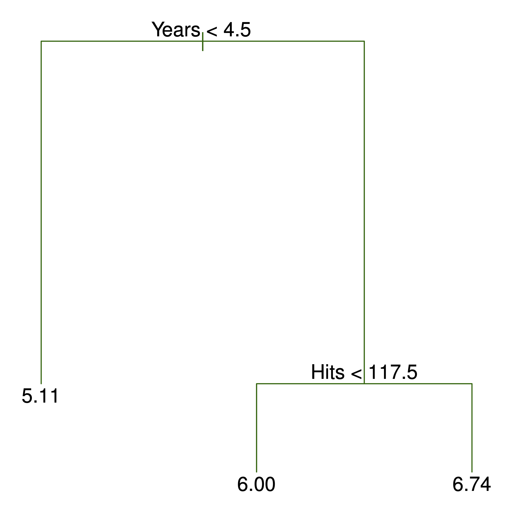
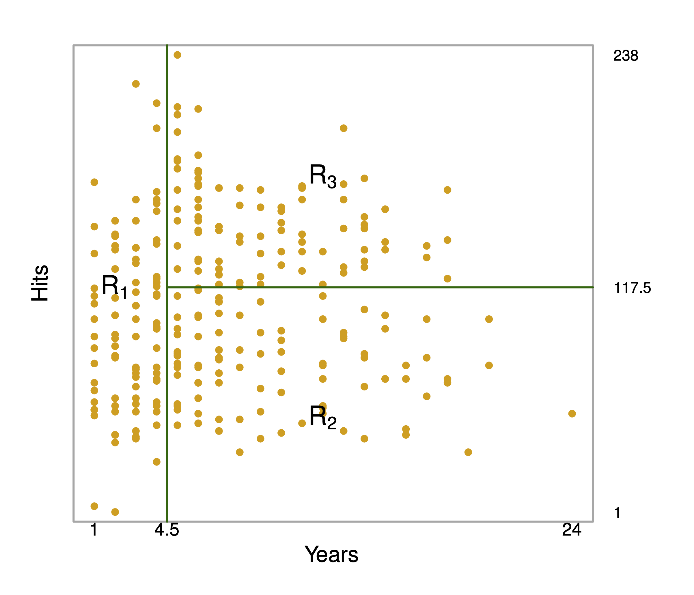
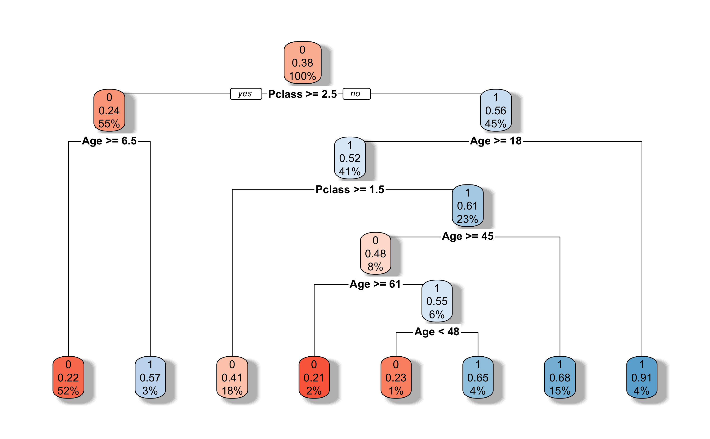
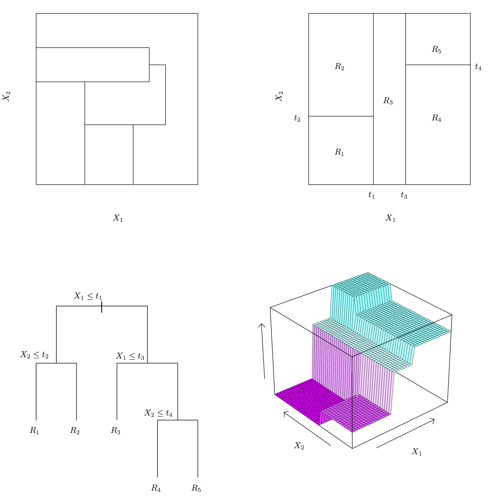
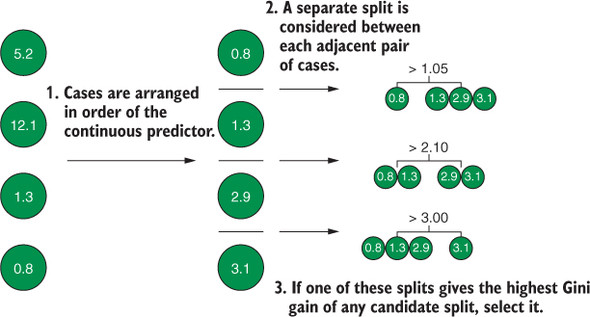
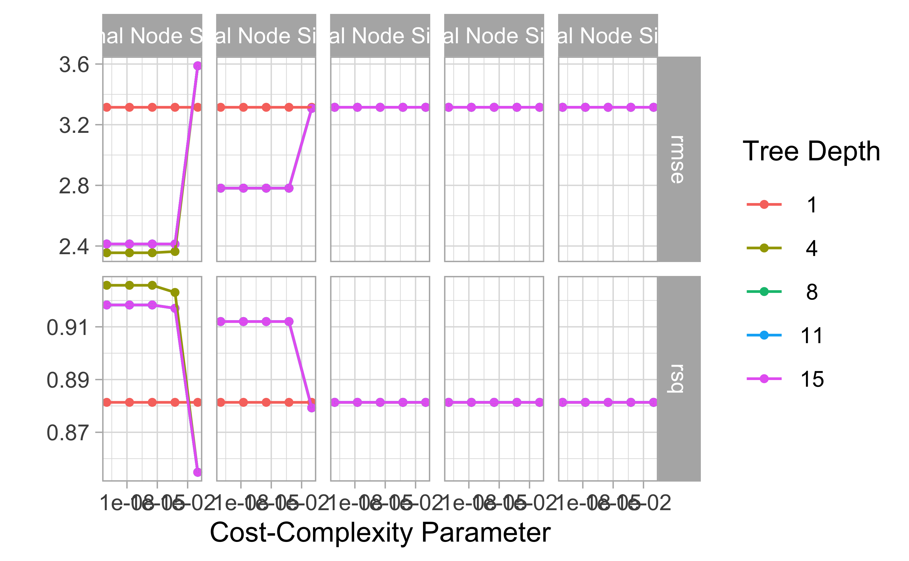

# Entscheidungsbäume


<!-- ```{r global-knitr-options, include=FALSE} -->
<!--   knitr::opts_chunk$set( -->
<!--   fig.pos = 'H', -->
<!--   fig.asp = 0.618, -->
<!--   fig.align='center', -->
<!--   fig.width = 5, -->
<!--   out.width = "100%", -->
<!--   fig.cap = "",  -->
<!--   dpi = 300, -->
<!--   # tidy = TRUE, -->
<!--   echo = FALSE, -->
<!--   message = FALSE, -->
<!--   warning = FALSE, -->
<!--   cache = TRUE, -->
<!--   fig.show = "hold") -->
<!-- ``` -->


## Vorbereitung


In diesem Kapitel werden folgende R-Pakete benötigt:


```r
library(titanic)  # Datensatzt Titanic
#library(rpart)  # Berechnung von Entscheidungsbäumen
library(tidymodels)
library(tictoc)  # Zeitmessung
```


## Lernsteuerung


## Anatomie eines Baumes

Ein Baum 🌳 hat (u.a.):

- Wurzel
- Blätter
- Äste


In einem *Entscheidungsbaum* ist die Terminologie ähnlich, s. Abb. \@ref(fig:rec-part2).
Allgemein gesagt, kann ein Entscheidungsbaum in einem baumähnlichen Graphen visualisiert werden.
Dort gibt es Knoten, die durch Kanten verbunden sind,
wobei zu einem Knoten genau ein Kanten führt. 


Ein  Beispiel für einen einfachen Baum sowie die zugehörige *rekursive Partionierung* ist in Abb. \@ref(fig:rec-part2) dargestellt; 
man erkennt $R=3$ *Regionen* bzw. Blätter [@islr].


<div class="figure" style="text-align: center">

<p class="caption">(\#fig:rec-part2)Einfaches Beispiel für einen Baum sowie der zugehörigen rekursiven Partionierung</p>
</div>


In Abb. \@ref(rec-part2) wird der Knoten an der Spitze auch als *Wurzel(knoten)* bezeichnet.
Von diesem Knoten entspringen alle Pfade.
Ein Pfad ist die geordnete Menge der Pfade mit ihren Knoten ausgehend von der Wurzel bis zu einem Blatt.
Knoten, aus denen kein Kanten mehr wegführt ("Endknoten") werden als *Blätter* bezeichnet.
Von einem Knoten gehen zwei Kanten aus (oder gar keine).
Knoten, von denen zwei Kanten ausgehen, spiegeln eine *Bedingung* (Prüfung) wider, im Sinne einer Aussage,
die mit ja oder nein beantwortet werden kann.
Die Anzahl der Knoten eines Pfads entsprechen den *Ebenen* bzw. der Tiefe des Baumes.
Von der obersten Ebene (Wurzelknoten) kann man die $e$ Ebenen aufsteigend durchnummerieren,
beginnend bei 1: $1,2,\ldots,e$.


## Bäume als Regelmaschinen rekursiver Partionierung

Ein Baum kann man als eine Menge von *Regeln*, im Sinne von *Wenn-dann-sonst-Aussagen*, sehen:

```
Wenn Prädiktor A = 1 ist dann
|  Wenn Prädiktor B = 0 ist dann p = 10%
|  sonst p = 30%
sonst p = 50%
```

In diesem Fall, zwei Prädiktoren, ist der Prädiktorenraum in *drei Regionen* unterteilt:
Der Baum hat drei Blätter.

Für Abb. \@ref(fig:tree1) ergibt sich eine komplexere Aufteilung, s. auch Abb. \@ref(fig:recursive-part).


<div class="figure" style="text-align: center">

<p class="caption">(\#fig:tree1)Beispiel für einen Entscheidungsbaum</p>
</div>

Kleine Lesehilft für Abb. \@ref(fig:tree1):

- Für jeden Knoten steht in der ersten Zeile der vorhergesagte Wert, z.B. `0` im Wurzelknoten
- darunter steht der Anteil (die Wahrscheinlichkeit) für die in diesem Knoten vorhergesagte Kategorie (`0` oder `1`)
- darunter (3. Zeile) steht der Anteil der Fälle (am Gesamt-Datensatz) in diesem Knoten, z.B. `100%`


<div class="figure" style="text-align: center">

<p class="caption">(\#fig:recursive-part)Partionierung in Rechtecke durch Entscheidungsbäume</p>
</div>


Wie der Algorithmus oben zeigt,
wird der Prädiktorraum wiederholt (rekursiv) aufgeteilt,
und zwar in Rechtecke,s. Abb. \@ref(fig:recursive-part).
Man nennt (eine Implementierung) dieses Algorithmus auch *rpart*.


Das Regelwerk zum Baum aus Abb. \@ref(fig:tree1) sieht so aus:


```
## parsnip model object
## 
## n= 891 
## 
## node), split, n, loss, yval, (yprob)
##       * denotes terminal node
## 
##   1) root 891 342 0 (0.61616162 0.38383838)  
##     2) Pclass>=2.5 491 119 0 (0.75763747 0.24236253)  
##       4) Age>=6.5 461 102 0 (0.77874187 0.22125813) *
##       5) Age< 6.5 30  13 1 (0.43333333 0.56666667) *
##     3) Pclass< 2.5 400 177 1 (0.44250000 0.55750000)  
##       6) Age>=17.5 365 174 1 (0.47671233 0.52328767)  
##        12) Pclass>=1.5 161  66 0 (0.59006211 0.40993789) *
##        13) Pclass< 1.5 204  79 1 (0.38725490 0.61274510)  
##          26) Age>=44.5 67  32 0 (0.52238806 0.47761194)  
##            52) Age>=60.5 14   3 0 (0.78571429 0.21428571) *
##            53) Age< 60.5 53  24 1 (0.45283019 0.54716981)  
##             106) Age< 47.5 13   3 0 (0.76923077 0.23076923) *
##             107) Age>=47.5 40  14 1 (0.35000000 0.65000000) *
##          27) Age< 44.5 137  44 1 (0.32116788 0.67883212) *
##       7) Age< 17.5 35   3 1 (0.08571429 0.91428571) *
```


Kleine Lesehilfe:
Ander Wurzel `root` des Baumes, Knoten `1)`haben wir 891 Fälle,
von denen 342 *nicht* unserer Vorhersage `yval` entsprechen, also `loss` sind,
das ist ein Anteil, `(yprob)` von 0.38.
Unsere Vorhersage ist `0`, da das die Mehrheit in diesem Knoten ist,
dieser Anteil beträgt ca. 61%.
In der Klammer stehen also die Wahrscheinlichkeiten für alle Ausprägungen von Y:, `0` und `1`,
in diesem Fall.
Entsprechendes gilt für jeden weiteren Knoten.


Ein kurzer Check der Häufigkeit am Wurzelknoten:


```r
count(titanic_train, Survived)
```

```
##   Survived   n
## 1        0 549
## 2        1 342
```


Solche Entscheidungsbäume zu erstellen, ist nichts neues. 
Man kann sie mit einer einfachen Checkliste oder Entscheidungssystem vergleichen.
Der Unterschied zu Entscheidungsbäumen im maschinellen Lernen ist nur,
dass die Regeln aus den Daten gelernt werden, man muss sie nicht vorab kennen.


Noch ein Beispiel ist in Abb. \@ref(fig:tree3) gezeigt [@islr]: 
Oben links zeigt eine *unmögliche* Partionierung (für einen Entscheidungsbaum). 
Oben rechts zeigt die Regionen, 
die sich durch den Entscheidungsbaum unten links ergeben.
Untenrechts ist der Baum in 3D dargestellt.


<div class="figure" style="text-align: center">

<p class="caption">(\#fig:tree3)Ein weiteres Beispiel zur Darstellung von Entscheidungsbäumen</p>
</div>


## Klassifikation


Bäume können für Zwecke der Klassifikation (nominal skalierte AV) oder Regression (numerische AV) verwendet werden.
Betrachten wir zunächst die binäre Klassifikation, also für eine zweistufige (nominalskalierte) AV.
Das Ziel des Entscheidungsmodel-Algorithmus ist es,
zu Blättern zu kommen, die möglichst "sortenrein" sind, 
sich also möglichst klar für eine (der beiden) Klassen $A$ oder $B$ aussprechen.
Nach dem Motto: "Wenn Prädiktor 1 kleiner $x$ und wenn Prädiktor 2 gleich $y$,
dann handelt es sich beim vorliegenden Fall ziemlich sicher um Klasse $A$."


:::: {.infobox .quote}
Je homogener die Verteilung der AV pro Blatt, desto genauer die Vorhersagen.
:::


Unsere Vorhersage in einem Blatt entspricht der Merheit bzw. der häufigsten Kategorie in diesem Blatt.


## Gini als Optimierungskriterium

Es gibt mehrere Kennzahlen, die zur Optimierung bzw. zur Entscheidung zum Aufbau des Entscheidungsbaum herangezogen werden.
Zwei übliche sind der *Gini-Koeffizient* und die *Entropie*.
Bei Kennzahlen sind Maß für die Homogenität oder "Sortenreinheit" (vs. Heterogenität, engl. auch impurity).

Den Algorithmus zur Erzeugung des Baumes kann man so darstellen:

```
Wiederhole für jede Ebenes
|  prüfe für alle Prädiktoren alle möglichen Bedingungen
|  wähle denjenigen Prädiktor mit derjenigen Bedingung, der die Homogenität maximiert
solange bis Abbruchkriterium erreicht ist.
```

Ein Bedingung könnte sein `Age >= 18` oder `Years < 4.5`.

Es kommen mehrere Abbruchkriterium in Frage:

- Eine Mindestanzahl von Beobachtungen pro Knoten wird unterschritten (`minsplit`)
- Die maximale Anzahl an Ebenen ist erreicht (`maxdepth`)
- Die minimale Zahl an Beobachtungen eines Blatts wird unterschritten (`minbucket`)


Der Gini-Koeffizient ist im Fall einer UV mit zwei Stufen, $c_A$ und $c_B$, so definiert:

$$G = 1 - \left(p(c_A)^2 + (1-p(c_A))^2\right)$$


Der Algorithmus ist "gierig" (greedy): Optimiert werden lokal optimale Aufteilungen,
auch wenn das bei späteren Aufteilungen im Baum dann insgesamt zu geringerer Homogenität führt.


Die Entropie ist definiert als 

$$D = - \sum_{k=1}^K p_k \cdot log(p_k),$$

wobei $K$ die Anzahl der Kategorien indiziert.

Gini-Koeffizient und Entropie kommen oft zu ähnlichen numerischen Ergebnissen,
so dass wir uns im Folgenden auf den Gini-Koeffizienten konzentieren werden.

---

*Beispiel*

Vergleichen wir drei Bedingungen mit jeweils $n=20$ Fällen, die zu unterschiedlich homogenen Knoten führen:

- 10/10
- 15/5
- 19/1

Was ist jeweils der Wert des Gini-Koeffizienten?


```r
G1 <- 1 - ((10/20)^2 + (10/20)^2)
G1
```

```
## [1] 0.5
```

```r
G2 <- 1 - ((15/20)^2 + (5/20)^2)
G2
```

```
## [1] 0.375
```

```r
G3 <- 1 - ((19/20)^2 + (1/20)^2)
G3
```

```
## [1] 0.095
```


Wie man sieht, sinkt der Wert des Gini-Koeffizienten ("G-Wert"), je homogener die Verteilung ist.
*Maximal* heterogen ("gemischt") ist die Verteilung, wenn alle Werte gleich oft vorkommen,
in diesem Fall also 50%/50%.


---


Neben dem G-Wert für einzelne Knoten kann man den G-Wert für eine Aufteilung ("Split") berechnen,
also die Fraeg beantworten, ob die Aufteilung eines Knoten in zwei zu mehr Homogenität führt.
Der G-Wert einer Aufteilung ist die gewichtete Summe der G-Werte der beiden Knoten (links, $l$ und rechts, $r$):


$$G_{split} = p(l) G_{l} + p(r) G_r$$

Der *Gewinn* (gain) an Homogenität ist dann die Differenz des G-Werts der kleineren Ebene und der Aufteilung:


$$G_{gain} = G - G_{split}$$


Der Algorithmus kann auch bei UV mit mehr als zwei, also $K$ Stufen, $c_1, c_2, \ldots, c_K$ verwendet werden:


$$G= 1- \sum_{k=1}^K p(c_k)^2$$ 


## Metrische Prädiktoren


Außerdem ist es möglich, Bedingung  bei *metrischen* UV auf ihre Homogenität hin zu bewerten,
also Aufteilungen der Art `Years < 4.5` zu tätigen. 
Dazu muss man einen Wert identifieren, bei dem man auftrennt.

Das geht in etwa so:

```
Sortiere die Werte eines Prädiktors (aufsteigend)
Für jedes Paar an aufeinanderfolgenden Werten berechne den G-Wert
Finde das Paar mit dem höchsten G-Wert aus allen Paaren
Nimm den Mittelwert der beiden Werte dieses Paares: Das ist der Aufteilungswert
```


Abbildung \@ref(fig:tree-metr) stellt dieses Vorgehen schematisch dar [@rhys].


```r

```

<div class="figure" style="text-align: center">

<p class="caption">(\#fig:tree-metr)Aufteilungswert bei metrischen Prädiktoren</p>
</div>


## Regressionbäume

Bei Regressionsbäumen wird nicht ein Homogenitätsmaß wie der Gini-Koeffizient als Optimierungskriterium
herangezogen, sondern die *RSS* (Residual Sum of Squares) bietet sich an.

Die $J$ Regionen (Partionierungen) des Prädiktorraums $R_1, R_2, \ldots, R_J$ müssen so gewählt werden,
dass RSS minimal ist:


$$RSS = \sum^J_{j=1}\sum_{i\in R_j}(u_i - \hat{y}_{R_j})^2,$$

wobei $\hat{y}$ der (vom Baum) vorhergesagte Wert ist für die $j$-te Region.

## Baum beschneiden

Ein Problem mit Entscheidungsbäumen ist,
dass ein zu komplexer Baum, "zu verästelt" sozusagen,
in hohem Maße Overfitting ausgesetzt ist:
Bei höheren Ebenen im Baum ist die Anzahl der Beobachtungen zwangsläufig klein,
was bedeutet, dass viel Rauschen gefittet wird.

Um das Overfitting zu vermeiden, gibt es zwei auf der Hand liegende Maßnahmen:

1. Den Baum nicht so groß werden lassen
2. Den Baum "zurückschneiden"

Die 1. Maßnahme beruht auf dem Festlegen einer maximalen Zahl an Ebenen (`maxdepth`) oder einer minimalen Zahl an Fällen pro Knoten (`minsplit`) oder im Blatt (`minbucket`).


Die 2. Maßnahme, das Zurückschneiden (pruning) des Baumes hat als Idee, einen "Teilbaum" $T$ zu finden,
der so klein wie möglich ist, aber so gut wie möglich präzise Vorhersagen erlaubt.
Dazu belegen wir die RSS eines Teilbaums (subtree) mit einem Strafterm $s = \alpha |T|$,
wobei $|T|$ die Anzahl der Blätter des Baums entspricht. $\alpha$ ist ein Tuningparameter,
also ein Wert, der nicht vom Modell berechnet wird, sondern von uns gesetzt werden muss -
zumeist durch schlichtes Ausprobieren.
$\alpha$ wägt ab zwischen Komplexität und Fit (geringe RSS).
Wenn $\alpha=0$ haben wir eine normalen, unbeschnittenen Baum $T_0$.
Je größer $\alpha$ wird, desto höher wird der "Preis" für viele Blätter, also für Komplexität
und der Baum wird kleiner.
Dieses Vorgehen nennt man auch *cost complexity pruning*.
Daher nennt man den zugehörigen Tuningparameter auch *Cost Complexity* $C_p$.


## Das Rechteck schlägt zurück


Entscheidungsbäume zeichnen sich durch rechtecke (rekursive) Partionierungen des Prädiktorenraums aus.
Lineare Modelle durch eine einfache lineare Partionierung (wenn man Klassifizieren möchte),
Abb. \@ref(fig:rechteck) verdeutlicht diesen Unterschied [@islr].


<div class="figure" style="text-align: center">

<p class="caption">(\#fig:rechteck)Rechteckige vs. lineare Partionierung</p>
</div>

Jetzt kann sich fragen: Welches Vorgehen ist besser - das rechteckige oder das lineare Partionierungen.
Da gibt es eine klare Antwort: Es kommt drauf an.
Wie Abb. \@ref(fig:rechteck) gibt es Datenlagen, in denen das eine Vorgehen zu homogenerer Klassifikation führt
und Situationen, in denen das andere Vorgehen besser ist, vgl. Abb. \@ref(fig:lunch).


<div class="figure" style="text-align: center">

<p class="caption">(\#fig:lunch)Free Lunch?</p>
</div>


## Tidymodels


Probieren wir den Algorithmus Entscheidungsbäume an einem einfachen Beispiel in R mit Tidymodels aus.

Die Aufgabe sei, Spritverbrauch (möglichst exakt) vorherzusagen.

Ein ähnliches Beispiel, mit analogem Vorgehen, findet sich in [dieser Fallstude](https://juliasilge.com/blog/wind-turbine/).


### Initiale Datenaufteilung


```r
library(tidymodels)
```


```r
data("mtcars")

set.seed(42)  # Reproduzierbarkeit
d_split <- initial_split(mtcars, strata = mpg)
```

```
## Warning: The number of observations in each quantile is below the recommended threshold of 20.
## • Stratification will use 1 breaks instead.
```

```
## Warning: Too little data to stratify.
## • Resampling will be unstratified.
```

```r
d_train <- training(d_split)
d_test <- testing(d_split)
```


Die Warnung zeigt uns, dass der Datensatz sehr klein ist; stimmt. Ignorieren wir hier einfach.

Wie man auf der [Hilfeseite der Funktion](https://rsample.tidymodels.org/reference/initial_split.html) sieht,
wird per Voreinstellung 3/1 aufgeteilt, also 75% in das Train-Sample, 25% der Daten ins Test-Sample.

Bei $n=32$ finden also 8 Autos ihren Weg ins Test-Sample und die übrigen 24 ins Train-Sample.
Bei der kleinen Zahl könnte man sich (berechtigterweise) fragen,
ob es Sinn macht, die spärlichen Daten noch mit einem Test-Sample weiter zu dezimieren.
Der Einwand ist nicht unberechtigt, 
allerdings zieht der Verzicht auf ein Test-Sample andere Probleme, Overfitting namentlich, nach sich.


### Kreuzvalidierung definieren


```r
d_cv <- vfold_cv(d_train, strata = mpg, repeats = 5, v = 5) 
d_cv
```

```
## #  5-fold cross-validation repeated 5 times using stratification 
## # A tibble: 25 × 3
##    splits         id      id2  
##    <list>         <chr>   <chr>
##  1 <split [19/5]> Repeat1 Fold1
##  2 <split [19/5]> Repeat1 Fold2
##  3 <split [19/5]> Repeat1 Fold3
##  4 <split [19/5]> Repeat1 Fold4
##  5 <split [20/4]> Repeat1 Fold5
##  6 <split [19/5]> Repeat2 Fold1
##  7 <split [19/5]> Repeat2 Fold2
##  8 <split [19/5]> Repeat2 Fold3
##  9 <split [19/5]> Repeat2 Fold4
## 10 <split [20/4]> Repeat2 Fold5
## # … with 15 more rows
```

Die Defaults (Voreinstellungen) der Funktion `vfold_cv()` können, wie immer, auf der [Hilfeseite der Funktion](https://rsample.tidymodels.org/reference/vfold_cv.html) nachgelesen werden.

Da die Stichprobe sehr klein ist,
bietet es sich an, eine kleine Zahl an Faltungen (`folds`) zu wählen.
Bei 10 Faltungen beinhaltete eine Stichprobe gerade 10% der Fälle in Train-Sample,
also etwa ... 2!


Zur Erinnerung:
Je größer die Anzahl der Repeats,
desto genauer schätzen wir die Modellgüte.


### Rezept definieren

Hier ein einfaches Rezept:


```r
recipe1 <-
  recipe(mpg ~ ., data = d_train) %>% 
  step_impute_knn() %>% 
  step_normalize() %>% 
  step_dummy() %>% 
  step_other(threshold = .1)
```


### Modell definieren


```r
tree_model <-
  decision_tree(
    cost_complexity = tune(),
    tree_depth = tune(),
    min_n = tune()
  ) %>% 
  set_engine("rpart") %>% 
  set_mode("regression")
```


Wenn Sie sich fragen, woher Sie die Optionen für die Tuningparameter wissen sollen: Schauen Sie mal in die [Hilfeseite des Pakets {{dials}}](https://dials.tidymodels.org/articles/Basics.html); das Paket ist Teil von Tidymodels.


Die Berechnung des Modells läuft über das Paket `{{rpart}}`, 
was wir durch `set_engine()` festgelegt haben.


Der Parameter *Cost Complexity*, $C_p$ oder manchmal auch mit $\alpha$ bezeichnet,
hat einen typischen Wertebereich von $10^{-10}$ bis $10^{-1}$:


```r
cost_complexity()
```

```
## Cost-Complexity Parameter (quantitative)
## Transformer: log-10 [1e-100, Inf]
## Range (transformed scale): [-10, -1]
```


Hier ist der Wert in Log-Einheiten angegeben. Wenn Sie sich fragen, woher Sie das bitteschön wissen sollen:
Naja, es steht auf der [Hilfeseite](https://dials.tidymodels.org/articles/Basics.html) 😄.

Unser Modell ist also so definiert:


```r
tree_model
```

```
## Decision Tree Model Specification (regression)
## 
## Main Arguments:
##   cost_complexity = tune()
##   tree_depth = tune()
##   min_n = tune()
## 
## Computational engine: rpart
```


Mit `tune()` weist man den betreffenden Parameter als "zu tunen" aus -
gute Werte sollen durch Ausprobieren während des Berechnens bestimmt werden.
Genauer gesagt soll das Modell für jeden Wert (oder jede Kombination an Werten von Tuningparametern)
berechnet werden.

Eine Kombination an Tuningparameter-Werten, die ein Modell spezifizieren,
sozusagen erst "fertig definieren", nennen wir einen *Modellkandidaten*.


Definieren wir also eine Tabelle (`grid`) mit Werten, die ausprobiert, "getuned" werden sollen.
Wir haben oben dre Tuningparameter bestimmt. Sagen wir,
wir hätten gerne jeweils 5 Werte pro Parameter.


```r
tree_grid <-
  grid_regular(
    cost_complexity(),
    tree_depth(),
    min_n(),
    levels = 4
  )
```


Für jeden Parameter sind Wertebereiche definiert;
dieser Wertebereich wird gleichmäßig (daher `grid regular`) aufgeteilt;
die Anzahl der verschiedenen Werte pro Parameter wird druch `levels` gegeben.


Mehr dazu findet sich auf der [Hilfeseite](https://dials.tidymodels.org/reference/grid_regular.html) zu `grid_regular()`.

Wenn man die alle miteinander durchprobiert, entstehen $4^3$ Kombinationen,
also Modellkandidaten. 

Allgemeiner gesagt sind das bei $n$ Tuningparametern mit jeweils $m$ verschiedenen Werten $m^n$ Möglichkeiten,
spricht Modellkandidaten. Um diesen Faktor erhöht sich die Rechenzeit im Vergleich zu einem Modell ohne Tuning.
Man sieht gleich, dass die Rechenzeit schnell unangenehm lang werden kann.

Entsprechend hat unsere Tabelle diese Zahl an Zeilen.
Jede Zeile definiert einen Modellkandidaten,
also eine Berechnung des Modells.


```r
dim(tree_grid)
```

```
## [1] 64  3
```


```r
head(tree_grid)
```

```
## # A tibble: 6 × 3
##   cost_complexity tree_depth min_n
##             <dbl>      <int> <int>
## 1    0.0000000001          1     2
## 2    0.0000001             1     2
## 3    0.0001                1     2
## 4    0.1                   1     2
## 5    0.0000000001          5     2
## 6    0.0000001             5     2
```


Man beachte, dass außer *Definitionen* bisher nichts passiert ist -- vor allem haben wir noch
nichts berechnet.
Sie scharren mit den Hufen? Wollen endlich loslegen?
Also gut.


### Workflow definieren


Fast vergessen: Wir brauchen noch einen Workflow.


```r
tree_wf <-
  workflow() %>% 
  add_model(tree_model) %>% 
  add_recipe(recipe1)
```


### Modell tunen und berechnen

Achtung: Das Modell zu berechnen kann etwas dauern.
Es kann daher Sinn machen, 
das Modell abzuspeichern,
so dass Sie beim erneuten Durchlaufen nicht nochmal berechnen müssen,
sondern einfach von der Festplatte laden können;
das setzt natürlich voraus,
dass sich am Modell nichts geändert hat.


```r
doParallel::registerDoParallel()  # mehrere Kerne parallel nutzen

set.seed(42)
tic()  # Stoppuhr an
trees_tuned <-
  tune_grid(
    object = tree_wf,
    grid = tree_grid,
    resamples = d_cv
  )
toc()  # Stoppuhr aus
```


Es bietet sich in dem Fall an, das Ergebnis-Objekt als *R Data serialized* (rds) abzuspeichern:


```r
write_rds(trees_tuned, "objects/trees1.rds")
```

Bzw. so wieder aus der RDS-Datei zu importieren:


```r
trees_tuned <- read_rds("objects/trees1.rds")
```


[Hier](https://stackoverflow.com/questions/21370132/what-are-the-main-differences-between-r-data-files) oder [hier](https://en.wikipedia.org/wiki/Serialization) kann man einiges zum Unterschied einer RDS-Datei vs. einer "normalen" R-Data-Datei nachlesen.
Wenn man möchte 😉.


```r
trees_tuned
```

```
## # Tuning results
## # 5-fold cross-validation repeated 5 times using stratification 
## # A tibble: 25 × 5
##    splits         id      id2   .metrics           .notes           
##    <list>         <chr>   <chr> <list>             <list>           
##  1 <split [19/5]> Repeat1 Fold1 <tibble [128 × 7]> <tibble [32 × 3]>
##  2 <split [19/5]> Repeat1 Fold2 <tibble [128 × 7]> <tibble [32 × 3]>
##  3 <split [19/5]> Repeat1 Fold3 <tibble [128 × 7]> <tibble [32 × 3]>
##  4 <split [19/5]> Repeat1 Fold4 <tibble [128 × 7]> <tibble [32 × 3]>
##  5 <split [20/4]> Repeat1 Fold5 <tibble [128 × 7]> <tibble [32 × 3]>
##  6 <split [19/5]> Repeat2 Fold1 <tibble [128 × 7]> <tibble [32 × 3]>
##  7 <split [19/5]> Repeat2 Fold2 <tibble [128 × 7]> <tibble [32 × 3]>
##  8 <split [19/5]> Repeat2 Fold3 <tibble [128 × 7]> <tibble [32 × 3]>
##  9 <split [19/5]> Repeat2 Fold4 <tibble [128 × 7]> <tibble [32 × 3]>
## 10 <split [20/4]> Repeat2 Fold5 <tibble [128 × 7]> <tibble [32 × 3]>
## # … with 15 more rows
## 
## There were issues with some computations:
## 
##   - Warning(s) x320: 27 samples were requested but there were 19 rows in the data. 19 ...   - Warning(s) x80: 27 samples were requested but there were 19 rows in the data. 19 ...   - Warning(s) x320: 27 samples were requested but there were 19 rows in the data. 19 ...   - Warning(s) x80: 27 samples were requested but there were 19 rows in the data. 19 ...   - Warning(s) x4: 27 samples were requested but there were 19 rows in the data. 19 ...
## 
## Use `collect_notes(object)` for more information.
```


Die Warnhinweise kann man sich so ausgeben lassen:


```r
collect_notes(trees_tuned)
```

```
## # A tibble: 804 × 5
##    id      id2   location                      type    note                     
##    <chr>   <chr> <chr>                         <chr>   <chr>                    
##  1 Repeat1 Fold1 preprocessor 1/1, model 33/64 warning 27 samples were requeste…
##  2 Repeat1 Fold1 preprocessor 1/1, model 34/64 warning 27 samples were requeste…
##  3 Repeat1 Fold1 preprocessor 1/1, model 35/64 warning 27 samples were requeste…
##  4 Repeat1 Fold1 preprocessor 1/1, model 36/64 warning 27 samples were requeste…
##  5 Repeat1 Fold1 preprocessor 1/1, model 37/64 warning 27 samples were requeste…
##  6 Repeat1 Fold1 preprocessor 1/1, model 38/64 warning 27 samples were requeste…
##  7 Repeat1 Fold1 preprocessor 1/1, model 39/64 warning 27 samples were requeste…
##  8 Repeat1 Fold1 preprocessor 1/1, model 40/64 warning 27 samples were requeste…
##  9 Repeat1 Fold1 preprocessor 1/1, model 41/64 warning 27 samples were requeste…
## 10 Repeat1 Fold1 preprocessor 1/1, model 42/64 warning 27 samples were requeste…
## # … with 794 more rows
```


Wie gesagt,
in diesem Fall war die Stichprobengröße sehr klein.


### Modellgüte evaluieren


```r
collect_metrics(trees_tuned)
```

```
## # A tibble: 128 × 9
##    cost_complexity tree_depth min_n .metric .estimator  mean     n std_err
##              <dbl>      <int> <int> <chr>   <chr>      <dbl> <int>   <dbl>
##  1    0.0000000001          1     2 rmse    standard   3.46     25  0.223 
##  2    0.0000000001          1     2 rsq     standard   0.666    21  0.0385
##  3    0.0000001             1     2 rmse    standard   3.46     25  0.223 
##  4    0.0000001             1     2 rsq     standard   0.666    21  0.0385
##  5    0.0001                1     2 rmse    standard   3.46     25  0.223 
##  6    0.0001                1     2 rsq     standard   0.666    21  0.0385
##  7    0.1                   1     2 rmse    standard   3.46     25  0.223 
##  8    0.1                   1     2 rsq     standard   0.666    21  0.0385
##  9    0.0000000001          5     2 rmse    standard   2.62     25  0.265 
## 10    0.0000000001          5     2 rsq     standard   0.863    25  0.0279
## # … with 118 more rows, and 1 more variable: .config <chr>
```


Praktischerweise gibt es eine Autoplot-Funktion, um die besten Modellparameter auszulesen:


```r
autoplot(trees_tuned)
```




### Bestes Modell auswählen

Aus allen Modellkandidaten wählen wir jetzt das beste Modell aus:


```r
select_best(trees_tuned)
```

```
## # A tibble: 1 × 4
##   cost_complexity tree_depth min_n .config              
##             <dbl>      <int> <int> <chr>                
## 1          0.0001          5     2 Preprocessor1_Model07
```


Mit diesem besten Kandidaten definieren wir jetzt das "finale" Modell,
wir "finalisieren" das Modell mit den besten Modellparametern:


```r
tree_final <-
  finalize_model(tree_model, parameters = select_best(trees_tuned))

tree_final
```

```
## Decision Tree Model Specification (regression)
## 
## Main Arguments:
##   cost_complexity = 1e-04
##   tree_depth = 5
##   min_n = 2
## 
## Computational engine: rpart
```

Hier ist, unser finaler Baum 🌳.


Schließlich updaten wir mit dem finalen Baum noch den Workflow:


```r
final_wf <-
  tree_wf %>% 
  update_model(tree_final)
```


### Final Fit

Jetzt fitten wir dieses Modell auf das *ganze* Train-Sample und predicten auf das Test-Sample:


```r
tree_fit_final <-
  final_wf %>% 
  last_fit(d_split)

tree_fit_final
```

```
## # Resampling results
## # Manual resampling 
## # A tibble: 1 × 6
##   splits         id               .metrics .notes   .predictions     .workflow 
##   <list>         <chr>            <list>   <list>   <list>           <list>    
## 1 <split [24/8]> train/test split <tibble> <tibble> <tibble [8 × 4]> <workflow>
```


```r
collect_metrics(tree_fit_final)
```

```
## # A tibble: 2 × 4
##   .metric .estimator .estimate .config             
##   <chr>   <chr>          <dbl> <chr>               
## 1 rmse    standard       3.93  Preprocessor1_Model1
## 2 rsq     standard       0.683 Preprocessor1_Model1
```


Voilà: Die Modellgüte für das Test-Sample:
Im Schnitt liegen wir ca. 4 Meilen daneben mit unseren Vorhersagen,
wenn wir RMSE mal so locker interpretieren wollen.

In der Regel ist übrigens RMSE interessanter als R-Quadrat,
da R-Quadrat die Güte eines Korrelationsmusters vorhersagt,
aber RMSE die Präzision der Vorhersage,
also sozusagen die Kürze der Fehlerbalken.


### Nur zum Spaß: Vergleich mit linearem Modell

Ein einfaches lineares Modell,
was hätte das jetzt wohl für eine Modellgüte?


```r
lm_model <-
  linear_reg()
```


```r
lm_wf <-
  workflow() %>% 
  add_model(lm_model) %>% 
  add_recipe(recipe1)
```


```r
tic()
lm_fit <-
  fit_resamples(
    lm_wf,
    resamples = d_cv
  )
toc()
```

```
## 9.263 sec elapsed
```


```r
collect_metrics(lm_fit)
```

```
## # A tibble: 2 × 6
##   .metric .estimator  mean     n std_err .config             
##   <chr>   <chr>      <dbl> <int>   <dbl> <chr>               
## 1 rmse    standard   4.16     25  0.362  Preprocessor1_Model1
## 2 rsq     standard   0.624    25  0.0587 Preprocessor1_Model1
```


```r
lm_fit_final <- 
  last_fit(lm_wf, d_split)
```


Wie präzise ist die Vorhersage im Test-Sample?


```r
collect_metrics(lm_fit_final)
```

```
## # A tibble: 2 × 4
##   .metric .estimator .estimate .config             
##   <chr>   <chr>          <dbl> <chr>               
## 1 rmse    standard       5.24  Preprocessor1_Model1
## 2 rsq     standard       0.434 Preprocessor1_Model1
```

Das lineare Modell schneidet etwas (deutlich?) schlechter ab als das einfache Baummodell.


Man beachte, dass die Modellgüte im Train-Samle höher ist als im Test-Sample (Overfitting).


