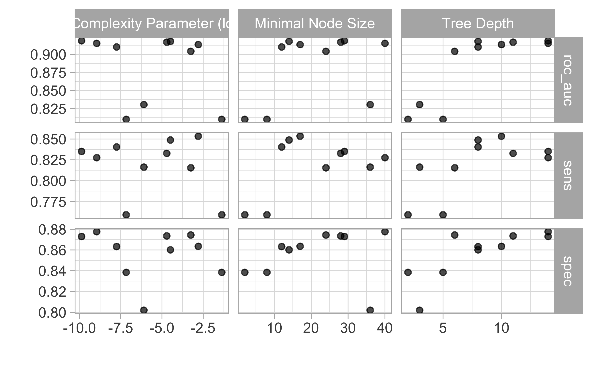
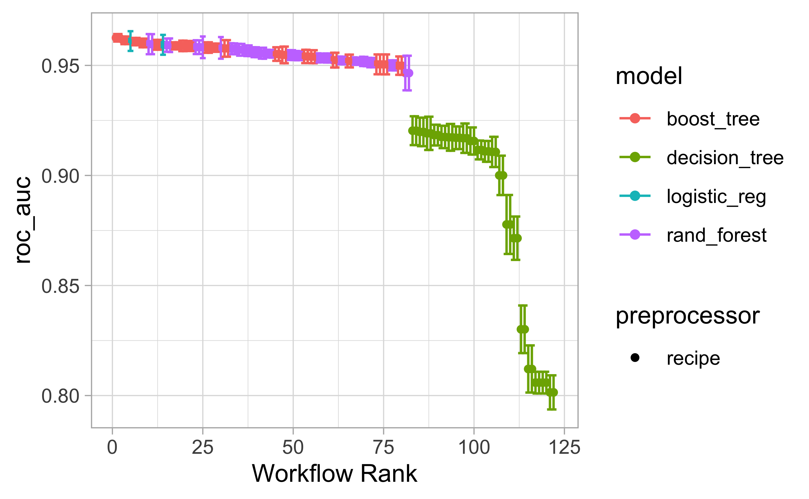
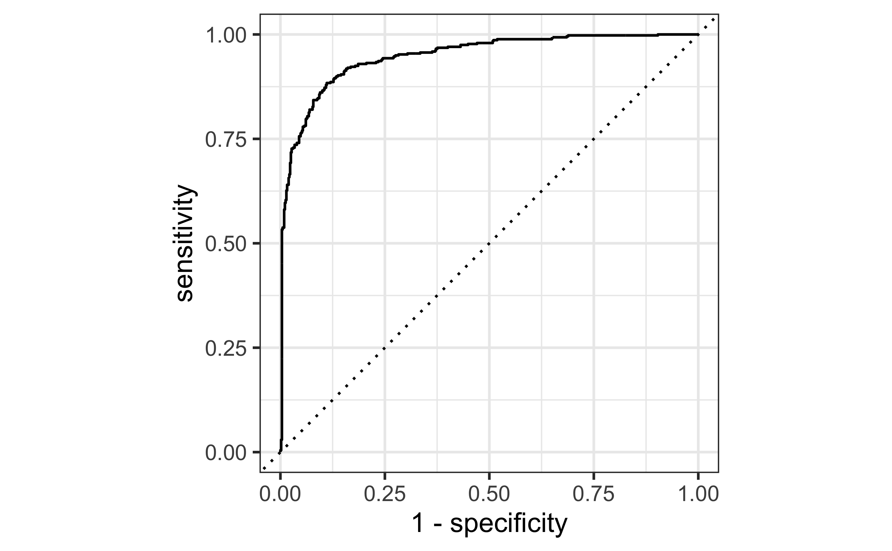

# Ensemble Lerner


## Lernsteuerung


### Lernziele 

- Sie können Algorithmen für Ensemble-Lernen erklären, d.i. Bagging, AdaBoost, XGBoost, Random Forest
- Sie wissen, anhand welche Tuningparamter man Overfitting bei diesen Algorithmen begrenzen kann
- Sie können diese Verfahren in R berechnen


### Literatur 

- Rhys, Kap. 8


## Vorbereitung


In diesem Kapitel werden folgende R-Pakete benötigt:


```r
library(tidymodels)
library(tictoc)  # Zeitmessung
library(vip)  # Variable importance plot
```


## Hinweise zur Literatur


Die folgenden Ausführungen basieren primär auf @rhys, aber auch auf @islr und (weniger) @kuhn.


## Wir brauchen einen Wald

Ein Pluspunkt von Entscheidungsbäumen ist ihre gute Interpretierbarkeit.
Man könnte behaupten, dass Bäume eine typische Art des menschlichen Entscheidungsverhalten
nachahmen: "Wenn A, dann tue B, ansonsten tue C" (etc.).
Allerdings: Einzelne Entscheidungsbäume haben oft keine so gute Prognosegenauigkeit. 
Der oder zumindest ein Grund ist, dass sie (zwar wenig Bias aber) viel Varianz aufweisen.
Das sieht man z.B. daran, dass die Vorhersagegenauigkeit stark schwankt,
wählt man eine andere Aufteilung von Train- vs. Test-Sample.
Anders gesagt: Bäume overfitten ziemlich schnell.
Und obwohl das No-Free-Lunch-Theorem zu den Grundfesten des maschinellen Lernens
(oder zu allem wissenschaftlichen Wissen) gehört,
kann man festhalten, dass sog. *Ensemble-Lernen* fast immer besser sind 
als einzelne Baummodelle.
Kurz gesagt: Wir brauchen einen Wald: 🌳🌳🌳^[Übrigens gehört zu den weiteren Vorteilen von Bäumen, dass sie die Temperatur absenken; zu Zeiten von Hitzewellen könnte das praktisch sein. Ansonsten erzeugen sie aber nur Luft und haben auch sonst kaum erkennbaren Nutzen.]


## Was ist ein Ensemble-Lerner?

Ensemble-Lerner kombinieren mehrere schwache Lerner zu einem starken Lerner.
Das Paradebeispiel sind baumbasierte Modelle; 
darauf wird sich die folgende Ausführung auch begrenzen.
Aber theoretisch kann man jede Art von Lerner kombinieren.
Bei numerischer Prädiktion wird bei Ensemble-Lerner zumeist der Mittelwert als Optmierungskriterium
herangezogen; bei Klassifikation (nominaler Prädiktion) hingegen die modale Klasse (also die häufigste).
Warum hilft es, mehrere Modelle (Lerner) zu einem zu aggregieren?
Die Antwort lautet, dass die Streuung der Mittelwerte sinkt,
wenn die Stichprobengröße steigt.
Zieht man Stichproben der Größe 1, werden die Mittelwerte stark variieren,
aber bei größeren Stichproben (z.B. Größe 100) deutlich weniger^[bei Fat-Tails-Variablen muss man diese Aussage einschränken].
Die Streuung der Mittelwerte in den Stichproben nennt man bekanntlich *Standardefehler* (se).
Den se des Mittelwerts ($se_M$) für eine normalverteilte Variable $X \sim \mathcal{N}(\mu, \sigma)$ gilt: 
$se_{M} = \sigma / \sqrt(n)$, wobei $\sigma$ die SD der Verteilung und $\mu$ den Erwartungswert ("Mittelwert") meint,
und $n$ ist die Stichprobengröße.


:::: {.infobox .quote}
Je größer die Stichprobe, desto kleiner die Varianz des Schätzers (ceteris paribus).
Anders gesagt: Größere Stichproben schätzen genauer als kleine Stichproben.
:::


Aus diesem Grund bietet es sich an,
schwache Lerner mit viel Varianz zu kombinieren,
da die Varianz so verringert wird.


## Bagging

### Bootstrapping

Das erste baumbasierte Modell, was vorgestellt werden soll,
basiert auf sog. *Bootstrapping*, ein Standardverfahren in der Statistik [@islr].

Bootstrapping ist eine Nachahmung für folgende Idee:
Hätte man viele Stichproben aus der relevanten Verteilung,
so könnte man z.B. die Genauigkeit eines Modells $\hat{f}_{\bar{X}}$ zur Schätzung des Erwartungswertes $\mu$ einfach dadurch bestimmen,
indem man *se* berechnet, also die Streuung der Mitterwerte $\bar{X}$ berechnet.
Außerdem gilt, dass die Präzision der Schätzung des Erwartungswerts steigt mit steigendem Stichprobenumfang $n$.
Wir könnten also für jede der $B$ Stichproben, $b=1,\ldots, B$, ein (Baum-)Modell berechnen
und dann deren Vorhersagen aggregieren (zum Mittelwert oder Modalwert).
Das kann man formal so darstellen [@islr]:


$$\hat{f}_{\bar{X}} = \frac{1}{B}\sum_{b=1}^{B}\hat{f}^b$$


Mit diesem Vorgehen kann die Varianz des Modells $\hat{f}_{\bar{X}}$ verringert werden;
die Vorhersagegenauigkeit steigt.

Leider haben wir in der Regel nicht viele ($B$) Datensätze.

Daher "bauen" wir uns aus dem einzelnen Datensatz, der uns zur Verfügung steht,
viele Datensätze.
Das hört sich nach "too good to be true" an^[Wenn es einen No-Free-Lunch-Satz gibt, müsste es auch einen Too-Good-to-be-True-Satz geben, den wir hiermit postulieren.]
Weil es sich unglaubwürdig anhört, nennt man das entsprechende Verfahren (gleich kommt es!) auch "Münchhausen-Methode",
nach dem berühmten Lübgenbaron.
Die Amerikaner ziehen sich übrigens nicht am Schopf aus dem Sumpf, sondern
mit den Stiefelschlaufen (die Cowboys wieder),
daher spricht man im Amerikanischen auch von der "Boostrapping-Methode".

Diese "Pseudo-Stichproben" oder "Bootstrapping-Stichproben" sind aber recht einfach zu gewinnen..
Gegeben sei Stichprobe der Größe $n$:


1. Ziehe mit Zurücklegen (ZmZ) aus der Stichprobe $n$ Beobachtungen
2. Fertig ist die Bootstrapping-Stichprobe.


Abb. \@ref(fig:zmz) verdeutlicht das Prinzip des ZMZ, d.h. des Bootstrappings.
Wie man sieht, sind die Bootstrap-Stichproben (rechts) vom gleichen Umfang $n$ 
wie die Originalstichprobe (links).
Allerdins kommen nicht alle Fälle (in der Regel) in den "Boostrap-Beutel" (in bag),
sondern einige Fälle werden oft mehrfach gezogen, so dass
einige Fälle nicht gezogen werden (out of bag).

<div class="figure" style="text-align: center">

<p class="caption">(\#fig:zmz)Bootstrapping: Der Topf links symbolisiert die Original-Stichprobe, aus der wir hier mehrere ZMZ-Stichproben ziehen (Rechts), dargestellt mit 'in bag'</p>
</div>


Man kann zeigen, dass ca. 2/3 der Fälle gezogen werden,
bzw. ca. 1/3 nicht gezogen werden. Die nicht gezogenen Fälle nennt man auch *out of bag* (OOB).

Für die Entwicklung des Bootstrapping wurde der Autor, Bradley Efron, im Jahr 2018
mit dem internationalen Preis für Statistik [ausgezeichnet](https://www.amstat.org/news-listing/2021/10/08/international-prize-in-statistics-awarded-to-bradley-efron);


>   “While statistics offers no magic pill for quantitative scientific investigations, the bootstrap is the best statistical pain reliever ever produced,” says Xiao-Li Meng, Whipple V. N. Jones Professor of Statistics at Harvard University.“


## Bagging-Algorithmus

Bagging, die Kurzform für *B*ootstrap-*Agg*regation ist wenig mehr als die Umsetzung des Boostrappings.


Der Algorithmus von Bagging kann so beschrieben werden:


1. Wähle $B$, die Anzahl der Boostrap-Stichproben und damit auch Anzahl der Submodelle (Lerner)
2. Ziehe $B$ Boostrap-Stichproben
3. Berechne das Modell $\hat{f}^{*b}$ für jede der $B$ Stichproben (typischerweise ein einfacher Baum)
4. Schicke die Test-Daten durch jedes Sub-Modell
5. Aggregiere ihre Vorhersage zu einem Wert (Modus bzw. Mittelwert) pro Fall aus dem Test-Sample, zu $\hat{f}_{\text{bag}}$


Anders gesagt:

$$\hat{f}_{\text{bag}} = \frac{1}{B}\sum_{b=1}^{B}\hat{f}^{*b}$$


Der Bagging-Algorithmus ist in Abbildung \@ref(fig:bag) dargestellt.


<div class="figure" style="text-align: center">

```{=html}
<div id="htmlwidget-63bc914c414cd029b843" style="width:100%;height:350px;" class="nomnoml html-widget"></div>
<script type="application/json" data-for="htmlwidget-63bc914c414cd029b843">{"x":{"code":"\n#fill: #FEFEFF\n#lineWidth: 1\n#zoom: 4\n#direction: right\n\n\n  [<database> Datensatz] ->zmz [Baum 1]\n[<database> Datensatz] ->zmz [Baum 2]\n[<database> Datensatz] ->zmz [Baum ...]\n[<database> Datensatz] ->zmz [Baum B]\n[Baum 1] -> [Modus als Vorhersagewert]\n[Baum 2] -> [Modus als Vorhersagewert]\n[Baum ...] -> [Modus als Vorhersagewert]\n[Baum B] -> [Modus als Vorhersagewert]\n  ","svg":false},"evals":[],"jsHooks":[]}</script>
```

<p class="caption">(\#fig:bag)Bagging schematisch illustriert</p>
</div>


Die Anzahl der Bäume (allgemeiner: Submodelle) $B$ ist häufig im oberen drei- oder niedrigem vierstelligen 
Bereich, z.B. $B=1000$. 
Eine gute Nachricht ist, dass Bagging nicht überanpasst, wenn $B$ groß wird.


### Variablenrelevanz


Man kann die Relevanz der Prädiktoren in einem Bagging-Modell auf mehrere Arten schätzen.
Ein Weg (bei numerischer Prädiktion) ist, dass man die RSS-Verringerung, die durch Aufteilung anhand eines Prädiktors
erzeugt wird, mittelt über alle beteiligten Bäume (Modelle).
Bei Klassifikation kann man die analog die Reduktion des Gini-Wertes über alle Bäume mitteln
und als Schätzwert für die Relevanz des Prädiktors heranziehen.


### Out of Bag Vorhersagen

Da nicht alle Fälle der Stichprobe in das Modell einfließen (sondern nur ca. 2/3),
kann der Rest der Fälle zur Vorhersage genutzt werden.
Bagging erzeugt sozusagen innerhalb der Stichprobe selbständig ein Train- und ein Test-Sample.
Man spricht von *Out-of-Bag-Schätzung* (OOB-Schätzung).
Der OOB-Fehler (z.B. MSE bei numerischen Modellen und Genauigkeit bei nominalen)
ist eine valide Schätzung des typischen Test-Sample-Fehlers.

Hat man aber Tuningparameter, so wird man dennoch auf die typische Train-Test-Aufteilung
zurückgreifen, um Overfitting durch das Ausprobieren der Tuning-Kandidaten zu vermeiden
 (was sonst zu Zufallstreffern führen würde bei genügend vielen Modellkandidaten).
 
 


## Random Forests

Random Forests ("Zufallswälder") sind eine Weiterentwicklung von Bagging-Modellen.
Sie *sind* Bagging-Modelle, aber haben noch ein Ass im Ärmel:
Und zwar wird an jedem Slit (Astgabel, Aufteilung) *nur eine Zufallsauswahl an $m$ Prädiktoren berücksichtigt*.
Das hört sich verrückt an: "Wie, mit weniger Prädiktoren soll eine bessere Vorhersage erreicht werden?!"
Ja, genau so ist es!
Nehmen Sie an, es gibt im Datensatz einen sehr starken und ein paar mittelstarke Prädiktoren;
der Rest der Prädiktoren ist wenig relevant.
Wenn Sie jetzt viele "gebootstrapte"^[Schlimmes Denglisch] ziehen,
werden diese Bäume sehr ähnlich sein: Der stärkste Prädiktor steht vermutlich immer ob an der Wurzel,
dann kommen die mittelstarken Prädiktoren.
Jeder zusätzliche Baum trägt dann wenig neue Information bei.
Anders gesagt: Die Vorhersagen der Bäume sind dann sehr ähnlich bzw. hoch korreliert.
Bildet man den Mittelwert von hoch korrelierten Variablen,
verringert sich leider die Varianzu nur *wenig* im Vergleich zu nicht oder gering korrelierten Variablen [@islr].
Dadurch dass Random Forests nur $m$ der $p$ Prädiktoren pro Split zulassen,
werden die Bäume unterschiedlicher. Wir "dekorrelieren" die Bäume.
Bildet man den Mittelwert von gering(er) korrelierten Variablen,
so ist die Varianzreduktion höher - und die Vohersage genauer.
Lässt man pro Split $m=p$ Prädiktoren zu,
so gleicht Bagging dem Random Forest.
Die Anzahl $m$ der erlaubten Prädiktoren werden als Zufallstichprobe aus den $p$
Prädiktoren des Datensatzes gezogen (ohne Zurücklegen).
$m$ ist ein Tuningparameter; $m=\sqrt(p)$ ist ein beliebter Startwert.
In den meisten Implementationen wird $m$ mit `mtry` bezeichnet (so auch in Tidymodels).

Der Random-Forest-Algorithmus ist in Abb. \@ref(fig:rf1) illustriert.

<div class="figure" style="text-align: center">

```{=html}
<div id="htmlwidget-92d49a7c60f001a2f0db" style="width:100%;height:700px;" class="nomnoml html-widget"></div>
<script type="application/json" data-for="htmlwidget-92d49a7c60f001a2f0db">{"x":{"code":"\n#fill: #FEFEFF\n#lineWidth: 1\n#zoom: 4\n#direction: right\n\n\n#direction:down\n                 [<database> Datensatz] ->zmz [Baum1\n[ZoZ]->[ZOZ2]\n[ZoZ]->[ZoZ3]\n]\n\n[<database> Datensatz] ->zmz [Baum2\n[ZoZ]->[ZOZ2]\n[ZoZ]->[ZoZ3]\n]\n[<database> Datensatz] ->zmz [Baum ...\n[ZoZ]->[ZOZ2]\n[ZoZ]->[ZoZ3]\n]\n[<database> Datensatz] ->zmz [Baum B\n[ZoZ]->[ZOZ2]\n[ZoZ]->[ZoZ3]\n]\n[Baum1\n[ZoZ]->[ZOZ2]\n[ZoZ]->[ZoZ3]\n] -> [Modus als Vorhersagewert]\n[Baum2\n[ZoZ]->[ZOZ2]\n[ZoZ]->[ZoZ3]\n] -> [Modus als Vorhersagewert]\n[Baum ...] -> [Modus als Vorhersagewert]\n[Baum B] -> [Modus als Vorhersagewert]\n                 ","svg":false},"evals":[],"jsHooks":[]}</script>
```

<p class="caption">(\#fig:rf1)Zufallswälder durch Ziehen mit Zurücklegen (zmz) und Ziehen ohne Zurücklegen (ZoZ)</p>
</div>


Abb. \@ref(fig:comp-trees) vergleicht die Test-Sample-Vorhersagegüte von Bagging- und Random-Forest-Algorithmen aus @islr.
In diesem Fall ist die Vorhersagegüte deutlich unter der OOB-Güte; laut @islr ist dies hier "Zufall".

<div class="figure" style="text-align: center">

<p class="caption">(\#fig:comp-trees)Test-Sample-Vorhersagegüte von Bagging- und Random-Forest-Algorithmen</p>
</div>


Den Effekt von $m$ (Anzahl der Prädiktoren pro Split) ist in Abb. \@ref(fig:mtry) dargestellt [@islr].
Man erkennt, dass der Zusatznutzen an zusätzlichen Bäumen, $B$, sich abschwächt.
$m=\sqrt{p}$ schneidet wie erwartet am besten ab.

<div class="figure" style="text-align: center">

<p class="caption">(\#fig:mtry)Test-Sample-Vorhersagegüte von Bagging- und Random-Forest-Algorithmen</p>
</div>


## Boosting


Im Unterschied zu Bagging und Random-Forest-Modellen wird beim Boosting der "Wald"
*sequenziell* entwickelt, nicht gleichzeitig wie bei den anderen vorgestellten "Wald-Modellen".
Die zwei bekanntesten Implementierungen bzw. Algorithmus-Varianten sind *AdaBoost* und *XGBoost*.
Gerade XGBoost hat den Ruf, hervorragende Vorhersagen zu leisten.
Auf [Kaggle](https://en.wikipedia.org/wiki/Kaggle) gewinnt nach [einigen Berichten oft XGBoost](https://www.kaggle.com/code/msjgriffiths/r-what-algorithms-are-most-successful-on-kaggle/report).
Nur neuronale Netze schneiden besser ab.
Random-Forest-Modelle kommen nach diesem Bereich auf Platz 3.
Allerdings benötigen neuronale Netzen oft riesige Stichprobengrößen
und bei spielen ihre Nuanciertheit vor allem bei komplexen Daten wie Bildern oder Sprache aus.
Für "rechteckige" Daten (also aus einfachen, normalen Tabellen) wird ein baumbasiertes Modell oft besser abschneiden.


Die Idee des Boosting ist es, anschaulich gesprochen, 
aus Fehlern zu lernen: Fitte einen Baum, schau welche Fälle er schlecht vorhergesagt hat,
konzentriere dich beim nächsten Baum auf diese Fälle und so weiter.

Wie andere Ensemble-Methoden auch kann Boosting theoretisch für beliebige Algorithmen eingesetzt werden.
Es macht aber Sinn, Boosting bei "schwachen Lernern" einzusetzen.
Typisches Beispiel ist ein einfacher Baum; "einfach" soll heißen, der Baum hat nur wenig Gabeln oder vielleicht sogar nur eine einzige.
Dann spricht man von einem *Stumpf*, was intuitiv gut passt.


### AdaBoost

Der AdaBoost-Algorithmus funktioniert, einfach dargestellt, wie folgt.
Zuerst hat jeder Fall im Datensatz des gleiche Gewicht.
Die erste (und alle weiteren) Stichprobe werden per Bootstrapping aus dem
Datensatz gezogen. Dabei ist die Wahrscheinlichkeit, gezogen zu werden,
proportional zum Gewicht. Da im ersten Durchgang die Gewichte identisch sind,
haben zunächst alle Fälle die gleiche Wahrscheinlichkeit, in das Bootstrap-Sample gezogen zu werden.
Nach Berechnung des Baumen und der Vorhersagen werden die *richtig* klassifizierten Fälle heruntergewichtet
und die falsch klassifizierten Fälle hoch gewichtet, also stärker gewichtet (bleiben wir aus Gründen der Einfachheit zunächst bei der Klassifikation).
Dieses Vorgehen folgt dem Gedanken, dass man sich seine Fehler genauer anschauen muss,
die falsch klassifizierten Fälle sozusagen mehr Aufmerksamkeit bedürfen.
Das nächste (zweite) Modell zieht ein weiteres Bootstrap-Sample.
Jetzt sind allerdings die Gewichte schon angepasst,
so dass mehr Fälle, die im vorherigen Modell falsch klassifiziert wurden, in den neuen (zweiten)
Baum gezogen werden.
Das neue Modell hat also bessere Chancen,
die Aspekte, die das Vorgänger-Modell übersah zu korrigieren bzw. zu lernen.
Jetzt haben wir zwei Modelle. Die können wir aggregieren, genau
wie beim Bagging: Der Modus der Vorhersage über alle (beide) Bäume hinwig ist
dann die Vorhersage für einen bestimmten Fall ("Fall" und "Beobachtung" sind stets synonym für $y_i$ zu verstehen).
So wiederholt sich das Vorgehen:
Die Gewichte werden angepasst, das neue Modell wird berechnet, 
alle Modelle machen ihre Vorhersagen, per Mehrheitsbeschluss wird die Vorhersage bestimmt pro Fall.
Irgendwann erreichen wir die vorab definierte Maximalzahl an Bäumen, $B$, und das Modell kommt zu einem Ende.

Da das Modell die Fehler seiner Vorgänger reduziert,
wird der Bias im Gesamtmodell verringert.
Da wir gleichzeitig auch Bagging vornehmen,
wird aber die Varianz auch verringert.
Klingt schon wieder (fast) nach Too-Good-to-be-True!


Das Gewicht $w_i^b$ des $i$ten Falls im $b$ten Modell von $B$ berechnet sich wie folgt [@rhys]:

$$ w_i^b = \begin{cases}
w_i^{b-1} \cdot e^{-\text{model weight}} \qquad \text{wenn korrekt klassifiziert} \\
w_i^{b-1} \cdot e^{\text{model weight}} \qquad \text{wenn inkorrekt klassifiziert} \\
\end{cases}$$


Das *Modellgewicht* $mw$ berechnet sich dabei so [@rhys]:


$$mw = 0.5 \cdot log\left( \frac{1-p(\text{inkorrect})}{p(\text{korrekt})} \right) \propto \mathcal{L(p)} $$


Das Modellgewicht ist ein Faktor, der schlechtere Modelle bestraft.


### XGBoost

XGBoost ist ein Gradientenverfahren,
eine Methode also, die die Richtung des parziellen Ableitungskoeffizienten als Optimierungskriterium heranzieht.
XGBoost ist ähnlich zu AdaBoost,
nur dass *Residuen* modelliert werden, nicht $y$.
Die Vorhersagefehler von $\hat{f}^b$ werden die Zielvariable von $\hat{f}^{b+1}$.
Ein Residuum ist der Vorhersagefehler, bei metrischen Modellen etwa RMSE,
oder schlicht $r_i = y_i - \hat{y}_i$.
Details finden sich z.B. [hier](https://arxiv.org/pdf/1603.02754.pdf), dem Original XGBoost-Paper [@chen_xgboost_2016].


Die hohe Vorhersagegüte von Boosting-Modellen ist exemplarisch in Abb. \@ref(fig:boost) dargestellt [@islr, S. 358ff].
Allerdings verwenden die Autoren Friedmans [-@friedman_greedy_2001] *Gradient Boosting Machine*, eine weitere Variante des Boosting .


<div class="figure" style="text-align: center">

<p class="caption">(\#fig:boost)Vorhersagegüte von Boosting und Random Forest</p>
</div>


## Tidymodels


### Datensatz Churn

Wir betrachten einen Datensatz zur Kundenabwanderung (Churn) aus [dieser Quelle](https://www.gmudatamining.com/lesson-13-r-tutorial.html).


```r
churn_df <- read_rds('https://gmudatamining.com/data/churn_data.rds')
```

Ein Blick in die Daten:


```r
churn_df %>% 
  head() %>% 
  gt::gt()
```

```{=html}
<div id="qijopgeigw" style="overflow-x:auto;overflow-y:auto;width:auto;height:auto;">
<style>html {
  font-family: -apple-system, BlinkMacSystemFont, 'Segoe UI', Roboto, Oxygen, Ubuntu, Cantarell, 'Helvetica Neue', 'Fira Sans', 'Droid Sans', Arial, sans-serif;
}

#qijopgeigw .gt_table {
  display: table;
  border-collapse: collapse;
  margin-left: auto;
  margin-right: auto;
  color: #333333;
  font-size: 16px;
  font-weight: normal;
  font-style: normal;
  background-color: #FFFFFF;
  width: auto;
  border-top-style: solid;
  border-top-width: 2px;
  border-top-color: #A8A8A8;
  border-right-style: none;
  border-right-width: 2px;
  border-right-color: #D3D3D3;
  border-bottom-style: solid;
  border-bottom-width: 2px;
  border-bottom-color: #A8A8A8;
  border-left-style: none;
  border-left-width: 2px;
  border-left-color: #D3D3D3;
}

#qijopgeigw .gt_heading {
  background-color: #FFFFFF;
  text-align: center;
  border-bottom-color: #FFFFFF;
  border-left-style: none;
  border-left-width: 1px;
  border-left-color: #D3D3D3;
  border-right-style: none;
  border-right-width: 1px;
  border-right-color: #D3D3D3;
}

#qijopgeigw .gt_title {
  color: #333333;
  font-size: 125%;
  font-weight: initial;
  padding-top: 4px;
  padding-bottom: 4px;
  border-bottom-color: #FFFFFF;
  border-bottom-width: 0;
}

#qijopgeigw .gt_subtitle {
  color: #333333;
  font-size: 85%;
  font-weight: initial;
  padding-top: 0;
  padding-bottom: 6px;
  border-top-color: #FFFFFF;
  border-top-width: 0;
}

#qijopgeigw .gt_bottom_border {
  border-bottom-style: solid;
  border-bottom-width: 2px;
  border-bottom-color: #D3D3D3;
}

#qijopgeigw .gt_col_headings {
  border-top-style: solid;
  border-top-width: 2px;
  border-top-color: #D3D3D3;
  border-bottom-style: solid;
  border-bottom-width: 2px;
  border-bottom-color: #D3D3D3;
  border-left-style: none;
  border-left-width: 1px;
  border-left-color: #D3D3D3;
  border-right-style: none;
  border-right-width: 1px;
  border-right-color: #D3D3D3;
}

#qijopgeigw .gt_col_heading {
  color: #333333;
  background-color: #FFFFFF;
  font-size: 100%;
  font-weight: normal;
  text-transform: inherit;
  border-left-style: none;
  border-left-width: 1px;
  border-left-color: #D3D3D3;
  border-right-style: none;
  border-right-width: 1px;
  border-right-color: #D3D3D3;
  vertical-align: bottom;
  padding-top: 5px;
  padding-bottom: 6px;
  padding-left: 5px;
  padding-right: 5px;
  overflow-x: hidden;
}

#qijopgeigw .gt_column_spanner_outer {
  color: #333333;
  background-color: #FFFFFF;
  font-size: 100%;
  font-weight: normal;
  text-transform: inherit;
  padding-top: 0;
  padding-bottom: 0;
  padding-left: 4px;
  padding-right: 4px;
}

#qijopgeigw .gt_column_spanner_outer:first-child {
  padding-left: 0;
}

#qijopgeigw .gt_column_spanner_outer:last-child {
  padding-right: 0;
}

#qijopgeigw .gt_column_spanner {
  border-bottom-style: solid;
  border-bottom-width: 2px;
  border-bottom-color: #D3D3D3;
  vertical-align: bottom;
  padding-top: 5px;
  padding-bottom: 5px;
  overflow-x: hidden;
  display: inline-block;
  width: 100%;
}

#qijopgeigw .gt_group_heading {
  padding: 8px;
  color: #333333;
  background-color: #FFFFFF;
  font-size: 100%;
  font-weight: initial;
  text-transform: inherit;
  border-top-style: solid;
  border-top-width: 2px;
  border-top-color: #D3D3D3;
  border-bottom-style: solid;
  border-bottom-width: 2px;
  border-bottom-color: #D3D3D3;
  border-left-style: none;
  border-left-width: 1px;
  border-left-color: #D3D3D3;
  border-right-style: none;
  border-right-width: 1px;
  border-right-color: #D3D3D3;
  vertical-align: middle;
}

#qijopgeigw .gt_empty_group_heading {
  padding: 0.5px;
  color: #333333;
  background-color: #FFFFFF;
  font-size: 100%;
  font-weight: initial;
  border-top-style: solid;
  border-top-width: 2px;
  border-top-color: #D3D3D3;
  border-bottom-style: solid;
  border-bottom-width: 2px;
  border-bottom-color: #D3D3D3;
  vertical-align: middle;
}

#qijopgeigw .gt_from_md > :first-child {
  margin-top: 0;
}

#qijopgeigw .gt_from_md > :last-child {
  margin-bottom: 0;
}

#qijopgeigw .gt_row {
  padding-top: 8px;
  padding-bottom: 8px;
  padding-left: 5px;
  padding-right: 5px;
  margin: 10px;
  border-top-style: solid;
  border-top-width: 1px;
  border-top-color: #D3D3D3;
  border-left-style: none;
  border-left-width: 1px;
  border-left-color: #D3D3D3;
  border-right-style: none;
  border-right-width: 1px;
  border-right-color: #D3D3D3;
  vertical-align: middle;
  overflow-x: hidden;
}

#qijopgeigw .gt_stub {
  color: #333333;
  background-color: #FFFFFF;
  font-size: 100%;
  font-weight: initial;
  text-transform: inherit;
  border-right-style: solid;
  border-right-width: 2px;
  border-right-color: #D3D3D3;
  padding-left: 12px;
}

#qijopgeigw .gt_summary_row {
  color: #333333;
  background-color: #FFFFFF;
  text-transform: inherit;
  padding-top: 8px;
  padding-bottom: 8px;
  padding-left: 5px;
  padding-right: 5px;
}

#qijopgeigw .gt_first_summary_row {
  padding-top: 8px;
  padding-bottom: 8px;
  padding-left: 5px;
  padding-right: 5px;
  border-top-style: solid;
  border-top-width: 2px;
  border-top-color: #D3D3D3;
}

#qijopgeigw .gt_grand_summary_row {
  color: #333333;
  background-color: #FFFFFF;
  text-transform: inherit;
  padding-top: 8px;
  padding-bottom: 8px;
  padding-left: 5px;
  padding-right: 5px;
}

#qijopgeigw .gt_first_grand_summary_row {
  padding-top: 8px;
  padding-bottom: 8px;
  padding-left: 5px;
  padding-right: 5px;
  border-top-style: double;
  border-top-width: 6px;
  border-top-color: #D3D3D3;
}

#qijopgeigw .gt_striped {
  background-color: rgba(128, 128, 128, 0.05);
}

#qijopgeigw .gt_table_body {
  border-top-style: solid;
  border-top-width: 2px;
  border-top-color: #D3D3D3;
  border-bottom-style: solid;
  border-bottom-width: 2px;
  border-bottom-color: #D3D3D3;
}

#qijopgeigw .gt_footnotes {
  color: #333333;
  background-color: #FFFFFF;
  border-bottom-style: none;
  border-bottom-width: 2px;
  border-bottom-color: #D3D3D3;
  border-left-style: none;
  border-left-width: 2px;
  border-left-color: #D3D3D3;
  border-right-style: none;
  border-right-width: 2px;
  border-right-color: #D3D3D3;
}

#qijopgeigw .gt_footnote {
  margin: 0px;
  font-size: 90%;
  padding: 4px;
}

#qijopgeigw .gt_sourcenotes {
  color: #333333;
  background-color: #FFFFFF;
  border-bottom-style: none;
  border-bottom-width: 2px;
  border-bottom-color: #D3D3D3;
  border-left-style: none;
  border-left-width: 2px;
  border-left-color: #D3D3D3;
  border-right-style: none;
  border-right-width: 2px;
  border-right-color: #D3D3D3;
}

#qijopgeigw .gt_sourcenote {
  font-size: 90%;
  padding: 4px;
}

#qijopgeigw .gt_left {
  text-align: left;
}

#qijopgeigw .gt_center {
  text-align: center;
}

#qijopgeigw .gt_right {
  text-align: right;
  font-variant-numeric: tabular-nums;
}

#qijopgeigw .gt_font_normal {
  font-weight: normal;
}

#qijopgeigw .gt_font_bold {
  font-weight: bold;
}

#qijopgeigw .gt_font_italic {
  font-style: italic;
}

#qijopgeigw .gt_super {
  font-size: 65%;
}

#qijopgeigw .gt_footnote_marks {
  font-style: italic;
  font-weight: normal;
  font-size: 65%;
}
</style>
<table class="gt_table">
  
  <thead class="gt_col_headings">
    <tr>
      <th class="gt_col_heading gt_columns_bottom_border gt_center" rowspan="1" colspan="1">canceled_service</th>
      <th class="gt_col_heading gt_columns_bottom_border gt_center" rowspan="1" colspan="1">enrollment_discount</th>
      <th class="gt_col_heading gt_columns_bottom_border gt_center" rowspan="1" colspan="1">spouse_partner</th>
      <th class="gt_col_heading gt_columns_bottom_border gt_center" rowspan="1" colspan="1">dependents</th>
      <th class="gt_col_heading gt_columns_bottom_border gt_center" rowspan="1" colspan="1">phone_service</th>
      <th class="gt_col_heading gt_columns_bottom_border gt_center" rowspan="1" colspan="1">internet_service</th>
      <th class="gt_col_heading gt_columns_bottom_border gt_center" rowspan="1" colspan="1">online_security</th>
      <th class="gt_col_heading gt_columns_bottom_border gt_center" rowspan="1" colspan="1">online_backup</th>
      <th class="gt_col_heading gt_columns_bottom_border gt_center" rowspan="1" colspan="1">device_protection</th>
      <th class="gt_col_heading gt_columns_bottom_border gt_center" rowspan="1" colspan="1">tech_support</th>
      <th class="gt_col_heading gt_columns_bottom_border gt_center" rowspan="1" colspan="1">streaming_tv</th>
      <th class="gt_col_heading gt_columns_bottom_border gt_center" rowspan="1" colspan="1">streaming_movies</th>
      <th class="gt_col_heading gt_columns_bottom_border gt_center" rowspan="1" colspan="1">contract</th>
      <th class="gt_col_heading gt_columns_bottom_border gt_center" rowspan="1" colspan="1">paperless_bill</th>
      <th class="gt_col_heading gt_columns_bottom_border gt_center" rowspan="1" colspan="1">payment_method</th>
      <th class="gt_col_heading gt_columns_bottom_border gt_right" rowspan="1" colspan="1">months_with_company</th>
      <th class="gt_col_heading gt_columns_bottom_border gt_right" rowspan="1" colspan="1">monthly_charges</th>
      <th class="gt_col_heading gt_columns_bottom_border gt_right" rowspan="1" colspan="1">late_payments</th>
    </tr>
  </thead>
  <tbody class="gt_table_body">
    <tr><td class="gt_row gt_center">yes</td>
<td class="gt_row gt_center">no</td>
<td class="gt_row gt_center">no</td>
<td class="gt_row gt_center">no</td>
<td class="gt_row gt_center">multiple_lines</td>
<td class="gt_row gt_center">fiber_optic</td>
<td class="gt_row gt_center">yes</td>
<td class="gt_row gt_center">yes</td>
<td class="gt_row gt_center">yes</td>
<td class="gt_row gt_center">no</td>
<td class="gt_row gt_center">no</td>
<td class="gt_row gt_center">no</td>
<td class="gt_row gt_center">one_year</td>
<td class="gt_row gt_center">no</td>
<td class="gt_row gt_center">credit_card</td>
<td class="gt_row gt_right">30</td>
<td class="gt_row gt_right">51.01440</td>
<td class="gt_row gt_right">3</td></tr>
    <tr><td class="gt_row gt_center">yes</td>
<td class="gt_row gt_center">no</td>
<td class="gt_row gt_center">yes</td>
<td class="gt_row gt_center">yes</td>
<td class="gt_row gt_center">multiple_lines</td>
<td class="gt_row gt_center">fiber_optic</td>
<td class="gt_row gt_center">no</td>
<td class="gt_row gt_center">yes</td>
<td class="gt_row gt_center">yes</td>
<td class="gt_row gt_center">yes</td>
<td class="gt_row gt_center">yes</td>
<td class="gt_row gt_center">no</td>
<td class="gt_row gt_center">two_year</td>
<td class="gt_row gt_center">yes</td>
<td class="gt_row gt_center">electronic_check</td>
<td class="gt_row gt_right">39</td>
<td class="gt_row gt_right">80.42466</td>
<td class="gt_row gt_right">4</td></tr>
    <tr><td class="gt_row gt_center">yes</td>
<td class="gt_row gt_center">yes</td>
<td class="gt_row gt_center">no</td>
<td class="gt_row gt_center">no</td>
<td class="gt_row gt_center">single_line</td>
<td class="gt_row gt_center">fiber_optic</td>
<td class="gt_row gt_center">no</td>
<td class="gt_row gt_center">no</td>
<td class="gt_row gt_center">no</td>
<td class="gt_row gt_center">no</td>
<td class="gt_row gt_center">yes</td>
<td class="gt_row gt_center">yes</td>
<td class="gt_row gt_center">month_to_month</td>
<td class="gt_row gt_center">yes</td>
<td class="gt_row gt_center">mailed_check</td>
<td class="gt_row gt_right">1</td>
<td class="gt_row gt_right">75.88737</td>
<td class="gt_row gt_right">3</td></tr>
    <tr><td class="gt_row gt_center">yes</td>
<td class="gt_row gt_center">no</td>
<td class="gt_row gt_center">yes</td>
<td class="gt_row gt_center">yes</td>
<td class="gt_row gt_center">single_line</td>
<td class="gt_row gt_center">fiber_optic</td>
<td class="gt_row gt_center">yes</td>
<td class="gt_row gt_center">no</td>
<td class="gt_row gt_center">no</td>
<td class="gt_row gt_center">no</td>
<td class="gt_row gt_center">yes</td>
<td class="gt_row gt_center">no</td>
<td class="gt_row gt_center">two_year</td>
<td class="gt_row gt_center">no</td>
<td class="gt_row gt_center">credit_card</td>
<td class="gt_row gt_right">29</td>
<td class="gt_row gt_right">81.96467</td>
<td class="gt_row gt_right">3</td></tr>
    <tr><td class="gt_row gt_center">yes</td>
<td class="gt_row gt_center">yes</td>
<td class="gt_row gt_center">no</td>
<td class="gt_row gt_center">no</td>
<td class="gt_row gt_center">single_line</td>
<td class="gt_row gt_center">digital</td>
<td class="gt_row gt_center">no</td>
<td class="gt_row gt_center">no</td>
<td class="gt_row gt_center">no</td>
<td class="gt_row gt_center">no</td>
<td class="gt_row gt_center">yes</td>
<td class="gt_row gt_center">yes</td>
<td class="gt_row gt_center">month_to_month</td>
<td class="gt_row gt_center">yes</td>
<td class="gt_row gt_center">bank_draft</td>
<td class="gt_row gt_right">9</td>
<td class="gt_row gt_right">101.34257</td>
<td class="gt_row gt_right">5</td></tr>
    <tr><td class="gt_row gt_center">yes</td>
<td class="gt_row gt_center">no</td>
<td class="gt_row gt_center">yes</td>
<td class="gt_row gt_center">no</td>
<td class="gt_row gt_center">single_line</td>
<td class="gt_row gt_center">fiber_optic</td>
<td class="gt_row gt_center">yes</td>
<td class="gt_row gt_center">yes</td>
<td class="gt_row gt_center">no</td>
<td class="gt_row gt_center">yes</td>
<td class="gt_row gt_center">yes</td>
<td class="gt_row gt_center">yes</td>
<td class="gt_row gt_center">month_to_month</td>
<td class="gt_row gt_center">no</td>
<td class="gt_row gt_center">mailed_check</td>
<td class="gt_row gt_right">14</td>
<td class="gt_row gt_right">72.01285</td>
<td class="gt_row gt_right">4</td></tr>
  </tbody>
  
  
</table>
</div>
```


### Data Splitting und CV

Das Kreuzvalidieren (CV) fassen wir auch unter diesen Punkt.


```r
churn_split <- initial_split(churn_df, prop = 0.75, 
                             strata = canceled_service)

churn_training <- churn_split %>% training()

churn_test <- churn_split %>% testing()

churn_folds <- vfold_cv(churn_training, v = 5)
```


### Feature Engineering


Hier definieren wir zwei Rezepte.
Gleichzeitig verändern wir die Prädiktoren (normalisieren, dummysieren, ...).
Das nennt man auch *Feature Engineering*.


```r
churn_recipe1 <- recipe(canceled_service ~ ., data = churn_training) %>% 
                       step_normalize(all_numeric(), -all_outcomes()) %>% 
                       step_dummy(all_nominal(), -all_outcomes())

churn_recipe2 <- recipe(canceled_service ~ ., data = churn_training) %>% 
                       step_YeoJohnson(all_numeric(), -all_outcomes()) %>% 
                       step_normalize(all_numeric(), -all_outcomes()) %>% 
                       step_dummy(all_nominal(), -all_outcomes())
```


`step_YeoJohnson()` reduziert Schiefe in der Verteilung.


### Modelle


```r
tree_model <- decision_tree(cost_complexity = tune(),
                            tree_depth = tune(),
                            min_n = tune()) %>% 
              set_engine('rpart') %>% 
              set_mode('classification')

rf_model <- rand_forest(mtry = tune(),
                        trees = tune(),
                        min_n = tune()) %>% 
            set_engine('ranger') %>% 
            set_mode('classification')


boost_model <- boost_tree(mtry = tune(),
                        min_n = tune(),
                        trees = tune()) %>% 
  set_engine("xgboost", nthreads = parallel::detectCores()) %>% 
  set_mode("classification")


glm_model <- logistic_reg()
```


### Workflows


Wir definieren ein Workflow-Set:


```r
preproc <- list(rec1 = churn_recipe1, rec2 = churn_recipe2)
models <- list(tree1 = tree_model, rf1 = rf_model, boost1 = boost_model, glm1 = glm_model)
 
 
all_workflows <- workflow_set(preproc, models)
```

Infos zu `workflow_set` bekommt man wie gewohnt mit `?workflow_set`.

Im Standard werden alle Rezepte und Modelle miteinander kombiniert (`cross = TRUE`),
also `preproc * models` Modelle gefittet.


### Modelle berechnen mit Tuning, einzeln


Wir könnten jetzt jedes Modell einzeln tunen, wenn wir wollen.


#### Baum


```r
tree_wf <-
  workflow() %>% 
  add_model(tree_model) %>% 
  add_recipe(churn_recipe1)


tic()
tree_fit <-
  tree_wf %>% 
  tune_grid(
    resamples = churn_folds,
    metrics =  metric_set(roc_auc, sens, yardstick::spec)
    )
toc()
```

```
## 16.369 sec elapsed
```

Im Standard werden 10 Modellkandidaten getuned.


```r
tree_fit
```

```
## # Tuning results
## # 5-fold cross-validation 
## # A tibble: 5 × 4
##   splits             id    .metrics          .notes          
##   <list>             <chr> <list>            <list>          
## 1 <split [2393/599]> Fold1 <tibble [30 × 7]> <tibble [0 × 3]>
## 2 <split [2393/599]> Fold2 <tibble [30 × 7]> <tibble [0 × 3]>
## 3 <split [2394/598]> Fold3 <tibble [30 × 7]> <tibble [0 × 3]>
## 4 <split [2394/598]> Fold4 <tibble [30 × 7]> <tibble [0 × 3]>
## 5 <split [2394/598]> Fold5 <tibble [30 × 7]> <tibble [0 × 3]>
```

Schauen wir uns das Objekt etwas näher an:


```r
tree_fit$.metrics[[1]]
```

```
## # A tibble: 30 × 7
##    cost_complexity tree_depth min_n .metric .estimator .estimate .config        
##              <dbl>      <int> <int> <chr>   <chr>          <dbl> <chr>          
##  1   0.00000848             9    30 sens    binary         0.849 Preprocessor1_…
##  2   0.00000848             9    30 spec    binary         0.873 Preprocessor1_…
##  3   0.00000848             9    30 roc_auc binary         0.925 Preprocessor1_…
##  4   0.00000000292         15     7 sens    binary         0.849 Preprocessor1_…
##  5   0.00000000292         15     7 spec    binary         0.845 Preprocessor1_…
##  6   0.00000000292         15     7 roc_auc binary         0.851 Preprocessor1_…
##  7   0.00237               11    16 sens    binary         0.865 Preprocessor1_…
##  8   0.00237               11    16 spec    binary         0.893 Preprocessor1_…
##  9   0.00237               11    16 roc_auc binary         0.913 Preprocessor1_…
## 10   0.000657               4    34 sens    binary         0.8   Preprocessor1_…
## # … with 20 more rows
```

30 Zeilen: 3 Gütemetriken (Sens, Spec, ROC AUC) mit je 10 Werten (Submodellen),
gibt 30 Koeffizienten.

Für jeden der 5 Faltungen haben wir also 10 Submodelle.


Welches Modell ist das beste?


```r
show_best(tree_fit)
```

```
## # A tibble: 5 × 9
##   cost_complexity tree_depth min_n .metric .estimator  mean     n std_err
##             <dbl>      <int> <int> <chr>   <chr>      <dbl> <int>   <dbl>
## 1        8.48e- 6          9    30 roc_auc binary     0.923     5 0.00203
## 2        5.11e-10         10    38 roc_auc binary     0.920     5 0.00180
## 3        1.23e- 8          6    25 roc_auc binary     0.915     5 0.00274
## 4        1.46e- 7          7    12 roc_auc binary     0.913     5 0.00325
## 5        2.37e- 3         11    16 roc_auc binary     0.910     5 0.00541
## # … with 1 more variable: .config <chr>
```

Aha, das sind die fünf besten Modelle, bzw. ihre Tuningparameter,
ihre mittlere Güte zusammen mit dem Standardfehler.


```r
autoplot(tree_fit)
```




#### RF


Was für Tuningparameter hat den der Algorithmus bzw. seine Implementierung?


```r
show_model_info("rand_forest")
```

```
## Information for `rand_forest`
##  modes: unknown, classification, regression, censored regression 
## 
##  engines: 
##    classification: randomForest, ranger, spark
##    regression:     randomForest, ranger, spark
## 
##  arguments: 
##    ranger:       
##       mtry  --> mtry
##       trees --> num.trees
##       min_n --> min.node.size
##    randomForest: 
##       mtry  --> mtry
##       trees --> ntree
##       min_n --> nodesize
##    spark:        
##       mtry  --> feature_subset_strategy
##       trees --> num_trees
##       min_n --> min_instances_per_node
## 
##  fit modules:
##          engine           mode
##          ranger classification
##          ranger     regression
##    randomForest classification
##    randomForest     regression
##           spark classification
##           spark     regression
## 
##  prediction modules:
##              mode       engine                    methods
##    classification randomForest           class, prob, raw
##    classification       ranger class, conf_int, prob, raw
##    classification        spark                class, prob
##        regression randomForest               numeric, raw
##        regression       ranger     conf_int, numeric, raw
##        regression        spark                    numeric
```


Da die Berechnung einiges an Zeit braucht,
kann man das (schon früher einmal berechnete) Ergebnisobjekt
von der Festplatte lesen (sofern es existiert).
Ansonsten berechnet man neu:


```r
if (file.exists("objects/rf_fit1.rds")){
  rf_fit1 <- read_rds("objects/rf_fit1.rds")
} else {
rf_wf1 <-
  workflow() %>% 
  add_model(rf_model) %>% 
  add_recipe(churn_recipe1)


tic()
rf_fit1 <-
  rf_wf1 %>% 
  tune_grid(
    resamples = churn_folds,
    metrics =  metric_set(roc_auc, sens, spec)
    )
toc()
}
```

So
kann man das berechnete Objekt abspeichern auf Festplatte,
um künftig Zeit zu sparen:


```r
write_rds(rf_fit1, file = "objects/rf_fit1.rds")
```


```r
rf_fit1
```

```
## # Tuning results
## # 5-fold cross-validation 
## # A tibble: 5 × 4
##   splits             id    .metrics          .notes          
##   <list>             <chr> <list>            <list>          
## 1 <split [2393/599]> Fold1 <tibble [30 × 7]> <tibble [0 × 3]>
## 2 <split [2393/599]> Fold2 <tibble [30 × 7]> <tibble [0 × 3]>
## 3 <split [2394/598]> Fold3 <tibble [30 × 7]> <tibble [0 × 3]>
## 4 <split [2394/598]> Fold4 <tibble [30 × 7]> <tibble [0 × 3]>
## 5 <split [2394/598]> Fold5 <tibble [30 × 7]> <tibble [0 × 3]>
```


```r
show_best(rf_fit1)
```

```
## # A tibble: 5 × 9
##    mtry trees min_n .metric .estimator  mean     n std_err .config              
##   <int> <int> <int> <chr>   <chr>      <dbl> <int>   <dbl> <chr>                
## 1     6  1686    18 roc_auc binary     0.958     5 0.00330 Preprocessor1_Model03
## 2     5   747    34 roc_auc binary     0.958     5 0.00324 Preprocessor1_Model10
## 3    10   818    22 roc_auc binary     0.956     5 0.00378 Preprocessor1_Model01
## 4     8   342     2 roc_auc binary     0.955     5 0.00361 Preprocessor1_Model09
## 5    13  1184    25 roc_auc binary     0.954     5 0.00423 Preprocessor1_Model08
```


#### XGBoost


```r
boost_wf1 <-
  workflow() %>% 
  add_model(boost_model) %>% 
  add_recipe(churn_recipe1)


tic()
boost_fit1 <-
  boost_wf1 %>% 
  tune_grid(
    resamples = churn_folds,
    metrics =  metric_set(roc_auc, sens, spec)
    )
toc()
```


Wieder auf Festplatte speichern:


```r
write_rds(boost_fit1, file = "objects/boost_fit1.rds")
```


Und so weiter.

### Workflow-Set tunen


```r
if (file.exists("objects/churn_model_set.rds")) {
  churn_model_set <- read_rds("objects/churn_model_set.rds")
} else {
  tic()
  churn_model_set <-
    all_workflows %>% 
    workflow_map(
      resamples = churn_folds,
      grid = 20,
      metrics = metric_set(roc_auc),
      seed = 42,  # reproducibility
      verbose = TRUE)
  toc()
}
```


Da die Berechnung schon etwas Zeit braucht,
macht es Sinn, das Modell (bzw. das Ergebnisobjekt) auf Festplatte zu speichern:


```r
write_rds(churn_model_set, file = "objects/churn_model_set.rds")
```


Entsprechend kann man das Modellobjekt wieder importieren, wenn einmal abgespeichert:


```r
churn_model_set <- read_rds(file = "objects/churn_model_set.rds")
```


### Ergebnisse im Train-Sest


Hier ist die Rangfolge der Modelle, geordnet nach mittlerem ROC AUC:


```r
rank_results(churn_model_set, rank_metric = "roc_auc")
```

```
## # A tibble: 122 × 9
##    wflow_id    .config      .metric  mean std_err     n preprocessor model  rank
##    <chr>       <chr>        <chr>   <dbl>   <dbl> <int> <chr>        <chr> <int>
##  1 rec2_boost1 Preprocesso… roc_auc 0.963 0.00104     5 recipe       boos…     1
##  2 rec1_boost1 Preprocesso… roc_auc 0.963 0.00104     5 recipe       boos…     2
##  3 rec2_boost1 Preprocesso… roc_auc 0.961 0.00106     5 recipe       boos…     3
##  4 rec1_boost1 Preprocesso… roc_auc 0.961 0.00106     5 recipe       boos…     4
##  5 rec2_glm1   Preprocesso… roc_auc 0.961 0.00272     5 recipe       logi…     5
##  6 rec1_boost1 Preprocesso… roc_auc 0.961 0.00102     5 recipe       boos…     6
##  7 rec2_boost1 Preprocesso… roc_auc 0.961 0.00102     5 recipe       boos…     7
##  8 rec2_boost1 Preprocesso… roc_auc 0.960 0.00120     5 recipe       boos…     8
##  9 rec1_boost1 Preprocesso… roc_auc 0.960 0.00120     5 recipe       boos…     9
## 10 rec1_rf1    Preprocesso… roc_auc 0.960 0.00278     5 recipe       rand…    10
## # … with 112 more rows
```


```r
autoplot(churn_model_set, metric = "roc_auc")
```




### Bestes Modell

Und hier nur der beste Kandidat pro Algorithmus:


```r
autoplot(churn_model_set, metric = "roc_auc", select_best = "TRUE") +
  geom_text(aes(y = mean - .01, label = wflow_id), angle = 90, hjust = 1) +
  theme(legend.position = "none") +
  lims(y = c(0.85, 1))
```


Boosting hat  - knapp - am besten abgeschnitten. 
Allerdings sind Random Forest und die schlichte, einfache logistische Regression auch fast genau so gut.
Das wäre ein Grund für das einfachste Modell, das GLM, zu votieren.
Zumal die Interpretierbarkeit am besten ist.
Alternativ könnte man sich für das Boosting-Modell aussprechen.


Man kann sich das beste Submodell auch von Tidymodels bestimmen lassen.
Das scheint aber (noch) nicht für ein Workflow-Set zu funktionieren,
sondern nur für das Ergebnisobjekt von `tune_grid`.


```r
select_best(churn_model_set, metric = "roc_auc")
```

```
## Error in `is_metric_maximize()`:
## ! Please check the value of `metric`.
```


`rf_fit1` haben wir mit `tune_grid()` berechnet;
mit diesem Modell kann `select_best()` arbeiten: 


```r
select_best(rf_fit1)
```

```
## # A tibble: 1 × 4
##    mtry trees min_n .config              
##   <int> <int> <int> <chr>                
## 1     6  1686    18 Preprocessor1_Model03
```


Aber wir können uns händisch behelfen.

Schauen wir uns mal die Metriken (Vorhersagegüte) an:


```r
churn_model_set %>% 
  collect_metrics() %>% 
  arrange(-mean)
```

```
## # A tibble: 122 × 9
##    wflow_id    .config      preproc model .metric .estimator  mean     n std_err
##    <chr>       <chr>        <chr>   <chr> <chr>   <chr>      <dbl> <int>   <dbl>
##  1 rec1_boost1 Preprocesso… recipe  boos… roc_auc binary     0.963     5 0.00104
##  2 rec2_boost1 Preprocesso… recipe  boos… roc_auc binary     0.963     5 0.00104
##  3 rec1_boost1 Preprocesso… recipe  boos… roc_auc binary     0.961     5 0.00106
##  4 rec2_boost1 Preprocesso… recipe  boos… roc_auc binary     0.961     5 0.00106
##  5 rec2_glm1   Preprocesso… recipe  logi… roc_auc binary     0.961     5 0.00272
##  6 rec1_boost1 Preprocesso… recipe  boos… roc_auc binary     0.961     5 0.00102
##  7 rec2_boost1 Preprocesso… recipe  boos… roc_auc binary     0.961     5 0.00102
##  8 rec1_boost1 Preprocesso… recipe  boos… roc_auc binary     0.960     5 0.00120
##  9 rec2_boost1 Preprocesso… recipe  boos… roc_auc binary     0.960     5 0.00120
## 10 rec1_rf1    Preprocesso… recipe  rand… roc_auc binary     0.960     5 0.00278
## # … with 112 more rows
```

`rec1_boost1` scheint das beste Modell zu sein.


```r
best_model_params <-
extract_workflow_set_result(churn_model_set, "rec1_boost1") %>% 
  select_best()

best_model_params
```

```
## # A tibble: 1 × 4
##    mtry trees min_n .config              
##   <int> <int> <int> <chr>                
## 1     6    80    21 Preprocessor1_Model05
```


### Finalisisieren

Wir entscheiden uns mal für das Boosting-Modell, `rec1_boost1`.
Diesen Workflow, in finalisierter Form, 
brauchen wir für den "final Fit".
Finalisierte Form heißt:

- Schritt 1: Nimm den passenden Workflow, hier `rec1` und `boost1`; das hatte uns oben `rank_results()` verraten.
- Schritt 2: Update (Finalisiere) ihn mit den besten Tuningparameter-Werten


```r
# Schritt 1:
best_wf <- 
all_workflows %>% 
  extract_workflow("rec1_boost1")

best_wf
```

```
## ══ Workflow ════════════════════════════════════════════════════════════════════
## Preprocessor: Recipe
## Model: boost_tree()
## 
## ── Preprocessor ────────────────────────────────────────────────────────────────
## 2 Recipe Steps
## 
## • step_normalize()
## • step_dummy()
## 
## ── Model ───────────────────────────────────────────────────────────────────────
## Boosted Tree Model Specification (classification)
## 
## Main Arguments:
##   mtry = tune()
##   trees = tune()
##   min_n = tune()
## 
## Engine-Specific Arguments:
##   nthreads = parallel::detectCores()
## 
## Computational engine: xgboost
```


Jetzt finalisieren wir den Workflow,
d.h. wir setzen die Parameterwerte des besten Submodells ein:


```r
# Schritt 2:
best_wf_finalized <- 
  best_wf %>% 
  finalize_workflow(best_model_params)

best_wf_finalized
```

```
## ══ Workflow ════════════════════════════════════════════════════════════════════
## Preprocessor: Recipe
## Model: boost_tree()
## 
## ── Preprocessor ────────────────────────────────────────────────────────────────
## 2 Recipe Steps
## 
## • step_normalize()
## • step_dummy()
## 
## ── Model ───────────────────────────────────────────────────────────────────────
## Boosted Tree Model Specification (classification)
## 
## Main Arguments:
##   mtry = 6
##   trees = 80
##   min_n = 21
## 
## Engine-Specific Arguments:
##   nthreads = parallel::detectCores()
## 
## Computational engine: xgboost
```


### Last Fit


```r
fit_final <-
  best_wf_finalized %>% 
  last_fit(churn_split)

fit_final
```

```
## # Resampling results
## # Manual resampling 
## # A tibble: 1 × 6
##   splits             id               .metrics .notes   .predictions .workflow 
##   <list>             <chr>            <list>   <list>   <list>       <list>    
## 1 <split [2992/998]> train/test split <tibble> <tibble> <tibble>     <workflow>
```


```r
collect_metrics(fit_final)
```

```
## # A tibble: 2 × 4
##   .metric  .estimator .estimate .config             
##   <chr>    <chr>          <dbl> <chr>               
## 1 accuracy binary         0.883 Preprocessor1_Model1
## 2 roc_auc  binary         0.955 Preprocessor1_Model1
```


### Variablenrelevanz


Um die Variablenrelevanz zu plotten,
müssen wir aus dem Tidymodels-Ergebnisobjekt
das eigentliche Ergebnisobjekt herausziehen,  von der R-Funktion, die die eigentliche
Berechnung durchführt,
das wäre `glm()` bei einer logistischen Regression oder `xgboost::xgb.train()` bei 
XGBoost:


```r
fit_final %>% 
  extract_fit_parsnip()
```

```
## parsnip model object
## 
## ##### xgb.Booster
## raw: 111.2 Kb 
## call:
##   xgboost::xgb.train(params = list(eta = 0.3, max_depth = 6, gamma = 0, 
##     colsample_bytree = 1, colsample_bynode = 0.285714285714286, 
##     min_child_weight = 21L, subsample = 1, objective = "binary:logistic"), 
##     data = x$data, nrounds = 80L, watchlist = x$watchlist, verbose = 0, 
##     nthreads = 8L, nthread = 1)
## params (as set within xgb.train):
##   eta = "0.3", max_depth = "6", gamma = "0", colsample_bytree = "1", colsample_bynode = "0.285714285714286", min_child_weight = "21", subsample = "1", objective = "binary:logistic", nthreads = "8", nthread = "1", validate_parameters = "TRUE"
## xgb.attributes:
##   niter
## callbacks:
##   cb.evaluation.log()
## # of features: 21 
## niter: 80
## nfeatures : 21 
## evaluation_log:
##     iter training_logloss
##        1         0.575790
##        2         0.496458
## ---                      
##       79         0.185073
##       80         0.184873
```

*Dieses* Objekt übergeben wir dann an `{vip}`:


```r
fit_final %>% 
  extract_fit_parsnip() %>% 
  vip()
```


### ROC-Curve


Eine ROC-Kurve berechnet Sensitivität und Spezifität aus den Vorhersagen,
bzw. aus dem Vergleich von Vorhersagen und wahrem Wert (d.h. der beobachtete Wert).


Ziehen wir also zuerst die Vorhersagen heraus:


```r
fit_final %>% 
  collect_predictions()
```

```
## # A tibble: 998 × 7
##    id              .pred_yes .pred_no  .row .pred_class canceled_service .config
##    <chr>               <dbl>    <dbl> <int> <fct>       <fct>            <chr>  
##  1 train/test spl…   0.00508  0.995       1 no          yes              Prepro…
##  2 train/test spl…   0.998    0.00223     3 yes         yes              Prepro…
##  3 train/test spl…   0.112    0.888       4 no          yes              Prepro…
##  4 train/test spl…   0.992    0.00810     8 yes         yes              Prepro…
##  5 train/test spl…   0.998    0.00216    16 yes         yes              Prepro…
##  6 train/test spl…   0.990    0.00953    18 yes         yes              Prepro…
##  7 train/test spl…   0.765    0.235      32 yes         yes              Prepro…
##  8 train/test spl…   0.937    0.0629     34 yes         yes              Prepro…
##  9 train/test spl…   0.969    0.0309     40 yes         yes              Prepro…
## 10 train/test spl…   0.828    0.172      42 yes         yes              Prepro…
## # … with 988 more rows
```

Praktischerweise werden die "wahren Werte" (also die beobachtaten Werte), `canceled_service`,
ausch angegeben.

Dann berechnen wir die `roc_curve` und `autoplot`ten sie.


```r
fit_final %>% 
  collect_predictions() %>% 
  roc_curve(canceled_service, .pred_yes) %>% 
  autoplot()
```




<!-- ## Aufgaben und Vertiefung -->


## Aufgaben 

- [Einfache Durchführung eines Modellierung mit XGBoost](https://data-se.netlify.app/2020/12/14/titanic-tidymodels-boost/)
- [Fallstudie Oregon Schools](https://bcullen.rbind.io/post/2020-06-02-tidymodels-decision-tree-learning-in-r/)
- [Fallstudie Churn](https://www.gmudatamining.com/lesson-13-r-tutorial.html)
- [Fallstudie Ikea](https://juliasilge.com/blog/ikea-prices/)
- [Fallstudie Wasserquellen in Sierra Leone](https://juliasilge.com/blog/water-sources/)
- [Fallstudie Bäume in San Francisco](https://dev.to/juliasilge/tuning-random-forest-hyperparameters-in-r-with-tidytuesday-trees-data-4ilh)
- [Fallstudie Vulkanausbrüche](https://juliasilge.com/blog/multinomial-volcano-eruptions/)
- [Fallstudie Brettspiele mit XGBoost](https://juliasilge.com/blog/board-games/)
