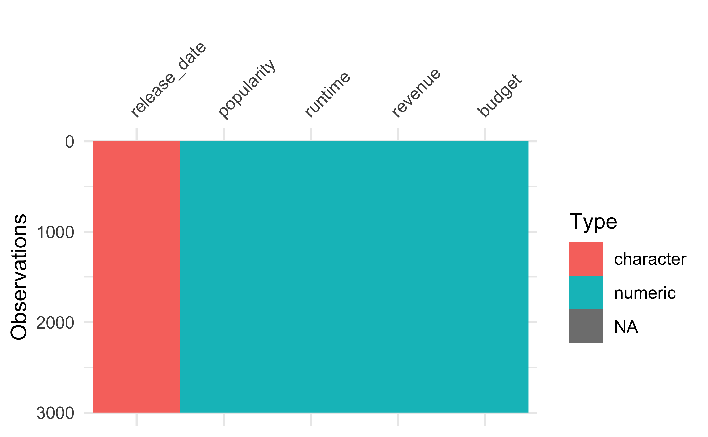
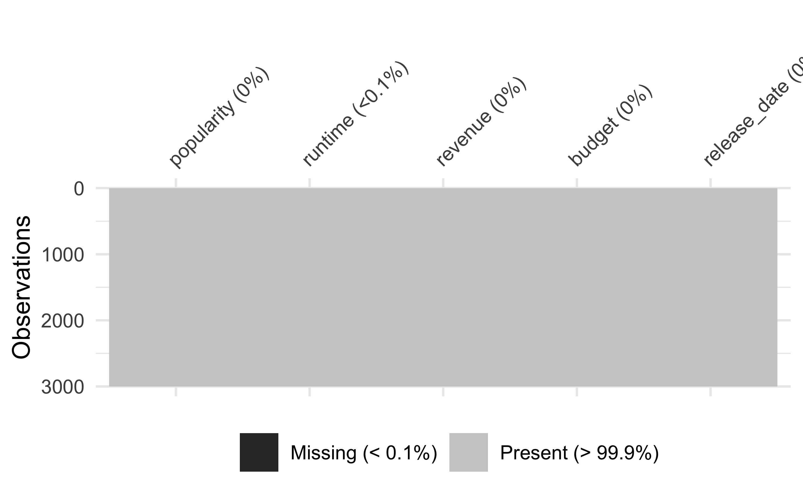
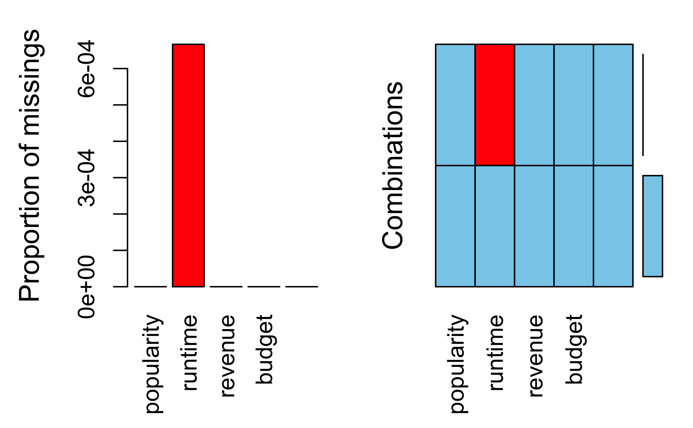
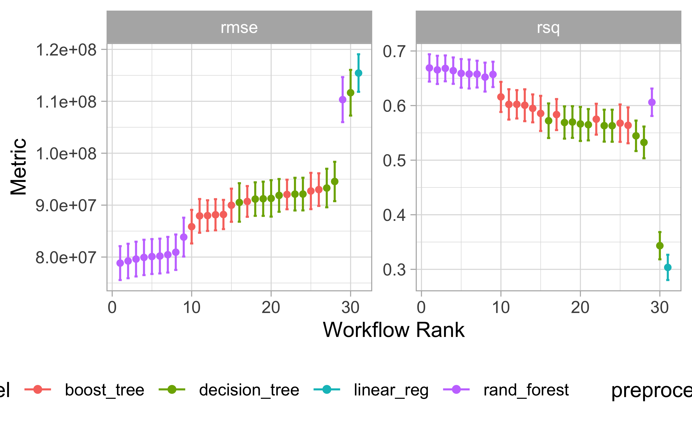

# Kaggle


## Vorbereitung


### Lernsteuerung


### Lernziele 

- Sie wissen, wie man einen Datensatz für einen Prognosewettbwerb bei Kaggle einreicht
- Sie kennen einige Beispiele von Notebooks auf Kaggle (für die Sprache R)
- Sie wissen, wie man ein Workflow-Set in Tidymodels berechnet
- Sie wissen, dass Tidymodels im Rezept keine Transformationen im Test-Sample berücksichtigt und wie man damit umgeht


### Hinweise 

- Machen Sie sich mit Kaggle vertraut. Als Übungs-Wettbewerb dient uns `TMDB Box-office Revenue`


### R-Pakete


In diesem Kapitel werden folgende R-Pakete benötigt:


```r
library(tidyverse)
library(tidymodels)
library(tictoc)  # Rechenzeit messen
library(lubridate)  # Datumsangaben
library(VIM)  # fehlende Werte
library(visdat)  # Datensatz visualisieren
```


## Was ist Kaggle?


>    Kaggle, a subsidiary of Google LLC, is an online community of data scientists and machine learning practitioners. Kaggle allows users to find and publish data sets, explore and build models in a web-based data-science environment, work with other data scientists and machine learning engineers, and enter competitions to solve data science challenges.

[Quelle](https://en.wikipedia.org/wiki/Kaggle)


[Kaggle as AirBnB for Data Scientists?!](https://www.kaggle.com/getting-started/44916)


## Fallstudie TMDB

Wir bearbeiten hier die Fallstudie [TMDB Box Office Prediction - 
Can you predict a movie's worldwide box office revenue?](https://www.kaggle.com/competitions/tmdb-box-office-prediction/overview),
ein [Kaggle](https://www.kaggle.com/)-Prognosewettbewerb.

Ziel ist es, genaue Vorhersagen zu machen,
in diesem Fall für Filme.


### Aufgabe

Reichen Sie bei Kaggle eine Submission für die Fallstudie ein! Berichten Sie den Score!


### Hinweise

- Sie müssen sich bei Kaggle ein Konto anlegen (kostenlos und anonym möglich); alternativ können Sie sich mit einem Google-Konto anmelden.
- Halten Sie das Modell so einfach wie möglich. Verwenden Sie als Algorithmus die lineare Regression ohne weitere Schnörkel.
- Logarithmieren Sie `budget` und `revenue`.
- Minimieren Sie die Vorverarbeitung (`steps`) so weit als möglich.
- Verwenden Sie `tidymodels`.
- Die Zielgröße ist `revenue` in Dollars; nicht in "Log-Dollars". Sie müssen also rücktransformieren,
wenn Sie `revenue` logarithmiert haben.


### Daten

Die Daten können Sie von der Kaggle-Projektseite beziehen oder so:


```r
d_train_path <- "https://raw.githubusercontent.com/sebastiansauer/Lehre/main/data/tmdb-box-office-prediction/train.csv"
d_test_path <- "https://raw.githubusercontent.com/sebastiansauer/Lehre/main/data/tmdb-box-office-prediction/test.csv"
```


```r
d_train_raw <- read_csv(d_train_path)
d_test <- read_csv(d_test_path)
```


Mal einen Blick werfen:


```r
glimpse(d_train_raw)
```

```
## Rows: 3,000
## Columns: 23
## $ id                    <dbl> 1, 2, 3, 4, 5, 6, 7, 8, 9, 10, 11, 12, 13, 14, 1…
## $ belongs_to_collection <chr> "[{'id': 313576, 'name': 'Hot Tub Time Machine C…
## $ budget                <dbl> 1.40e+07, 4.00e+07, 3.30e+06, 1.20e+06, 0.00e+00…
## $ genres                <chr> "[{'id': 35, 'name': 'Comedy'}]", "[{'id': 35, '…
## $ homepage              <chr> NA, NA, "http://sonyclassics.com/whiplash/", "ht…
## $ imdb_id               <chr> "tt2637294", "tt0368933", "tt2582802", "tt182148…
## $ original_language     <chr> "en", "en", "en", "hi", "ko", "en", "en", "en", …
## $ original_title        <chr> "Hot Tub Time Machine 2", "The Princess Diaries …
## $ overview              <chr> "When Lou, who has become the \"father of the In…
## $ popularity            <dbl> 6.575393, 8.248895, 64.299990, 3.174936, 1.14807…
## $ poster_path           <chr> "/tQtWuwvMf0hCc2QR2tkolwl7c3c.jpg", "/w9Z7A0GHEh…
## $ production_companies  <chr> "[{'name': 'Paramount Pictures', 'id': 4}, {'nam…
## $ production_countries  <chr> "[{'iso_3166_1': 'US', 'name': 'United States of…
## $ release_date          <chr> "2/20/15", "8/6/04", "10/10/14", "3/9/12", "2/5/…
## $ runtime               <dbl> 93, 113, 105, 122, 118, 83, 92, 84, 100, 91, 119…
## $ spoken_languages      <chr> "[{'iso_639_1': 'en', 'name': 'English'}]", "[{'…
## $ status                <chr> "Released", "Released", "Released", "Released", …
## $ tagline               <chr> "The Laws of Space and Time are About to be Viol…
## $ title                 <chr> "Hot Tub Time Machine 2", "The Princess Diaries …
## $ Keywords              <chr> "[{'id': 4379, 'name': 'time travel'}, {'id': 96…
## $ cast                  <chr> "[{'cast_id': 4, 'character': 'Lou', 'credit_id'…
## $ crew                  <chr> "[{'credit_id': '59ac067c92514107af02c8c8', 'dep…
## $ revenue               <dbl> 12314651, 95149435, 13092000, 16000000, 3923970,…
```

```r
glimpse(d_test)
```

```
## Rows: 4,398
## Columns: 22
## $ id                    <dbl> 3001, 3002, 3003, 3004, 3005, 3006, 3007, 3008, …
## $ belongs_to_collection <chr> "[{'id': 34055, 'name': 'Pokémon Collection', 'p…
## $ budget                <dbl> 0.00e+00, 8.80e+04, 0.00e+00, 6.80e+06, 2.00e+06…
## $ genres                <chr> "[{'id': 12, 'name': 'Adventure'}, {'id': 16, 'n…
## $ homepage              <chr> "http://www.pokemon.com/us/movies/movie-pokemon-…
## $ imdb_id               <chr> "tt1226251", "tt0051380", "tt0118556", "tt125595…
## $ original_language     <chr> "ja", "en", "en", "fr", "en", "en", "de", "en", …
## $ original_title        <chr> "ディアルガVSパルキアVSダークライ", "Attack of t…
## $ overview              <chr> "Ash and friends (this time accompanied by newco…
## $ popularity            <dbl> 3.851534, 3.559789, 8.085194, 8.596012, 3.217680…
## $ poster_path           <chr> "/tnftmLMemPLduW6MRyZE0ZUD19z.jpg", "/9MgBNBqlH1…
## $ production_companies  <chr> NA, "[{'name': 'Woolner Brothers Pictures Inc.',…
## $ production_countries  <chr> "[{'iso_3166_1': 'JP', 'name': 'Japan'}, {'iso_3…
## $ release_date          <chr> "7/14/07", "5/19/58", "5/23/97", "9/4/10", "2/11…
## $ runtime               <dbl> 90, 65, 100, 130, 92, 121, 119, 77, 120, 92, 88,…
## $ spoken_languages      <chr> "[{'iso_639_1': 'en', 'name': 'English'}, {'iso_…
## $ status                <chr> "Released", "Released", "Released", "Released", …
## $ tagline               <chr> "Somewhere Between Time & Space... A Legend Is B…
## $ title                 <chr> "Pokémon: The Rise of Darkrai", "Attack of the 5…
## $ Keywords              <chr> "[{'id': 11451, 'name': 'pok√©mon'}, {'id': 1155…
## $ cast                  <chr> "[{'cast_id': 3, 'character': 'Tonio', 'credit_i…
## $ crew                  <chr> "[{'credit_id': '52fe44e7c3a368484e03d683', 'dep…
```


### Train-Set verschlanken

Da wir aus Gründen der Einfachheit einige Spalten nicht berücksichtigen,
entfernen wir diese Spalten,
was die Größe des Datensatzes massiv reduziert.


```r
d_train <-
  d_train_raw %>% 
  select(popularity, runtime, revenue, budget, release_date) 
```


### Datensatz kennenlernen


```r
library(visdat)
vis_dat(d_train)
```




### Fehlende Werte prüfen

Welche Spalten haben viele fehlende Werte?


```r
vis_miss(d_train)
```




Mit `{VIM}` kann man einen Datensatz gut auf fehlende Werte hin untersuchen:


```r
aggr(d_train)
```




## Rezept

### Rezept definieren


```r
rec1 <-
  recipe(revenue ~ ., data = d_train) %>% 
  #update_role(all_predictors(), new_role = "id") %>% 
  #update_role(popularity, runtime, revenue, budget, original_language) %>% 
  #update_role(revenue, new_role = "outcome") %>% 
  step_mutate(budget = if_else(budget < 10, 10, budget)) %>% 
  step_log(budget) %>% 
  step_mutate(release_date = mdy(release_date)) %>% 
  step_date(release_date, features = c("year", "month"), keep_original_cols = FALSE) %>% 
  step_impute_knn(all_predictors()) %>% 
  step_dummy(all_nominal())

rec1
```

```
## Recipe
## 
## Inputs:
## 
##       role #variables
##    outcome          1
##  predictor          4
## 
## Operations:
## 
## Variable mutation for if_else(budget < 10, 10, budget)
## Log transformation on budget
## Variable mutation for mdy(release_date)
## Date features from release_date
## K-nearest neighbor imputation for all_predictors()
## Dummy variables from all_nominal()
```


```r
tidy(rec1)
```

```
## # A tibble: 6 × 6
##   number operation type       trained skip  id              
##    <int> <chr>     <chr>      <lgl>   <lgl> <chr>           
## 1      1 step      mutate     FALSE   FALSE mutate_jdS5r    
## 2      2 step      log        FALSE   FALSE log_fBmPl       
## 3      3 step      mutate     FALSE   FALSE mutate_jRePL    
## 4      4 step      date       FALSE   FALSE date_wZREV      
## 5      5 step      impute_knn FALSE   FALSE impute_knn_iJwRX
## 6      6 step      dummy      FALSE   FALSE dummy_LMB2i
```


### Check das Rezept 


```r
prep(rec1, verbose = TRUE)
```

```
## oper 1 step mutate [training] 
## oper 2 step log [training] 
## oper 3 step mutate [training] 
## oper 4 step date [training] 
## oper 5 step impute knn [training] 
## oper 6 step dummy [training] 
## The retained training set is ~ 0.38 Mb  in memory.
```

```
## Recipe
## 
## Inputs:
## 
##       role #variables
##    outcome          1
##  predictor          4
## 
## Training data contained 3000 data points and 2 incomplete rows. 
## 
## Operations:
## 
## Variable mutation for ~if_else(budget < 10, 10, budget) [trained]
## Log transformation on budget [trained]
## Variable mutation for ~mdy(release_date) [trained]
## Date features from release_date [trained]
## K-nearest neighbor imputation for runtime, budget, release_date_year, release_da... [trained]
## Dummy variables from release_date_month [trained]
```


```r
prep(rec1) %>% 
  bake(new_data = NULL) 
```

```
## # A tibble: 3,000 × 16
##    popularity runtime budget  revenue release_date_year release_date_month_Feb
##         <dbl>   <dbl>  <dbl>    <dbl>             <dbl>                  <dbl>
##  1      6.58       93  16.5  12314651              2015                      1
##  2      8.25      113  17.5  95149435              2004                      0
##  3     64.3       105  15.0  13092000              2014                      0
##  4      3.17      122  14.0  16000000              2012                      0
##  5      1.15      118   2.30  3923970              2009                      1
##  6      0.743      83  15.9   3261638              1987                      0
##  7      7.29       92  16.5  85446075              2012                      0
##  8      1.95       84   2.30  2586511              2004                      0
##  9      6.90      100   2.30 34327391              1996                      1
## 10      4.67       91  15.6  18750246              2003                      0
## # … with 2,990 more rows, and 10 more variables: release_date_month_Mar <dbl>,
## #   release_date_month_Apr <dbl>, release_date_month_May <dbl>,
## #   release_date_month_Jun <dbl>, release_date_month_Jul <dbl>,
## #   release_date_month_Aug <dbl>, release_date_month_Sep <dbl>,
## #   release_date_month_Oct <dbl>, release_date_month_Nov <dbl>,
## #   release_date_month_Dec <dbl>
```


Wir definieren eine Helper-Funktion:


```r
sum_isna <- function(x) {sum(is.na(x))}
```


Und wenden diese auf jede Spalte an:


```r
prep(rec1) %>% 
  bake(new_data = NULL) %>%  
  map_df(sum_isna)
```

```
## # A tibble: 1 × 16
##   popularity runtime budget revenue release_date_year release_date_month_Feb
##        <int>   <int>  <int>   <int>             <int>                  <int>
## 1          0       0      0       0                 0                      0
## # … with 10 more variables: release_date_month_Mar <int>,
## #   release_date_month_Apr <int>, release_date_month_May <int>,
## #   release_date_month_Jun <int>, release_date_month_Jul <int>,
## #   release_date_month_Aug <int>, release_date_month_Sep <int>,
## #   release_date_month_Oct <int>, release_date_month_Nov <int>,
## #   release_date_month_Dec <int>
```


Keine fehlenden Werte mehr *in den Prädiktoren*.

Nach fehlenden Werten könnte man z.B. auch so suchen:


```r
datawizard::describe_distribution(d_train)
```

Variable   |     Mean |       SD |      IQR |              Range | Skewness | Kurtosis |    n | n_Missing
---------------------------------------------------------------------------------------------------------
popularity |     8.46 |    12.10 |     6.88 | [1.00e-06, 294.34] |    14.38 |   280.10 | 3000 |         0
runtime    |   107.86 |    22.09 |    24.00 |     [0.00, 338.00] |     1.02 |     8.19 | 2998 |         2
revenue    | 6.67e+07 | 1.38e+08 | 6.66e+07 |   [1.00, 1.52e+09] |     4.54 |    27.78 | 3000 |         0
budget     | 2.25e+07 | 3.70e+07 | 2.90e+07 |   [0.00, 3.80e+08] |     3.10 |    13.23 | 3000 |         0


So bekommt man gleich noch ein paar Infos über die Verteilung der Variablen. Praktische Sache.

### Check Test-Sample

Das Test-Sample backen wir auch mal.

Wichtig: Wir preppen den Datensatz mit dem *Train-Sample*.


```r
bake(prep(rec1), new_data = d_test) %>% 
  head()
```

```
## # A tibble: 6 × 15
##   popularity runtime budget release_date_year release_date_mon… release_date_mo…
##        <dbl>   <dbl>  <dbl>             <dbl>             <dbl>            <dbl>
## 1       3.85      90   2.30              2007                 0                0
## 2       3.56      65  11.4               2058                 0                0
## 3       8.09     100   2.30              1997                 0                0
## 4       8.60     130  15.7               2010                 0                0
## 5       3.22      92  14.5               2005                 1                0
## 6       8.68     121   2.30              1996                 1                0
## # … with 9 more variables: release_date_month_Apr <dbl>,
## #   release_date_month_May <dbl>, release_date_month_Jun <dbl>,
## #   release_date_month_Jul <dbl>, release_date_month_Aug <dbl>,
## #   release_date_month_Sep <dbl>, release_date_month_Oct <dbl>,
## #   release_date_month_Nov <dbl>, release_date_month_Dec <dbl>
```


## Kreuzvalidierung


```r
cv_scheme <- vfold_cv(d_train,
                      v = 5, 
                      repeats = 3)
```


## Modelle

### Baum


```r
mod_tree <-
  decision_tree(cost_complexity = tune(),
                tree_depth = tune(),
                mode = "regression")
```


### Random Forest


```r
doParallel::registerDoParallel()
```


```r
mod_rf <-
  rand_forest(mtry = tune(),
              min_n = tune(),
              trees = 1000,
              mode = "regression") %>% 
  set_engine("ranger", num.threads = 4)
```


### XGBoost


```r
mod_boost <- boost_tree(mtry = tune(),
                        min_n = tune(),
                        trees = tune()) %>% 
  set_engine("xgboost", nthreads = parallel::detectCores()) %>% 
  set_mode("regression")
```


### LM


```r
mod_lm <-
  linear_reg()
```


## Workflows


```r
preproc <- list(rec1 = rec1)
models <- list(tree1 = mod_tree, rf1 = mod_rf, boost1 = mod_boost, lm1 = mod_lm)
 
 
all_workflows <- workflow_set(preproc, models)
```


## Fitten und tunen


```r
if (file.exists("objects/tmdb_model_set.rds")) {
  tmdb_model_set <- read_rds("objects/tmdb_model_set.rds")
} else {
  tic()
  tmdb_model_set <-
    all_workflows %>% 
    workflow_map(
      resamples = cv_scheme,
      grid = 10,
    #  metrics = metric_set(rmse),
      seed = 42,  # reproducibility
      verbose = TRUE)
  toc()
}
```


Man kann sich das Ergebnisobjekt abspeichern, 
um künftig Rechenzeit zu sparen:


```r
write_rds(tmdb_model_set, "objects/tmdb_model_set.rds")
```


Professioneller ist der Ansatz mit dem R-Paket [target](https://books.ropensci.org/targets/).


## Finalisieren


### Welcher Algorithmus schneidet am besten ab?

Genauer geagt, welches Modell, denn es ist ja nicht nur ein Algorithmus,
sondern ein Algorithmus plus ein Rezept plus die Parameterinstatiierung plus
ein spezifischer Datensatz.


```r
tune::autoplot(tmdb_model_set) +
  theme(legend.position = "bottom")
```



R-Quadrat ist nicht entscheidend; `rmse` ist wichtiger.

Die Ergebnislage ist nicht ganz klar, aber
einiges spricht für das Boosting-Modell, `rec1_boost1`.


```r
tmdb_model_set %>% 
  collect_metrics() %>% 
  arrange(-mean) %>% 
  head(10)
```

```
## # A tibble: 10 × 9
##    wflow_id    .config     preproc model .metric .estimator   mean     n std_err
##    <chr>       <chr>       <chr>   <chr> <chr>   <chr>       <dbl> <int>   <dbl>
##  1 rec1_lm1    Preprocess… recipe  line… rmse    standard   1.15e8    15  2.20e6
##  2 rec1_tree1  Preprocess… recipe  deci… rmse    standard   1.12e8    15  2.67e6
##  3 rec1_rf1    Preprocess… recipe  rand… rmse    standard   1.10e8    15  2.64e6
##  4 rec1_tree1  Preprocess… recipe  deci… rmse    standard   9.46e7    15  2.30e6
##  5 rec1_tree1  Preprocess… recipe  deci… rmse    standard   9.33e7    15  2.26e6
##  6 rec1_boost1 Preprocess… recipe  boos… rmse    standard   9.30e7    15  1.91e6
##  7 rec1_boost1 Preprocess… recipe  boos… rmse    standard   9.27e7    15  2.13e6
##  8 rec1_tree1  Preprocess… recipe  deci… rmse    standard   9.21e7    15  1.91e6
##  9 rec1_tree1  Preprocess… recipe  deci… rmse    standard   9.21e7    15  1.91e6
## 10 rec1_boost1 Preprocess… recipe  boos… rmse    standard   9.21e7    15  1.73e6
```


```r
best_model_params <-
extract_workflow_set_result(tmdb_model_set, "rec1_boost1") %>% 
  select_best()

best_model_params
```

```
## # A tibble: 1 × 4
##    mtry trees min_n .config              
##   <int> <int> <int> <chr>                
## 1     6   100     4 Preprocessor1_Model04
```


```r
best_wf <- 
all_workflows %>% 
  extract_workflow("rec1_boost1")

#best_wf
```


```r
best_wf_finalized <- 
  best_wf %>% 
  finalize_workflow(best_model_params)

best_wf_finalized
```

```
## ══ Workflow ════════════════════════════════════════════════════════════════════
## Preprocessor: Recipe
## Model: boost_tree()
## 
## ── Preprocessor ────────────────────────────────────────────────────────────────
## 6 Recipe Steps
## 
## • step_mutate()
## • step_log()
## • step_mutate()
## • step_date()
## • step_impute_knn()
## • step_dummy()
## 
## ── Model ───────────────────────────────────────────────────────────────────────
## Boosted Tree Model Specification (regression)
## 
## Main Arguments:
##   mtry = 6
##   trees = 100
##   min_n = 4
## 
## Engine-Specific Arguments:
##   nthreads = parallel::detectCores()
## 
## Computational engine: xgboost
```

### Final Fit


```r
fit_final <-
  best_wf_finalized %>% 
  fit(d_train)
```

```
## [00:36:53] WARNING: amalgamation/../src/learner.cc:576: 
## Parameters: { "nthreads" } might not be used.
## 
##   This could be a false alarm, with some parameters getting used by language bindings but
##   then being mistakenly passed down to XGBoost core, or some parameter actually being used
##   but getting flagged wrongly here. Please open an issue if you find any such cases.
```

```r
fit_final
```

```
## ══ Workflow [trained] ══════════════════════════════════════════════════════════
## Preprocessor: Recipe
## Model: boost_tree()
## 
## ── Preprocessor ────────────────────────────────────────────────────────────────
## 6 Recipe Steps
## 
## • step_mutate()
## • step_log()
## • step_mutate()
## • step_date()
## • step_impute_knn()
## • step_dummy()
## 
## ── Model ───────────────────────────────────────────────────────────────────────
## ##### xgb.Booster
## raw: 341.6 Kb 
## call:
##   xgboost::xgb.train(params = list(eta = 0.3, max_depth = 6, gamma = 0, 
##     colsample_bytree = 1, colsample_bynode = 0.4, min_child_weight = 4L, 
##     subsample = 1, objective = "reg:squarederror"), data = x$data, 
##     nrounds = 100L, watchlist = x$watchlist, verbose = 0, nthreads = 8L, 
##     nthread = 1)
## params (as set within xgb.train):
##   eta = "0.3", max_depth = "6", gamma = "0", colsample_bytree = "1", colsample_bynode = "0.4", min_child_weight = "4", subsample = "1", objective = "reg:squarederror", nthreads = "8", nthread = "1", validate_parameters = "TRUE"
## xgb.attributes:
##   niter
## callbacks:
##   cb.evaluation.log()
## # of features: 15 
## niter: 100
## nfeatures : 15 
## evaluation_log:
##     iter training_rmse
##        1     121863752
##        2     100362192
## ---                   
##       99      27461648
##      100      27365600
```


```r
d_test$revenue <- NA

final_preds <- 
  fit_final %>% 
  predict(new_data = d_test) %>% 
  bind_cols(d_test)
```


## Submission


### Submission vorbereiten


```r
submission_df <-
  final_preds %>% 
  select(id, revenue = .pred)
```


Abspeichern und einreichen:


```r
write_csv(submission_df, file = "objects/submission.csv")
```

Diese CSV-Datei reichen wir dann bei Kagglei ein.


### Kaggle Score

Diese Submission erzielte einen Score von **4.79227** (RMSLE).


<!-- ## Aufgaben und Vertiefung -->


## Aufgaben 

- Arbeiten Sie sich so gut als möglich durch [diese Analyse zum Verlauf von Covid-Fällen](https://github.com/sebastiansauer/covid-icu)
- [Fallstudie zur Modellierung einer logististischen Regression mit tidymodels](https://onezero.blog/modelling-binary-logistic-regression-using-tidymodels-library-in-r-part-1/)
- [Fallstudie zu Vulkanausbrüchen](https://juliasilge.com/blog/multinomial-volcano-eruptions/)
- [Fallstudie Himalaya](https://juliasilge.com/blog/himalayan-climbing/)


## Vertiefung 

- [Fields arranged by purity, xkcd 435](https://xkcd.com/435/)


