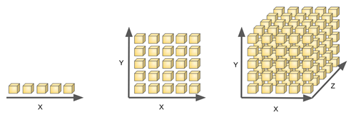
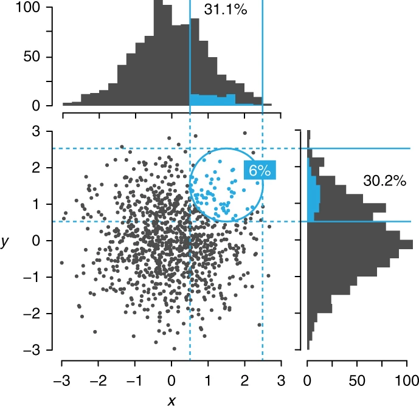
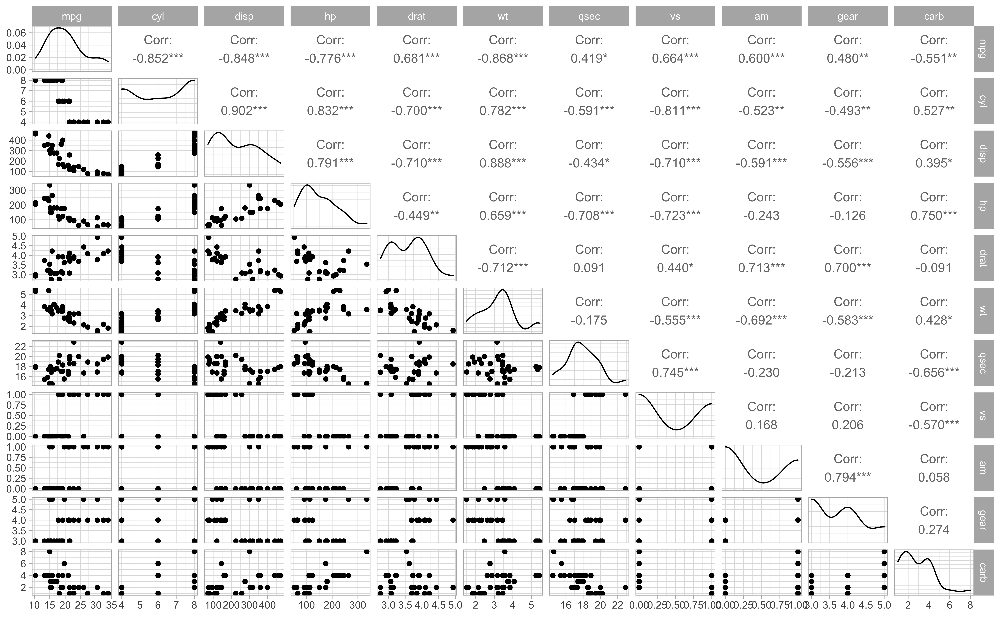
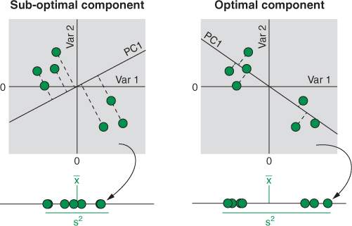

# Dimensionsreduktion


## Lernsteuerung


### Lernziele 

- Sie kennen den Principal-Components-Algorithmus (PCA) und können ihn in Grundzügen erläutern
- Sie können eine PCA in R berechnen
- Sie wissen um Vorteile und Beschränkungen dieses Algorithmus


### Literatur 

- Rhys, Kap. 13


## Vorbereitung


In diesem Kapitel werden folgende R-Pakete benötigt:


```r
library(tidymodels)
library(tidyverse)  
```


## Dimensionsreduktion mit der Hauptkomponentenanalyse


Sagen wir, Sie möchten das Körpergewicht einer Person vorhersagen und haben dafür mehrere Prädiktoren zur Verfügung, vgl. Abb. \@ref(fig:redundpred).


<div class="figure" style="text-align: center">

```{=html}
<div id="htmlwidget-08d2f945c79437b63c16" style="width:100%;height:300px;" class="nomnoml html-widget"></div>
<script type="application/json" data-for="htmlwidget-08d2f945c79437b63c16">{"x":{"code":"\n#fill: #FEFEFF\n#lineWidth: 1\n#zoom: 4\n#direction: right\n\n[Armlänge] -> [Gewicht]\n  [Beinlänge] -> [Gewicht]\n  [Handlänge] -> [Gewicht]\n  [Fußlänge] -> [Gewicht]\n  ","svg":false},"evals":[],"jsHooks":[]}</script>
```

<p class="caption">(\#fig:redundpred)Vorhersage von Gewicht mit mehreren hochkorrelierten Prädiktoren</p>
</div>


Sicherlich sind die ganzen "XXX_Länge-Prädiktoren" alle gut mit einer Variablen *Körpergröße* zusammenzufassen.
Man kann also die Komplexität der Vorhersage deutlich reduzieren,
indem man die Prädiktoren zu einer bzw. zumindest weniger neuen Dimensionen zusammenfasst.
Eine Methode dazu ist die Hauptkomponentenanalyse (Principal Component Analysis, PCA).


### Wozu Dimensionsreduktion?


Einerseits ist es nützlich, zusätzliche Prädiktoren zu einem prädiktiven Modell hinzuzufügen -
vorausgesetzt sie sind mit der Outcome-Variablen korreliert.
Auf der anderen Seite steigt der Stichprobenbedarf *exponenziell* der der Anzahl der Prädiktoren,
vgl. Abb. \@ref(fig:curse1), man spricht vom [Fluch der Dimension](https://en.wikipedia.org/wiki/Curse_of_dimensionality).

<div class="figure" style="text-align: center">

<p class="caption">(\#fig:curse1)Illustration des Fluchs der Dimension</p>
</div>


Anders formuliert: Bei steigender Dimensionszahl sind die einzelnen Datenpunkte immer weiter voneinander entfernt,
die Datenlage wird "spärlicher" (sparse), vgl. Abb. \@ref(fig:curse2) aus @altman_curses_2018.


<div class="figure" style="text-align: center">

<p class="caption">(\#fig:curse2)Je mehr Dimensionen, desto weniger Daten pro Einheit</p>
</div>


Man könnte also sagen: Das Hinzufügen von Prädiktoren ist sinnvoll, *wenn* sie prädiktiv und die Stichprobe groß genug ist.

Außerdem ist es schwierig, sich (als Mensch, nicht unbedingt wenn Sie eine Maschine sind) im hochdimensionalen Raum zu orientieren.
Man könnte sogar zugespitzt behaupten, dass das Maschinelle Lernen nur deswegen erfunden wurde,
weil sich Menschen nur im 3D-Raum orientieren können.

Sagen wir, Sie haben $p=10$ Prädiktoren, das ergibt dann ${p \choose 2} = p(p-1)/2$ Möglichkeiten, also 45 bei $p=10$.

Im Datensatz `mtcars` sieht das so aus, nur mal zur Verdeutlichung, s. Abb. \@ref(fig:manyscatter).


```r
library(GGally)
data(mtcars)
ggpairs(mtcars)
```

<div class="figure" style="text-align: center">

<p class="caption">(\#fig:manyscatter)Viele Streudiagramm</p>
</div>


### PCA: ungeleitetes Verfahren


PCA ist ein *ungeleitetes* bzw. *unüberwachtes* Verfahren, es gibt also mehrere Variablen, aber keine "Outcome-Variable".
Es geht daher nicht um Vorhersage - die ist nicht möglich, da es keine Zielvariable gibt.
Stattdessen kann das Ziel nur sein, Muster in den Variablen zu finden, 
so dass man die Anzahl der Variablen reduzieren kann.

Die PCA versucht also, eine niedrig dimensionale Repräsentation der Datenmatrix $\boldsymbol{X}$ zu erstellen,
eine "Informationsverdichtung", wenn es gut läuft.

Aus den $p$ Dimensionen von  $\boldsymbol{X}$ suchen wir eine kleine Zahl an zusammengefassten *interessanten* Prädiktoren.


### PCA veranschaulicht


PCA wird zur Dimensionsreduktion in verschiedenen Anwendungsbereichen verwendet, zum Beispiel zur Datenkompression, etwa bei Bildern, wie [hier anschaulich dargestellt](https://theanlim.rbind.io/project/image-compression-with-principal-component-analysis/).

*Interessant* wird in der PCA operationalisiert als die neuen Dimensionen, 
entlang derer die Daten am meisten variieren.


Angenommen, wir haben eine Datenmatrix mit $p=2$ und die beiden (metrischen) Variablen sind korreliert, vgl. Abb. \@ref(fig:pca1), [Quelle](https://machinelearningcoban.com/2017/06/15/pca/).


<div class="figure" style="text-align: center">

<p class="caption">(\#fig:pca1)Zwei korrelierte, metrische Variablen</p>
</div>


Wir könnten argumentieren, dass diese 2D-Daten mit wenig Informationsverlust anhand *einer* Dimension
beschrieben werden können. Diese Dimension ist so in die Daten "gelegt", dass ihr Vektor in die Richtung zeigt,
der die Varianz maximiert.
Gleichzeitig ist die Streuung der Daten innerhalb dieser Dimension minimiert,
s. Abb. \@ref(fig:pca2). 
In der Abbildung ist die Dimension,
die in in Richtung der maximalen Streuung der Daten zeigt, mit $u_1$ beschrieben.
In einem 2D-System kann es maximale zwei (orthogonale) Dimensionen geben.
Die zweite Dimension ist mit $u_2$ bezeichnet und bindet (relativ zu $u_1$) 
wenig Streuung auf sich.


<div class="figure" style="text-align: center">

<p class="caption">(\#fig:pca2)Zwei korrelierte, metrische Variablen</p>
</div>


Geometrisch betrachtet ist die PCA also ein Rotationsverfahren,
das neue Achsen findet und zwar so,
dass die Achsen die Daten "gut beschreiben", "interessant sind",
also in die Richtung der maximalen Varianz zeigen.
Geometrisch kann man das für 2-3 Dimensionen gut veranschaulichen,
aber dankbarerweise funktioniert die Algebra auch bei $p$ Dimension ohne Murren.


### Was sind Hauptkomponenten?


Hauptkomponenten (Principal Components, PC) nennt man die Dimensionen,
die die $p$ Variablen des Datensatzes zusammenfassen sollen.
Jede dieser Dimensionen ist eine *Linearkombination* der $p$ Variablen [@islr].

Die erste Hauptkomponente kann man dabei so darstellen: 

$$\underbrace{Z_1}_{Score} = \underbrace{\phi_{11}}_{Ladung 1}\underbrace{X_1}_{Prädiktor 1} + \phi_{21}X_2 + \cdots + \phi_{p1}X_p$$

Dabei wird $Z_1$ so gewählt, dass die Varianz maximal ist.
Außerdem gilt die Nebenbedingung, dass $\sum_{j=1}^p \phi^2_{j1}= 1$.
Anders gesagt müssen die Ladungen so gewählt werden, dass die Summe ihrer Quadrate 1 ergibt.
Andernfalls gäbe es beliebig viele Lösungen (mit beliebig großen Ladungen).
Bildlich gesprochen wird die Varianz der auf die Hauptkomponente projizierten Daten maximiert [@rhys],
vgl. Abb. \@ref(fig:pca3). 
Da wir nicht am Mittelwert, sondern nur den Streuungen interessiert sind,
gehen wir von zentrierten Daten aus.

<div class="figure" style="text-align: center">

<p class="caption">(\#fig:pca3)Die Hauptkomponente maximiert die Varianz</p>
</div>

Anders gesagt optimiert die erste Hauptkomponente das folgende Optimierungsproblem:

$$
\begin{equation}
\underbrace{\operatorname{maximize}}_{\phi_11, \ldots, \phi_1p}\left\{  n^{-1}\sum_{i=1}^n \left( \sum_{j=1}^p \phi_{j1}x_{ij} \right)^2 \right\}.
\end{equation}
$$
