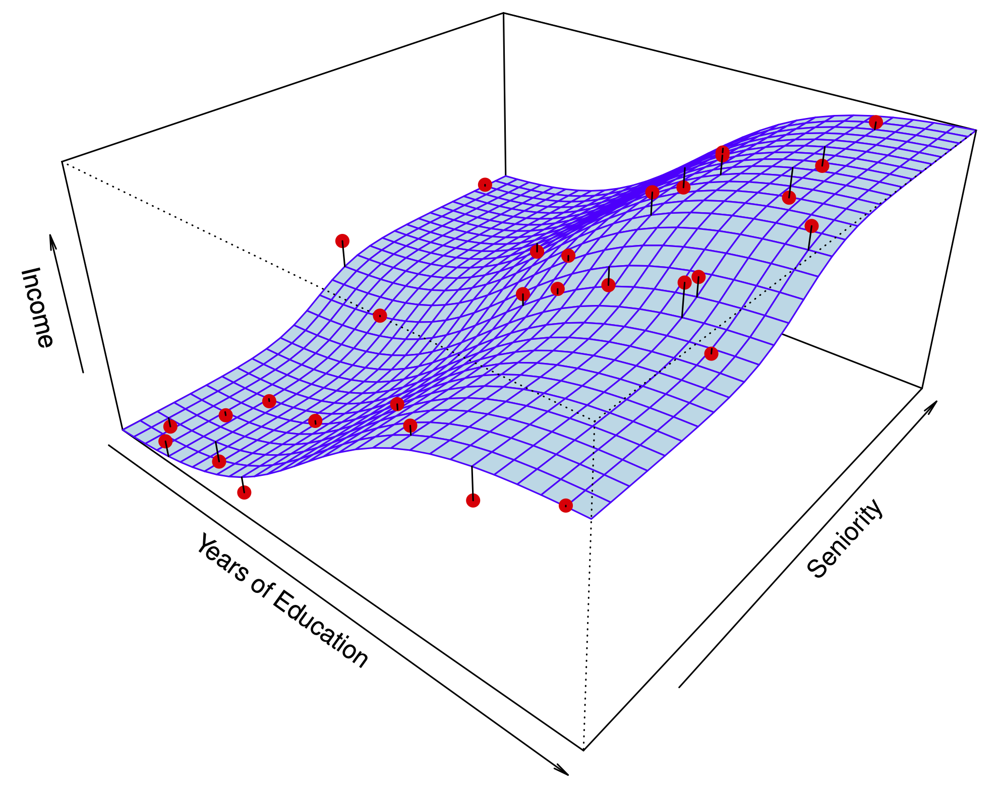

# (PART) Themen {-}

# Grundkonzepte


## Was ist Data Science?


Es gibt mehrere Definitionen von *Data Science*, aber keinen kompletten Konsens.
@baumer_modern_2017 definieren Data Science wie folgt (S. 4):


:::: {.infobox .quote}
The science of extracting meaningful information from data
:::

Auf der anderen Seite entgegen viele Statistiker: "Hey, das machen wir doch schon immer!".


Eine Antwort auf diesen Einwand ist, dass in Data Science nicht nur die Statistik eine Rolle spielt, sondern auch die Informatik sowie - zu einem geringen Teil - die Fachwissenschafte ("Domäne"), die sozusagen den Empfänger bzw. die Kunden oder den Rahmen stellt.
Dieser "Dreiklang" ist in folgendem Venn-Diagramm dargestellt.


<script type="module" src="https://unpkg.com/venny?module"></script>

<venn-diagram>
  <venn-set name="A" label="Statistik"></venn-set>
  <venn-set name="B" label="Informatik"></venn-set>
  <venn-set name="C" label="Domäne" size = "5"></venn-set>
  <venn-n sets="A B C">
</venn-diagram>


## Was ist Machine Learning?

*Maschinelles Lernen* (ML), oft auch (synonym) als *statistisches Lernen* (statistical learning) bezeichnet, ist ein Teilgebiet der *künstlichen Intelligenz* (KI; artificial intelligence, AI) [@rhys]. ML wird auch als *data-based* bezeichnet in Abgrenzung von *rule-based*, was auch als "klassische KI" bezeichnet wird, vgl. Abb. \@ref(fig:ai-ml2).


<div class="figure" style="text-align: center">

```{=html}
<div id="htmlwidget-546b974806b3e0bd20f6" style="width:100%;height:250px;" class="grViz html-widget"></div>
<script type="application/json" data-for="htmlwidget-546b974806b3e0bd20f6">{"x":{"diagram":"\ndigraph D {\n\n    node [fontname=\"Arial\"];\n\n    node_A [shape=record    label=\"{KI|{rule-based|data-based}}\"];\n\n\n}\n\n","config":{"engine":"dot","options":null}},"evals":[],"jsHooks":[]}</script>
```

<p class="caption">(\#fig:ai-ml2)KI und Maschinelles Lernen</p>
</div>


In beiden Fällen finden Algorithmen Verwendung.
Algorithmen sind nichts anderes als genaue Schritt-für-Schritt-Anleitungen, um etwas zu erledigen.
Ein Kochrezept ist ein klassisches Beispiel für einen Algorithmus.

[Hier](https://www.c-programming-simple-steps.com/images/xsum-two-numbers-h.png.pagespeed.ic.AM9WYFPgEo.webp) findet sich ein Beispiel für einen einfachen Additionsalgorithmus.


Es gibt viele ML-Algorithmen, vgl. Abb. \@ref(fig:algos).

<div class="figure" style="text-align: center">

```{=html}
<div id="htmlwidget-4d2cb7ed4631be2da830" style="width:100%;height:350px;" class="nomnoml html-widget"></div>
<script type="application/json" data-for="htmlwidget-4d2cb7ed4631be2da830">{"x":{"code":"\n#fill: #FEFEFF\n#lineWidth: 1\n#zoom: 4\n#direction: right\n\n#direction: leftright\n[KI|\n  [ML|\n    [Regression] \n    [Neuronale Netze] \n    [...]\n  ]  \n  \n]\n","svg":false},"evals":[],"jsHooks":[]}</script>
```

<p class="caption">(\#fig:algos)ML-Matroschka</p>
</div>


### Rule-based

Klassische (ältere) KI implementiert Regeln "hartverdrahtet" in ein Computersystem. 
Nutzer füttern Daten in dieses System. Das System leitet dann daraus Antworten ab.

*Regeln* kann man prototypisch mit *Wenn-Dann-Abfragen* darstellen:


```r
lernzeit <- c(0, 10, 10, 20)
schlauer_nebensitzer <- c(FALSE, FALSE, TRUE, TRUE)

for (i in 1:4) {
  if (lernzeit[i] > 10) {
    print("bestanden!")
  } else {
    if (schlauer_nebensitzer[i] == TRUE) {
      print("bestanden!")
    } else print("Durchgefallen!")
  }
}
```

```
## [1] "Durchgefallen!"
## [1] "Durchgefallen!"
## [1] "bestanden!"
## [1] "bestanden!"
```


Sicherlich könnte man das schlauer programmieren, vielleicht so:


```r
d <- 
  tibble(
  lernzeit = c(0, 10, 10, 20),
  schlauer_nebensitzer = c(FALSE, FALSE, TRUE, TRUE)
)

d %>% 
  mutate(bestanden = ifelse(lernzeit > 10 | schlauer_nebensitzer == TRUE, TRUE, FALSE))
```

```
## # A tibble: 4 × 3
##   lernzeit schlauer_nebensitzer bestanden
##      <dbl> <lgl>                <lgl>    
## 1        0 FALSE                FALSE    
## 2       10 FALSE                FALSE    
## 3       10 TRUE                 TRUE     
## 4       20 TRUE                 TRUE
```


### Data-based

ML hat zum Ziel, Regeln aus den Daten zu lernen. Man füttert Daten und Antworten in das System, das System gibt Regeln zurück.


@islr definieren ML so:
Nehmen wir an, wir haben die abhängige Variable $Y$ und $p$ Prädiktoren, $X_1,X_2, \ldots, X_p$.
Weiter nehmen wir an, die Beziehung zwischen $Y$ und $X = (X_1, X_2, \ldots, X_p)$ kann durch eine Funktion $f$ beschrieben werden.
Das kann man so darstellen:

$$Y = f(X) + \epsilon$$

ML kann man auffassen als eine Menge an Verfahren, um $f$ zu schätzen.

Ein Beispiel ist in Abb. \@ref(fig:statlearning) gezeigt [@islr].

<div class="figure" style="text-align: center">

<p class="caption">(\#fig:statlearning)Vorhersage des Einkommens durch Ausbildungsjahre</p>
</div>


Natürlich kann $X$ mehr als eine Variable beinhalten, vgl. Abb. \@ref(fig:sl2) [@islr].


<div class="figure" style="text-align: center">

<p class="caption">(\#fig:sl2)Vorhersage des Einkommens als Funktion von Ausbildungsjahren und Dienstjahren</p>
</div>


<!-- ```{nomnoml, echo = FALSE} -->
<!-- #direction: leftright -->
<!-- #fontSize: 8 -->
<!-- #arrowSize: 1 -->
<!-- #bendSize: 0.3 -->
<!-- #edges: rounded -->
<!-- #stroke: #123456 -->

<!--   [rule-based| -->
<!--   [Daten] -> [Antworten] -->
<!--   [Regeln] -> [Antworten] -->
<!-- ] -->
<!--   [data-based| -->
<!--   [Daten] -> [Regeln] -->
<!--   [Antworten] -> [Regeln] -->
<!-- ] -->
<!-- ``` -->


Anders gesagt: traditionelle KI-Systeme werden mit Daten und Regeln gefüttert und liefern Antworten.
ML-Systeme werden mit Daten und Antworten gefüttert und liefern Regeln zurück, vgl. Abb. \@ref(fig:ki-ml2).


<div class="figure" style="text-align: center">

```{=html}
<div id="htmlwidget-10d652ae2407987eddc7" style="width:100%;height:450px;" class="nomnoml html-widget"></div>
<script type="application/json" data-for="htmlwidget-10d652ae2407987eddc7">{"x":{"code":"\n#fill: #FEFEFF\n#lineWidth: 1\n#zoom: 4\n#direction: right\n\n#direction: leftright\n  [rule-based|\n  [Daten] -> [Antworten]\n  [Regeln] -> [Antworten]\n]\n  [data-based|\n  [Daten] -> [Regeln]\n  [Antworten] -> [Regeln]\n]  \n  ","svg":false},"evals":[],"jsHooks":[]}</script>
```

<p class="caption">(\#fig:ki-ml2)Vergleich von klassischer KI und ML</p>
</div>


## Modell vs. Algorithmus


### Modell 

Ein Modell, s. Abb. \@ref(fig:vw) [@spurzem_vw_2017]!


<div class="figure" style="text-align: center">

<p class="caption">(\#fig:vw)Ein Modell-Auto</p>
</div>


Wie man sieht, ist ein Modell eine vereinfachte Repräsentation eines Gegenstands.

Der Gegenstand definiert (gestaltet) das Modell. Das Modell ist eine Vereinfachung des Gegenstands, vgl. Abb. \@ref(fig:modell).

<div class="figure" style="text-align: center">

<p class="caption">(\#fig:modell)Gegenstand und Modell</p>
</div>


Im maschinellen Lernen meint ein Modell, praktisch gesehen, die Regeln,
die aus den Daten gelernt wurden.


### Beispiel für einen ML-Algorithmus

Unter einem ML-Algorithmus versteht man das (mathematische oder statistische) Verfahren,
anhand dessen die Beziehung zwischen $X$ und $Y$ "gelernt" wird. Bei @rhys (S. 9) findet sich dazu ein Beispiel, das kurz zusammengefasst etwa so lautet:


*Beispiel eines Regressionsalgorithmus*

1. Setze Gerade in die Daten mit $b_0 = \hat{y}, b_1 = 0$
2. Berechne $MSS = \sum (y_i - \hat{y_i})^2$
3. "Drehe" die Gerade ein bisschen, d.h. erhöhe $b_1^{neu} = b_1^{alt} + 0.1$
4. Wiederhole 2-3 solange, bis $MSS < \text{Zielwert}$


Diesen Algorithmus kann man "von Hand" z.B. mit [dieser App](https://shinyapps.org/showapp.php?app=https://shiny.psy.lmu.de/felix/lmfit&by=Felix%20Sch%C3%B6nbrodt&title=Find-a-fit!&shorttitle=Find-a-fit!) durchspielen.


## Taxonomie

Methoden des maschinellen Lernens lassen sich verschiedentlich gliedern.
Eine typische Gliederung unterscheidet in *supervidierte* (geleitete) und *nicht-supervidierte* (ungeleitete) Algorithmen, s. Abb. \@ref(fig:taxonomie).


<div class="figure" style="text-align: center">

```{=html}
<div id="htmlwidget-e93fde4ec8dfc42a2dda" style="width:100%;height:250px;" class="DiagrammeR html-widget"></div>
<script type="application/json" data-for="htmlwidget-e93fde4ec8dfc42a2dda">{"x":{"diagram":"\ngraph LR\n  ML[Maschinelles Lernen]\n  SL[Supervidiertes Lernen]\n  NSL[Nicht-supervidiertes Lernen]\n  Re[Regression]\n  Class[Klassifikation]\n  DimRed[Dimensionsreduktion]\n  Clust[Clustering]\n  ML --> SL\n  ML --> NSL\n  SL --> Re\n  SL --> Class\n  NSL --> DimRed\n  NSL --> Clust\n"},"evals":[],"jsHooks":[]}</script>
```

<p class="caption">(\#fig:taxonomie)Taxonomie der Arten des maschinellen Lernens</p>
</div>


### Geleitetes Lernen

Die zwei Phasen des geleiteten Lernens sind in Abb. \@ref(fig:supervid) dargestellt.

<div class="figure" style="text-align: center">

```{=html}
<div id="htmlwidget-1618b7f6a121749d84cc" style="width:100%;height:550px;" class="nomnoml html-widget"></div>
<script type="application/json" data-for="htmlwidget-1618b7f6a121749d84cc">{"x":{"code":"\n#fill: #FEFEFF\n#lineWidth: 1\n#zoom: 4\n#direction: right\n\n\n\n[Lernphase|\n[Daten mit Antwort] -> [Geleiteter Algorithmus]\n[Geleiteter Algorithmus] -> [Modell]\n]\n\n[Vorhersagephase|\n[Neue Daten, ohne Antwort] -> [Modell]\n[Modell] -> [Antworten]\n]\n\n","svg":false},"evals":[],"jsHooks":[]}</script>
```

<p class="caption">(\#fig:supervid)Geleitetes Lernen geschieht in zwei Phasen</p>
</div>


#### Regression: Numerische Vorhersage


Die Modellgüte eines numerischen Vorhersagemodells wird oft mit (einem der) folgenden *Gütekoeffizienten* gemessen:

- Mean Squared Error (Mittlerer Quadratfehler):

$$MSE := \frac{1}{n} \sum (y_i - \hat{y}_i)^2$$


- Mean Absolute Error (Mittlerer Absolutfehler):

$$MAE :=  \frac{1}{n} \sum |(y_i - \hat{y}_i)|$$


:::: {.infobox .caution}
Wir sind nicht adaran interessiert die Vorhersagegenauigkeit in den bekannten Daten einzuschätzen, sondern im Hinblick auf neue Daten, die in der Lernphase dem Modell nicht bekannt waren.
:::


#### Klassifikation: Nominale Vorhersage


Die Modellgüte eines numerischen Vorhersagemodells wird oft mit folgendem *Gütekoeffizienten* gemessen:

- Mittlerer Klassifikationfehler $e$:

$$e := \frac{1}{n} I(y_i \ne \hat{y}_i) $$

Dabei ist $I$ eine Indikatorfunktion, die `1` zurückliefert, 
wenn tatsächlicher Wert und vorhergesagter Wert identisch sind.

### Ungeleitetes Lernen

Die zwei Phasen des ungeleiteten Lernens sind in Abb. \@ref(fig:unsuper) dargestellt.


<div class="figure" style="text-align: center">

```{=html}
<div id="htmlwidget-947829320f906d119de3" style="width:100%;height:450px;" class="nomnoml html-widget"></div>
<script type="application/json" data-for="htmlwidget-947829320f906d119de3">{"x":{"code":"\n#fill: #FEFEFF\n#lineWidth: 1\n#zoom: 4\n#direction: right\n\n\n\n[Lernphase|\n[Daten ohne Antwort] -> [Ungeleiteter Algorithmus]\n[Ungeleiteter Algorithmus] -> [Modell]\n]\n\n[Vorhersagephase|\n[Neue Daten, ohne Antwort] -> [Modell]\n[Modell] -> [Zuordnung zu den Regeln des Modells]\n]\n\n","svg":false},"evals":[],"jsHooks":[]}</script>
```

<p class="caption">(\#fig:unsuper)Die zwei Phasen des ungeleiteten Lernens</p>
</div>


Ungeleitetes Lernen kann man wiederum in zwei Arten unterteilen, vgl. Abb. \@ref(fig:ungel):

1. Fallreduzierendes Modellieren (Clustering)
2. Dimensionsreduzierendes Modellieren (z.B. Faktorenanalyse)

<div class="figure" style="text-align: center">

<p class="caption">(\#fig:ungel)Zwei Arten von ungeleitetem Modellieren</p>
</div>


## Ziele des ML

Man kann vier Ziele des ML unterscheiden, s. Abb. \@ref(fig:ziele).

<div class="figure" style="text-align: center">

```{=html}
<div id="htmlwidget-390fef03d081cc931c1f" style="width:100%;height:450px;" class="DiagrammeR html-widget"></div>
<script type="application/json" data-for="htmlwidget-390fef03d081cc931c1f">{"x":{"diagram":"\ngraph TD\n  ML[Maschinelles Lernen]\n  V[Vorhersage]\n  E[Erklärung/kausal]\n  B[Beschreibung]\n  DimRed[Dimensionsreduktion]\n  ML --> V\n  ML --> E\n  ML --> B\n  ML --> DimRed\n"},"evals":[],"jsHooks":[]}</script>
```

<p class="caption">(\#fig:ziele)Ziele des maschinellen Lernens</p>
</div>

*Vorhersage* bezieht sich auf die Schätzung der Werte von Zielvariablen (sowie die damit verbundene Unsicherheit).
*Erklärung* meint die kausale Analyse von Zusammenhängen.
*Beschreibung* ist praktisch gleichzusetzen mit der Verwendung von deskriptiven Statistiken.
*Dimensionsreduktion* ist ein Oberbegriff für Verfahren, die die Anzahl der Variablen (Spalten) oder der Beobachtungen (Zeilen) verringert.s


Wie "gut" ein Modell ist, quantifiziert man in verschiedenen Kennzahlen; man spricht von Modellgüte oder *model fit*. 
Je schlechter die Modellgüte, desto höher der *Modellfehler*, vgl. Abb. \@ref(fig:resid).

<div class="figure" style="text-align: center">

<p class="caption">(\#fig:resid)Wenig (links) vs. viel (rechts) Vorhersagefehler</p>
</div>


Die Modellgüte eines Modells ist nur relevant für *neue Beobachtungen*,
an denen das Modell nicht trainiert wurde.


## Über- vs. Unteranpassung

*Overfitting*: Ein Modell sagt die Trainingsdaten zu genau vorher - es nimmt Rauschen als "bare Münze", also fälschlich als Signal. Solche Modelle haben zu viel *Varianz* in ihren Vorhersagen.

*Underfitting*: Ein Modell ist zu simpel (ungenau, grobkörnig) - es unterschlägt Nuancen des tatsächlichen Musters. Solche Modelle haben zu viel *Verzerrung* (Bias) in ihren Vorhersagen.

Welches der folgenden Modelle (B,C,D) passt am besten zu den Daten (A), s. Abb. \@ref(fig:overunder), vgl. [@modar], Kap. 15.

<div class="figure" style="text-align: center">

<p class="caption">(\#fig:overunder)Over- vs. Underfitting</p>
</div>


Welches Modell wird wohl neue Daten am besten vorhersagen? Was meinen Sie?

Modell D zeigt sehr gute Beschreibung ("Retrodiktion") der Werte, anhand derer das Modell trainiert wurde ("Trainingsstichprobe").
Wird es aber "ehrlich" getestet, d.h. anhand neuer Daten ("Test-Stichprobe"),
wird es vermutlich *nicht* so gut abschneiden.


Es gilt, ein Modell mit "mittlerer" Komplexität zu finden, um Über- und Unteranpassung in Grenzen zu halten.
Leider ist es nicht möglich, vorab zu sagen, was der richtige, "mittlere" Wert an Komplexität eines Modells ist, vgl. Abb. \@ref(fig:overfitting) aus [@modar].


<div class="figure" style="text-align: center">

<p class="caption">(\#fig:overfitting)Mittlere Modellkomplexität führt zur besten Vorhersagegüte</p>
</div>


## No free lunch

<a href="https://imgflip.com/i/687izk"></a><div><a href="https://imgflip.com/memegenerator">from Imgflip Meme Generator</a></div>


Wenn $f$ (die Beziehung zwischen $Y$ und $X$, auch *datengenerierender Prozess* genannt) linear oder fast linear ist,
dann wird ein lineare Modell gute Vorhersagen liefern, vgl. Abb. \@ref(fig:2-10) aus @islr, dort zeigt die schwarze Linie den "wahren Zusammenhang", also $f$ an. In orange sieht man ein lineares Modell, in grün ein hoch komplexes Modell,
das sich in einer "wackligen" Funktion - also mit hoher Varianz - 
niederschlägt. Das grüne Modell könnte z.B. ein Polynom-Modell hohen Grades sein, z. B. 
$y = b_0 + b_1 x^{10} + b_2 x^9 + \ldots + b_11 x^1 + \epsilon$. 
Das lineare Modell hat hingegen wenig Varianz und in diesem Fall wenig Bias.
Daher ist es für dieses $f$ gut passend.
Die grüne Funktion zeigt dagegen Überanpassung (overfitting), 
also viel Modellfehler (für eine Test-Stichprobe).


:::: {.infobox .caution}
Die grüne Funktion in  Abb. \@ref(fig:2-10) wird neue, beim Modelltraining unbekannte Beobachtungen ($y_0$) vergleichsweise schlecht vorhersagen. In Abb. \@ref(fig:2-11)  ist es umgekehrt.
:::

<div class="figure" style="text-align: center">

<p class="caption">(\#fig:2-10)Ein lineare Funktion verlangt ein lineares Modell; ein nichtlineares Modell wird in einem höheren Vorhersagefehler (bei neuen Daten!) resultieren.</p>
</div>


Betrachten wir im Gegensatz dazu  Abb. \@ref(fig:2-11) aus @islr, die (in schwarz) eine hochgradig *nichtlineare* Funktion $f$ zeigt.
Entsprechend wird das lineare Modell (orange) nur schlechte Vorhersagen erreichen - es hat zu viel Bias, da zu simpel. 
Ein lineares Modell wird der Komplexität von $f$ nicht gerecht,
Unteranpassung (underfitting) liegt vor.


<div class="figure" style="text-align: center">

<p class="caption">(\#fig:2-11)Eine nichtlineare Funktion (schwarz) verlangt eine nichtlineares Modell. Ein lineares Modell (orange) ist unterangepasst und hat eine schlechte Vorhersageleistung.</p>
</div>


## Bias-Varianz-Abwägung

Der Gesamtfehler $E$ des Modells ist die Summe dreier Terme:

$$E = (y - \hat{y}) = \text{Bias} + \text{Varianz} + \epsilon$$

Dabei meint $\epsilon$ den *nicht reduzierbaren Fehler*, z.B. weil dem Modell Informationen fehlen. So kann man etwa auf der Motivation von Studentis keine perfekte Vorhersage ihrer Noten erreichen (lehrt die Erfahrung).

Bias und Varianz sind Kontrahenten: Ein Modell, das wenig Bias hat, neigt tendenziell zu wenig Varianz und umgekehrt, vgl. Abb. \@ref(fig:bias-var) aus @modar.


<div class="figure" style="text-align: center">

<p class="caption">(\#fig:bias-var)Abwängung von Bias vs. Varianz</p>
</div>


<!-- ## Aufgaben -->


## Aufgaben 

- [Machen Sie sich mit 'Kaggle' vertraut](https://www.kaggle.com/)
- [Bearbeiten Sie die Fallstudie 'TitaRnic' auf Kaggle](https://www.kaggle.com/code/headsortails/tidy-titarnic/report)


<!-- ## Vertiefung -->


## Vertiefung 

- [Verdienst einer deutschen Data Scientistin](https://www.zeit.de/arbeit/2020-10/data-scientist-gehalt-geldanlage-programmieren-kontoauszug)
- [Weitere Fallstudie zum Thema Regression auf Kaggle](https://www.kaggle.com/micahshull/r-bike-sharing-linear-regression)
- [Crashkurs Data Science (Coursera, Johns Hopkins University) mit 'Star-Dozenten'](https://www.coursera.org/learn/data-science-course)
- [Arbeiten Sie diese Regressionsfallstudie (zum Thema Gehalt) auf Kaggle auf](https://www.kaggle.com/pranjalpandey12/performing-simple-linear-regression-in-r)
- [Werfen Sie einen Blick in diese Fallstudie auf Kaggle zum Thema Hauspreise](https://www.kaggle.com/lazaro97/data-preprocessing-and-linear-regression-with-r)
- [Wiederholen Sie unser Vorgehen in der Fallstudie zu den Flugverspätungen](https://data-se.netlify.app/2021/03/10/fallstudie-modellierung-von-flugversp%C3%A4tungen/)

